# v2.2 Requirements — Security Hardening & UI Polish

**Milestone:** v2.2
**Started:** 2026-05-11
**Goal:** Close every known production bug, complete remaining security audit items, and ship 3 backlog features so v2.2 is a clean, secure foundation before the next feature push.

---

## Active Requirements

### Foundation (must run first)

- [ ] **QA-01** — Dev-browser walkthrough of every page/flow on production produces a regression catalog appended to this file (any new bugs found get appended as `QA-NN` items and mapped into existing phases or a new catch-all phase)

### Auth, Signup & Payment Gate (front-door — highest priority)

- [ ] **AUTH-01** — Email signup completes successfully AND surfaces feedback to the user (Phase 29 sweep found the current behavior is WORSE than originally cataloged: signup actually succeeds in the backend with HTTP 200 + valid Supabase user object, but the UI gives ZERO feedback — no toast, no redirect, no "check your email" confirmation. Fix must wire the existing toast UI into both success and error paths and mirror the gold-standard `/forgot-password` confirmation screen pattern. See QA-19, QA-20.)
- [ ] **AUTH-02** — Pricing / plan-selection page is shown before account creation (no silent free-tier bypass)
- [ ] **AUTH-03** — Payment gate enforced before onboarding — `soren@vibeos.com` and any other non-grandfathered account must hit pricing, not the onboarding wizard
- [ ] **AUTH-04** — Signup failure surfaces a useful message ("This email is already registered", "Password too short", etc.) instead of generic "unexpected error"
- [ ] **AUTH-05** — Google sign-in error path explains the actual issue (not "call not found" when the user is authenticated but the call wasn't shared with them)

### Shared-Call Public Surface

- [ ] **SHARE-01** — `/s/:token` route shows a public landing page (Loom/Zoom style) that names the inviter, names the call, and offers "sign up to view" + "view in your existing account" — replaces the bare signin redirect
- [ ] **SHARE-02** — Wrong-account error shows "This call was shared with na***@gmail.com — sign out and sign in with that email" with explicit logout button (currently shows "Call Not Found / invalid or expired"). **Backend-first**: Phase 29 sweep (QA-22) discovered the `share-call` Edge Function returns identical `HTTP 404 / CALL_NOT_FOUND` for BOTH "token doesn't exist" AND "token exists but wrong recipient" — the discrimination signal is destroyed at the backend, so this fix REQUIRES a backend response shape change (e.g., `HTTP 403 / WRONG_RECIPIENT / recipient_masked: "na***@gmail.com"`) before any frontend change can render the desired message.
- [ ] **SHARE-03** — Share Call modal visual cleanup: remove the spurious orange/red field-borders, fix the broken-looking red dots icon next to the email field, fix overflow against the parent dialog
- [ ] **SHARE-04** — Single-call share still works end-to-end (sender creates link → receiver clicks → receiver sees call)

### Critical Root-Cause Bugs

- [ ] **BUG-01** — Fix `invalid input syntax for type uuid: "143800259"` error on assignment loading — code path is passing the numeric Fathom `source_call_id` where a recording UUID is required. **This fix unblocks two visible symptoms: (a) auto-AI-tags failing on "Tag with AI", (b) Folders column blank for most calls.**
- [ ] **BUG-02** — Fix `HTTP 406 PGRST116` on `PATCH /workspaces` — root cause of the "Failed to update workspace" toast. Triggered by toggling default-workspace in the Workspace Detail panel
- [ ] **BUG-03** — Call list refreshes immediately after mutations (move, delete, tag) — no manual page reload required. Toast success and table state must agree
- [ ] **BUG-04** — Date sort is strictly chronological. No more Apr → Nov → Mar jumps in the same column direction
- [ ] **BUG-05** — Manual paste/upload transcript flow is exposed in the UI. Currently the route exists (the "Q3 Sales Sync" test call proves it) but there's no entry point on Import or anywhere else
- [ ] **BUG-06** — "Import History" button in the Import Source Manager actually shows import history
- [ ] **BUG-07** — "+" button at the top of Import Source Manager actually adds a new source
- [ ] **BUG-08** — Auto-creation of "Hall of Fame" and "Manager Reviews" folders is removed (verify it isn't running)
- [ ] **BUG-09** — `DialogContent` accessibility warnings resolved — every modal has a `DialogDescription` (use `<VisuallyHidden>` when description is implicit)

### Selection State System (one canonical pattern, applied everywhere)

**Canonical pattern:** vertical orange pill on left edge, gray rounded highlight, BOLD (not bold-italic) title, icon in rounded square with orange ring around the icon and white bg (light mode) / black bg (dark mode).

- [ ] **VIS-01** — Sidebar selection state matches canonical pattern (currently icons show gray bg, missing orange ring)
- [ ] **VIS-02** — 2nd pane workspace selector matches canonical pattern
- [ ] **VIS-03** — Settings tab list (Account / Billing / Organizations / AI Integrations / Admin) matches canonical pattern (currently uses orange-underline-pill)
- [ ] **VIS-04** — Call Detail modal tabs (Overview / Transcript / Invitees / Participants) match canonical pattern (currently uses orange-underline-pill)
- [ ] **VIS-05** — Settings > Organizations org-tab strip ("AI SIMPLE | BUSINESS | GOVIBEY") replaced with a 2nd-pane dropdown selector that matches the rest of the app

### Sidebar Order & Caps

- [ ] **BRAND-01** — Sidebar order: **CALLS → IMPORT → RULES → PEOPLE → ORGANIZATION**
- [ ] **BRAND-02** — All primary sidebar / 2nd-pane titles are UPPERCASE (CALLS, PEOPLE, ORGANIZATION, IMPORT, RULES, NAVIGATION, MY CALLS, etc.)
- [ ] **BRAND-03** — Workspace title in 2nd pane is **bold only** (currently bold + italic)

### Layout & Brand Polish

- [ ] **BRAND-04** — Organization box at top of 2nd pane fills the full width with equal padding (left / right / bottom). Currently flex-sized
- [ ] **BRAND-05** — Top-bar org selector width matches the 2nd-pane org box width
- [ ] **BRAND-06** — "ALL" link in Home 2nd pane is dark enough to read (currently too light)
- [ ] **BRAND-07** — Doubled X close button in (per Image #7) — one instance remains
- [ ] **BRAND-08** — Global search modal: rounded corners on the search input, brand-consistent styling (matches Cmd+K dialog elsewhere)
- [ ] **BRAND-09** — "MEMBERSHIPS" and "WORKSPACE MEMBERS | TESTING" headings in Workspace Detail panel don't have stray box-creating borders
- [ ] **BRAND-10** — Settings > Organizations page header shows the selected org's name + description (e.g. "AI Simple — Your personal organization for private recordings") instead of generic "Workspaces / Manage your organizational structure and collaboration workspaces"

### Table & Column Cleanup (3rd pane)

- [ ] **TABLE-01** — "Shared" column removed from the 3rd pane recording table
- [ ] **TABLE-02** — "Folders" column reflects current folder assignment for every call (depends on BUG-01)
- [ ] **TABLE-03** — Column alignment standardized — recommend left-aligned for text columns, or whatever looks best, but consistent

### Filters (3rd pane)

- [ ] **FILTER-01** — Folder filter removed (redundant — folder selection is the 2nd pane)
- [ ] **FILTER-02** — Duration filter removed (low-value)
- [ ] **FILTER-03** — Contacts filter queries the full contacts DB, not just invitees/attendees. Searching "Phill" should return Phill Tomlinson
- [ ] **FILTER-04** — Source filter: Apply/Clear buttons fit within the popover (currently overflow), and the second row of source pills is visible without hover

### DND

- [ ] **DND-01** — Drag target is position-stable — it does NOT shift when the underlying item is selected
- [ ] **DND-02** — Drag target enlarged to occupy the left ⅓–½ of the card (centered around the icon next to the title) — much easier to grab

### Card Click Targets

- [ ] **CARD-01** — Whole workspace card is clickable to open Pane 4 (currently must hit the chevron exactly)
- [ ] **CARD-02** — Same rule applied to any other cards that only had chevron-precision click targets

### Security Hardening — Deferred-Phase-28 High Findings (2026-05-07 audit, items 4-10)

These six findings were originally planned as v2.1 Phase 28. Phase 28 was deferred to this milestone — they were NEVER fixed. Source: `~/.claude/projects/-Users-Naegele-dev-brain/memory/project_security_audit_2026_05_07.md`.

- [ ] **SEC-06** — `zoom-webhook` HMAC signature comparison uses `===` (timing-attack vulnerable). Replace with `crypto.subtle.timingSafeEqual` for constant-time comparison
- [ ] **SEC-07** — `zoom-webhook` AND `polar-webhook` have no timestamp replay window on signature verification — replays are valid forever. Add 5-minute window check against `x-zm-request-timestamp` / Polar equivalent
- [ ] **SEC-08** — `file-upload-transcribe` trusts client-supplied `file.type` (trivially spoofable). Add magic-byte validation (MP3 `0xFF 0xFB`, WAV `RIFF`, MP4 `ftyp`). Also: `req.formData()` buffers full 25MB in memory — switch to streaming
- [ ] **SEC-09** — `fathom-oauth-callback` stores OAuth `access_token` + `refresh_token` plaintext in `import_sources` and `user_settings`. Encrypt at rest using `pgcrypto`'s `pgp_sym_encrypt()` with a server-side secret key
- [ ] **SEC-10** — `send-org-invite` interpolates `inviterName` / `orgName` / `formattedRole` directly into the HTML email body without escaping (HTML injection). Create `_shared/html-escape.ts` helper and route all email-body interpolation through it
- [ ] **SEC-11** — `share-call` `handleCreateShareLink` skips the org membership check when no `recordings` row exists (legacy data path). Either require a recordings row before allowing share-link creation OR migrate the legacy data so the path is unreachable
- [ ] **SEC-12** — `polar-webhook` has no event-ID idempotency table. Replays and out-of-order events corrupt subscription state. Copy the `processed_webhooks` pattern already used by `zoom-webhook`

### Security Hardening — New v2.2 Scope

**Verified state (2026-05-11 live codebase audit). SEC-01 split into atomic items so nothing slides.**

#### SEC-01 — Medium/Low audit items (split per item)

- [ ] **SEC-01A** — `polar-webhook` DRY refactor. `handleSubscriptionCreated` (`supabase/functions/polar-webhook/index.ts:185-219`) and `handleSubscriptionActive` (`:225-258`) are still near-duplicates — only `subscription.status` vs `'active'` differs. Extract to single `upsertSubscription(userId, status, sub, customer)` helper
- [ ] **SEC-01B** — `polar-webhook` MCP provisioning is in-band (synchronous). `provisionMcpTokenForUser` calls at `:218` and `:257` are `await`-blocking the webhook response. Wrap in `EdgeRuntime.waitUntil(...)` so the webhook ACKs in <3s and provisioning runs async
- [ ] **SEC-01C** — `polar-webhook` strip CORS. Imports `getCorsHeaders` at `:26`, handles OPTIONS preflight at `:32-34`, spreads `corsHeaders` on all responses. Polar/Svix is server-to-server, no browser, no Origin header. Remove the entire CORS apparatus from this file
- [ ] **SEC-01D** — `polar-webhook` generic error responses. `:171-178` returns `error.message` directly to caller. Replace with `'Internal error'` to caller, log full detail via `console.error` for ops visibility only
- [x] **SEC-01E** — `fathom-oauth-callback` + `file-upload-transcribe` migrated to `_shared/auth.ts` `authenticateRequest()`. **VERIFIED DONE 2026-05-11** — `grep "authHeader.replace"` returns 0 matches in both files; both now import from `_shared/auth.ts`

#### SEC-02 — Edge Function shared-auth migration + fresh audit

The 2026-05-07 audit assumed a smaller migration surface. Live audit (2026-05-11) shows **38 edge functions** with `index.ts`; **only 4** use `_shared/auth.ts` (the 2 from SEC-01E + `send-org-invite` + `share-call`). The other 34 either need migration or are legitimately auth-less (webhooks / OAuth metadata).

- [ ] **SEC-02A** — Migrate all user-JWT-authenticated edge functions to `_shared/auth.ts`. Surveyable list:
  - Functions that DO need user JWT: every non-webhook, non-OAuth-metadata function. Approximately 25-30 functions.
  - Functions that legitimately do NOT (skip these): `polar-webhook`, `zoom-webhook`, `webhook`, `mcp-oauth-metadata`, `mcp-oauth-register`, `teams`, `fetch-single-meeting`
  - Acceptance: every function in the "needs auth" list uses `authenticateRequest()`; zero remaining `authHeader.replace('Bearer ', '')` outside the exempt list
- [ ] **SEC-02B** — Fresh comprehensive audit of all 38 edge functions for new Critical / High findings beyond the 2026-05-07 audit. Acceptance: documented audit report in `.planning/security/2026-05-Q2-edge-audit.md` with severity-rated findings; every Critical and High fixed before phase closes

#### SEC-03 — Frontend security

Live audit (2026-05-11): `npm audit --production` shows 0 critical, 1 high (transitive `lodash`), 4 moderate (dompurify, esbuild, postcss, vite — all transitive/dev-tier). No `dangerouslySetInnerHTML` in `src/`. No exposed secrets (the two `VITE_SUPABASE_PUBLISHABLE_KEY` references are publishable anon keys by design). No hardcoded JWTs.

- [ ] **SEC-03A** — `npm audit --production` returns **zero high or critical vulnerabilities**. Resolve the transitive lodash high via `package.json overrides` or upstream dependency bump
- [ ] **SEC-03B** — Resolve as many of the 4 moderate findings as can be cleanly addressed (dompurify, esbuild, postcss, vite). Document any deferred with explicit reason
- [ ] **SEC-03C** — React Query cache leak verification — confirm via dev-browser that switching organizations clears any cached call/folder/tag data from the previous org. No data bleeds across org boundary
- [ ] **SEC-03D** — OAuth token handling review — frontend never receives raw provider tokens (Google, Fathom, Zoom); all token exchange happens server-side; only Supabase JWT is in client memory

#### SEC-04 — RLS / database / service-role concentration

Live audit (2026-05-11): RLS coverage is **complete** — every user-facing table has `ENABLE ROW LEVEL SECURITY`. But **35 of 38 edge functions use `SUPABASE_SERVICE_ROLE_KEY`**. That's an architectural concern — every function is a potential RLS-bypass surface if input validation slips.

- [ ] **SEC-04A** — Document service-role usage rationale per function. For each of the 35 functions, add a one-line comment at the top: `// service-role required: <reason>` (cross-user webhook fan-out, server-to-server only, etc.). Anything that can't justify it gets migrated to anon+RLS
- [ ] **SEC-04B** — Defense-in-depth filter audit — for every service-role function that touches user data, confirm explicit `.eq('org_id', orgId)` or `.eq('user_id', userId)` is present even where RLS would catch it. Document any exceptions
- [ ] **SEC-04C** — RLS regression test — write a smoke test that creates 2 orgs, attempts cross-org queries from each, confirms 0 rows returned. Run on CI

#### SEC-05 — Edge Function orphan cleanup

Live audit (2026-05-11): **38 functions with source in repo** (up from 35 at the 2026-05-07 audit baseline). Deployed-vs-source delta requires `supabase functions list` to verify.

- [ ] **SEC-05A** — Run `supabase functions list` and produce a `.planning/security/deployed-functions-2026-05.md` snapshot showing `<deployed_count>` deployed vs 38 in source. Compute the delta
- [ ] **SEC-05B** — For each deployed-but-not-in-source function, verify zero callers (frontend `grep`, external webhook registrations, cron definitions, MCP server calls). Document the cross-reference
- [ ] **SEC-05C** — `supabase functions delete <name>` for every confirmed-dead function. Final state: deployed count == source count (38) ± any non-orphan exceptions documented in the snapshot

### Backlog Features (mixed in)

- [ ] **FEAT-01** — Fathom Mirror: `fetch-meetings` reads from `fathom_raw_calls` mirror table instead of hitting Fathom API. Includes new-user backfill + reconciliation cron + multi-account-per-user routing + bringing `create-fathom-webhook` back into source control
- [ ] **FEAT-02** — Fathom re-import / overwrite: add force-reimport flag to sync pipeline so a renamed/updated Fathom call updates the existing recording (title, transcript, summary, duration) while preserving UUID + workspace + tags + folder assignments

### Tech Debt (carried forward from v2.0 / v2.1)

- [ ] **DEBT-01** — PAY-05 — the 2 remaining AI features are gated through `useAiGate` + `track-ai-usage`
- [ ] **DEBT-02** — MCP-04 — operational config complete (env vars, monitoring, runbook)
- [ ] **DEBT-03** — Close the 13 deferred human-verification items from v2.0 (audit, verify each, fix or document)

---

### QA Sweep Findings (Phase 29, 2026-05-11)

<!--
Phase 29 cluster decisions (per D-09 algorithm):
- 22 NEW QA-NN entries total (QA-02 through QA-23) created from 25 raw observations across Plans 02/03/04 after dedupe (CSP `worker-src` merged from 3 surfaces; Analytics finding merged from F010 + F055).
- Auth/signup cluster (QA-19, QA-20, QA-21 = 3 findings): NO new mini-phase — Phase 31 already owns AUTH-01..05 scope.
- Brand/visual cluster (QA-06, QA-09, QA-10 = 3 findings): NO new mini-phase — Phase 34 already owns Sidebar/Layout/Brand Polish.
- BACKLOG papercuts (QA-02, QA-03, QA-12, QA-15, QA-16, QA-17, QA-18 = 7 findings P3 only): routed to BACKLOG per D-09.
- No subsystem accumulated ≥3 findings outside existing phase scope, so no new themed mini-phase is created (D-09 algorithm step 3 not triggered).
-->

- [ ] **QA-02** — Auth routes don't redirect signed-in users
  - **Surface/Route:** `/login`, `/auth`
  - **Persona:** A
  - **Steps to reproduce:**
    1. Sign in as an owner-role user
    2. Navigate to `https://app.callvaultai.com/login` (or `/auth`)
    3. Observe the page
  - **Observed:** Sign-in form rendered for an already-authenticated user. No automatic redirect to `/` or the post-login home.
  - **Expected:** Authenticated users hitting `/login` or `/auth` should redirect to `/` (UX convention).
  - **Severity:** P3
  - **Maps to:** BACKLOG
  - **Screenshot:** 

- [ ] **QA-03** — Sign-in password field shows pre-filled autofill dots
  - **Surface/Route:** `/login`
  - **Persona:** A
  - **Steps to reproduce:**
    1. Visit `/login` in a browser with stored credentials for the domain
    2. Observe the Password field
  - **Observed:** Password field is pre-filled with 7-8 obscured dots (browser autofill). UX should make the autofill obvious or clear it.
  - **Expected:** Empty password field on a fresh sign-in form, OR a visible "autofilled" affordance.
  - **Severity:** P3
  - **Maps to:** BACKLOG
  - **Screenshot:** 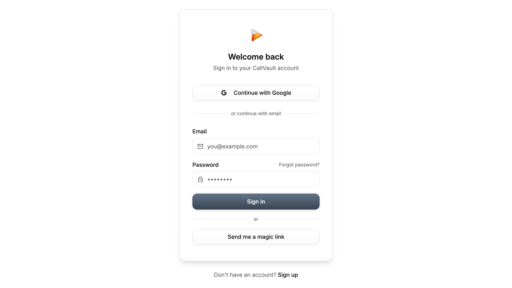

- [ ] **QA-04** — Settings deep-link URLs `/settings/ai-integrations` and `/settings/admin` redirect to `/settings/account`
  - **Surface/Route:** `/settings/ai-integrations`, `/settings/admin`
  - **Persona:** A
  - **Steps to reproduce:**
    1. Navigate directly to `https://app.callvaultai.com/settings/ai-integrations` (or `/settings/admin`)
    2. Observe URL after load
  - **Observed:** URL silently redirects to `/settings/account`. Settings nav tabs exist for AI Integrations and Admin (visible on the Settings page), but the URL deep-link parameter is not honored.
  - **Expected:** Direct URL to `/settings/ai-integrations` opens the AI Integrations tab. Same for Admin.
  - **Severity:** P1
  - **Maps to:** Phase 33
  - **Screenshot:** 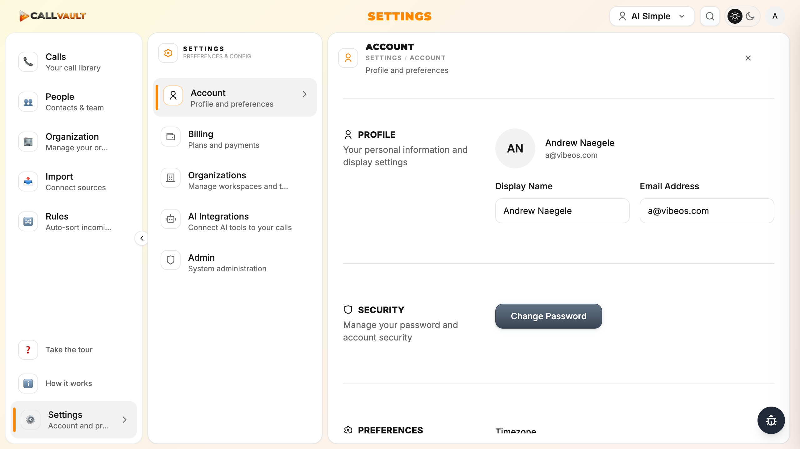

- [ ] **QA-05** — `/call/:callId` direct deep-link redirects to `/` instead of opening just call detail
  - **Surface/Route:** `/call/:callId` (UUID)
  - **Persona:** A
  - **Steps to reproduce:**
    1. While signed in, navigate to `https://app.callvaultai.com/call/2fdf6aa5-86a8-4b49-b19b-1e5b26ef60f8`
    2. Observe URL and rendering
  - **Observed:** URL changes back to `/`. Home table is shown. The call detail modal IS opened on top of home, but the URL doesn't persist on the call detail surface. Reloading the page closes the modal.
  - **Expected:** Either the URL persists as `/call/{uuid}` while the modal is open, OR navigating directly to the URL opens just the call detail without home behind. Reload should not lose state.
  - **Severity:** P2
  - **Maps to:** Phase 36
  - **Screenshot:** 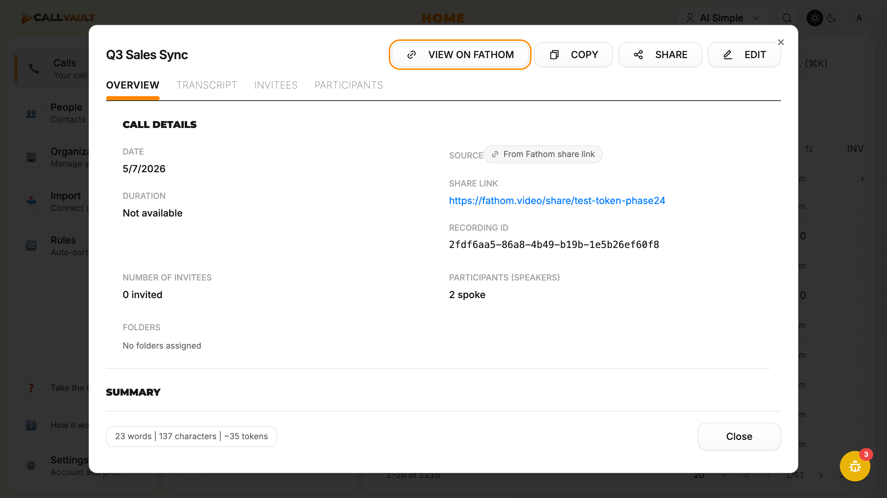

- [ ] **QA-06** — Sidebar uses emoji icons instead of Remix Icons (HARD-CONSTRAINT violation)
  - **Surface/Route:** Sidebar (every authenticated route)
  - **Persona:** A
  - **Steps to reproduce:**
    1. Visit any authenticated route
    2. Inspect sidebar `<button>` elements for nav items
  - **Observed:** Sidebar nav items render emoji icons (📞 Calls, 👥 People, 🏢 Organization, 📥 Import, 🔀 Rules, ❓ Take the tour, ℹ️ How it works, ⚙️ Settings). Emoji render differently per OS / fontset.
  - **Expected:** All icons must be Remix Icons (`@remixicon/react`) per CLAUDE.md HARD CONSTRAINT: "Remix Icons ONLY — no Lucide, FontAwesome, or others".
  - **Severity:** P1
  - **Maps to:** Phase 34
  - **Screenshot:** 

- [ ] **QA-07** — CSP `worker-src` missing — blob: workers blocked globally
  - **Surface/Route:** All routes (authed `/`, `/people`, `/import`; signed-out `/login`; share `/s/:token`) — confirmed on three distinct surfaces across three personas
  - **Persona:** A, B, C
  - **Steps to reproduce:**
    1. Navigate to any route as any persona
    2. Open browser console
  - **Observed:** Repeated console errors: `Refused to create a worker from 'blob:https://app.callvaultai.com/{uuid}' because it violates the following Content Security Policy directive: "script-src 'self' 'unsafe-inline' 'unsafe-eval'". Note that 'worker-src' was not explicitly set, so 'script-src' is used as a fallback. The action has been blocked.`
  - **Expected:** CSP should explicitly include `worker-src 'self' blob:` so the app can spawn blob: workers, OR the app should stop creating blob: workers. The current CSP silently breaks every feature that depends on web workers (transcript playback / analytics / AI features).
  - **Severity:** P1
  - **Maps to:** Phase 38
  - **Screenshot:** 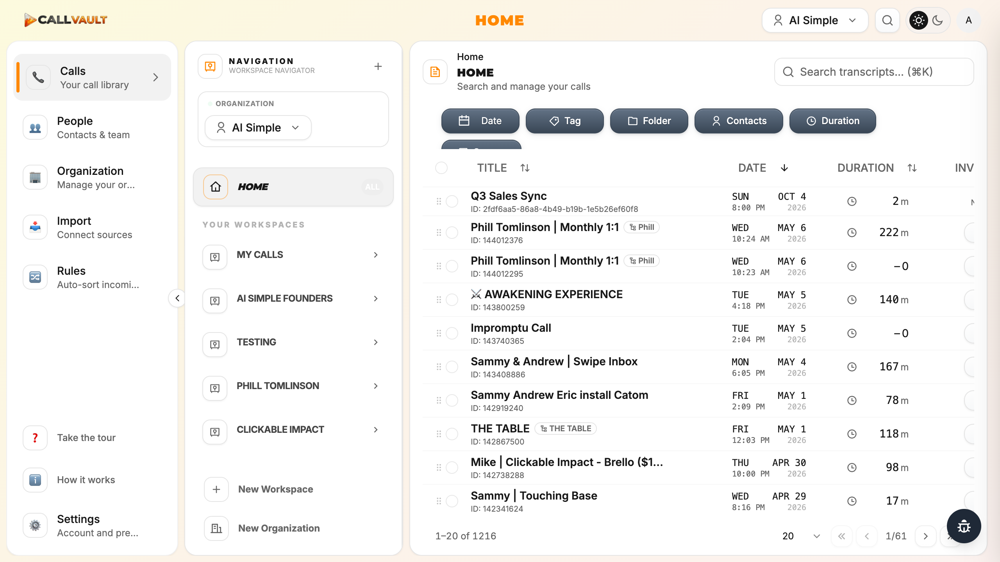
  - **Backend log:**
    ```
    console.error: Refused to create a worker from 'blob:https://app.callvaultai.com/{uuid}' because it violates the following Content Security Policy directive: "script-src 'self' 'unsafe-inline' 'unsafe-eval'". Note that 'worker-src' was not explicitly set, so 'script-src' is used as a fallback.
    ```
    Observed ≥10 distinct worker spawn attempts across the route walk; reproduced on authed shell (Plan 02), signed-out `/login` (Plan 03), and share recipient `/s/:token` (Plan 04).

- [ ] **QA-08** — Analytics page shows "coming soon" stubs + Total Calls mismatch (22 vs 1,216)
  - **Surface/Route:** `/analytics`, `/analytics/overview`
  - **Persona:** A
  - **Steps to reproduce:**
    1. Navigate to `/` — Home table shows "1-20 of 1216" (1,216 calls)
    2. Navigate to `/analytics`
  - **Observed:** Analytics renders KPI cards ("Total Calls: 22, Total Hours: 43.9h, Avg Duration: 120 min, Avg % Talk Time: 0%, Unique Speakers: 0") followed by two chart placeholders: "Line chart coming soon" and "Bar chart coming soon". Total Calls (22) doesn't match Home (1,216) — no visible date-range filter to explain the gap.
  - **Expected:** Real charts rendered with actual call data (or the section is hidden until ready, per CLAUDE.md "Known Stubs that prevent goal achievement should NOT ship"). Counts should match Home, OR a visible filter explains the difference.
  - **Severity:** P2
  - **Maps to:** Phase 36
  - **Screenshot:** 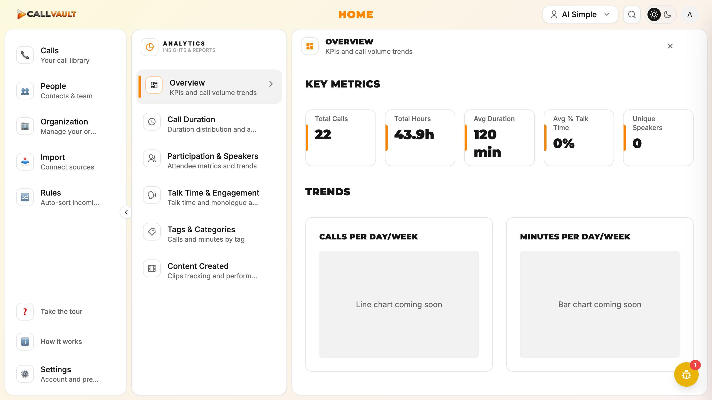

- [ ] **QA-09** — Top-bar central title displays "HOME" on every page (doesn't update per route)
  - **Surface/Route:** Top-bar central title (every authenticated route)
  - **Persona:** A
  - **Steps to reproduce:**
    1. Navigate to `/rules` (or `/organization`, `/import`)
    2. Look at the central title in the top bar
  - **Observed:** Central title stays as "HOME" on `/rules`, `/organization`, `/import`. It only changes on `/settings` ("SETTINGS"), `/analytics` ("ANALYTICS"), and `/people` ("PEOPLE"). Even though the page IS rendering Routing Rules / Organization Overview / Imports content, the top-bar title says HOME.
  - **Expected:** Top-bar central title reflects the current page (RULES, ORGANIZATION, IMPORT, etc.).
  - **Severity:** P2
  - **Maps to:** Phase 34
  - **Screenshot:** 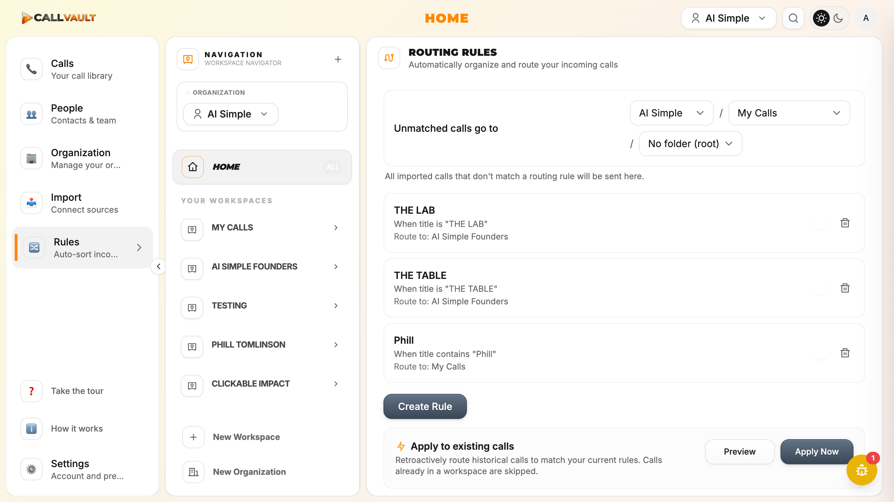

- [ ] **QA-10** — `/organization` central title abbreviated to "ORG" inconsistent with route name
  - **Surface/Route:** `/organization`
  - **Persona:** A
  - **Steps to reproduce:**
    1. Navigate to `/organization`
    2. Compare 2nd-pane title to main pane title
  - **Observed:** 2nd-pane title says "ORG" (3 chars) but main pane title is "OVERVIEW" with "Organization details and settings" subtitle. Inconsistent abbreviation.
  - **Expected:** Either "ORGANIZATION" (full) or "ORG" (consistent everywhere).
  - **Severity:** P3
  - **Maps to:** Phase 34
  - **Screenshot:** 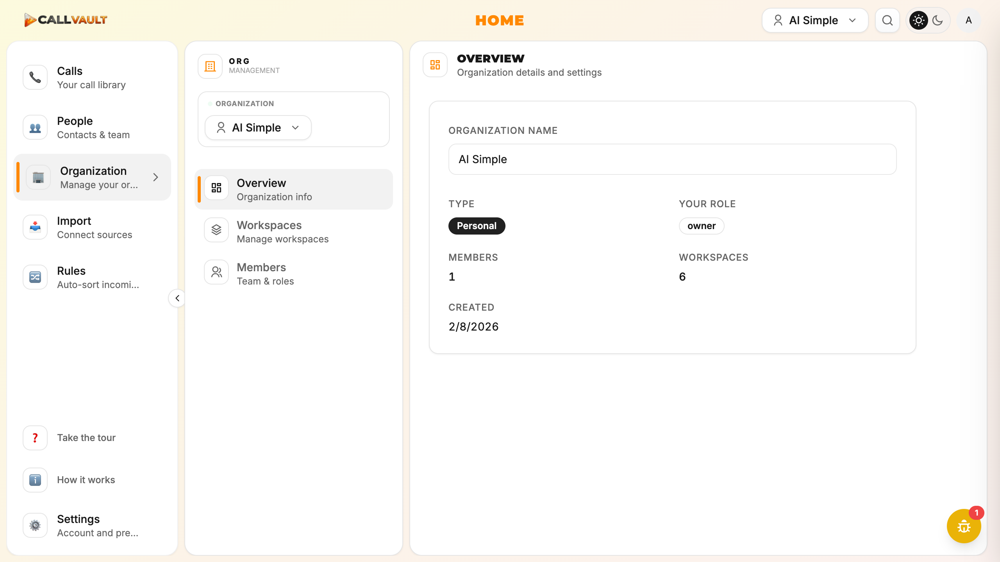

- [ ] **QA-11** — Business org "Cross-Organization Default: Copy And_remove" raw enum value leak in Settings>Organizations
  - **Surface/Route:** `/settings/organizations` on Business tab
  - **Persona:** A
  - **Steps to reproduce:**
    1. Switch to Business org
    2. Navigate to `/settings/organizations`
    3. Look at the Business org details card
  - **Observed:** Card shows "Business / Business organization for team collaboration / Cross-Organization Default: **Copy And_remove** / Created: 2/10/2026". "Copy And_remove" is a leaked enum value (`copy_and_remove`) being rendered verbatim with raw casing.
  - **Expected:** Human-readable label like "Copy and remove" or "Remove from original org" with appropriate styling.
  - **Severity:** P2
  - **Maps to:** Phase 36
  - **Screenshot:** 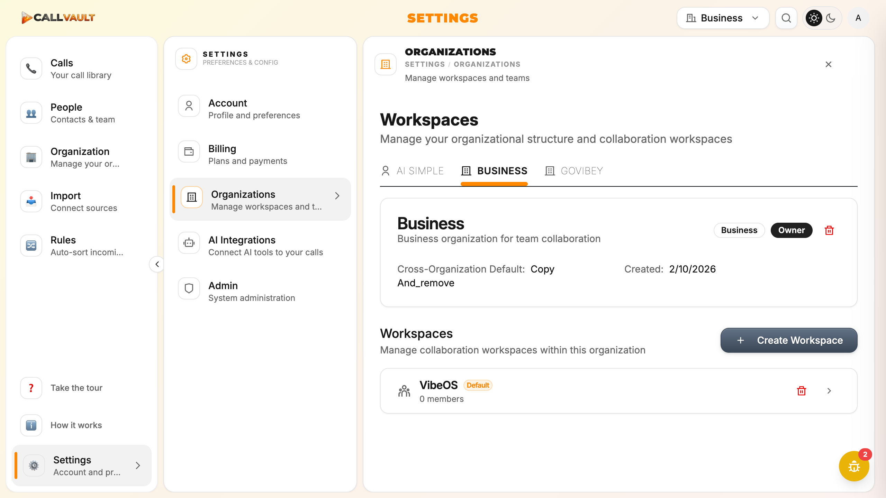

- [ ] **QA-12** — Cmd+K initial empty-state has repetitive "Search calls, transcripts, and summaries" placeholder
  - **Surface/Route:** Cmd+K global search modal
  - **Persona:** A
  - **Steps to reproduce:**
    1. Open Cmd+K
    2. Observe empty state before typing
  - **Observed:** Modal opens with input placeholder "Search calls, transcripts, and summaries..." AND the same placeholder repeated in the body below. Repetitive UI.
  - **Expected:** Either the body shows recent searches / pinned items, OR removes the duplicate placeholder text.
  - **Severity:** P3
  - **Maps to:** BACKLOG
  - **Screenshot:** 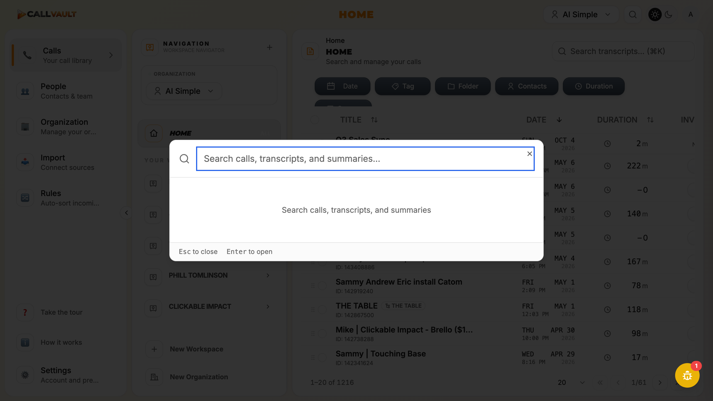

- [ ] **QA-13** — Cmd+K search takes 3-4 seconds to return results (perceived latency)
  - **Surface/Route:** Cmd+K global search
  - **Persona:** A
  - **Steps to reproduce:**
    1. Open Cmd+K
    2. Type "Sammy"
    3. Wait for results
  - **Observed:** Typing "Phill" (4 chars) — after 1.5s wait, still showed loading spinner. Typing "Sammy" — after ~4s, results appeared. Search is functional but slow.
  - **Expected:** Sub-second perceived latency for transcript search (especially on small queries).
  - **Severity:** P2
  - **Maps to:** Phase 36
  - **Screenshot:** 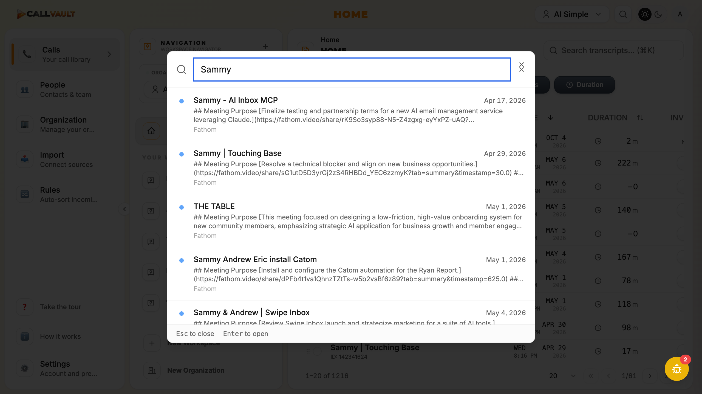

- [ ] **QA-14** — Call Detail uses centered modal with dim backdrop (violates "Pane 4 slides in, same plane" architecture rule)
  - **Surface/Route:** Call Detail modal (any call → click title)
  - **Persona:** A
  - **Steps to reproduce:**
    1. Click any call title
  - **Observed:** Modal centered in viewport, on dim/dark backdrop, covering the home table behind it. Per CLAUDE.md root: "AppShell: Pane 4 slides in and Pane 3 shrinks to make room. All panes operate on the same plane/z-index — no drawer overlays, no covering content." Call Detail clearly uses an overlay pattern.
  - **Expected:** Call detail opens as Pane 4 sliding in from the right, shrinking Pane 3 (home table). Same plane, no dim backdrop.
  - **Severity:** P2
  - **Maps to:** Phase 36
  - **Screenshot:** 

- [ ] **QA-15** — Call Detail "Invitees" tab body heading says "PARTICIPANTS" (label mismatch on ad-hoc calls)
  - **Surface/Route:** Call Detail modal → INVITEES tab on an ad-hoc call
  - **Persona:** A
  - **Steps to reproduce:**
    1. Open an ad-hoc call (e.g., one with no calendar invitees)
    2. Click INVITEES tab
  - **Observed:** Tab body header reads "PARTICIPANTS (2) Ad-hoc call" with message "This appears to be an impromptu or ad-hoc call — no calendar invitees were found. Showing transcript speakers instead." Tab is named INVITEES but content is participants.
  - **Expected:** Heading clarifies fallback behavior explicitly (e.g., "INVITEES — Ad-hoc call, showing PARTICIPANTS").
  - **Severity:** P3
  - **Maps to:** BACKLOG
  - **Screenshot:** 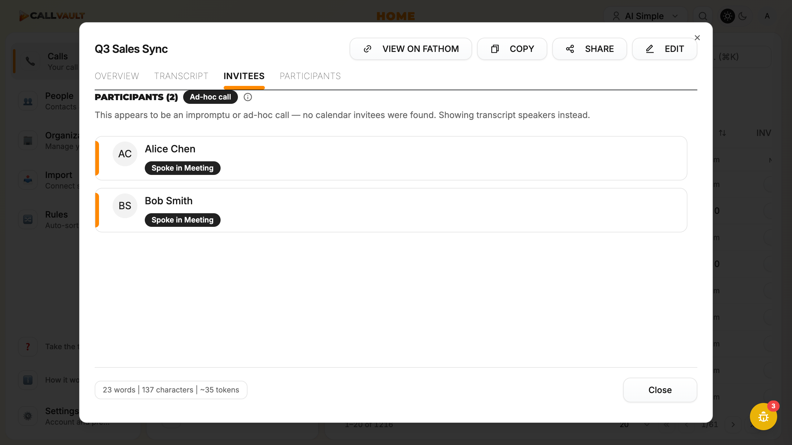

- [ ] **QA-16** — Workspace Detail Pane 4 bottom shows "ADVANCED SETTINGS" label with no content
  - **Surface/Route:** Pane 4 Workspace Detail
  - **Persona:** A
  - **Steps to reproduce:**
    1. Open a workspace detail pane via Settings>Organizations chevron (e.g., AI Simple Founders)
    2. Scroll to bottom of Pane 4
  - **Observed:** Label "ADVANCED SETTINGS" visible at bottom of Pane 4, but no expand/collapse control and no content. Could be a section header awaiting content (stub) or truncated by viewport.
  - **Expected:** Either content underneath, OR remove the heading if empty.
  - **Severity:** P3
  - **Maps to:** BACKLOG
  - **Screenshot:** 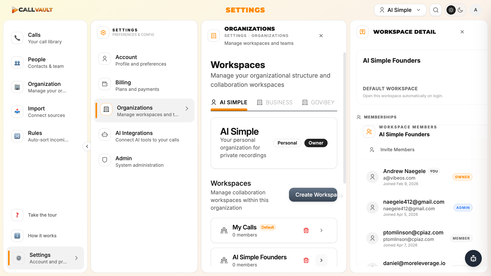

- [ ] **QA-17** — Org switcher dropdown repeats "owner" label redundantly on every row
  - **Surface/Route:** Top-right org selector dropdown
  - **Persona:** A
  - **Steps to reproduce:**
    1. Click top-right "AI Simple ▾"
    2. Inspect dropdown items
  - **Observed:** Dropdown shows: "AI Simple owner / Business 1 member owner / GoVibey 1 member owner / Create Organization / Manage Organizations". "owner" label after each org repeats — the owner is the same user for all 3, so the label is redundant.
  - **Expected:** Either remove redundant "owner" labels OR only show membership count for non-owner orgs.
  - **Severity:** P3
  - **Maps to:** BACKLOG
  - **Screenshot:** 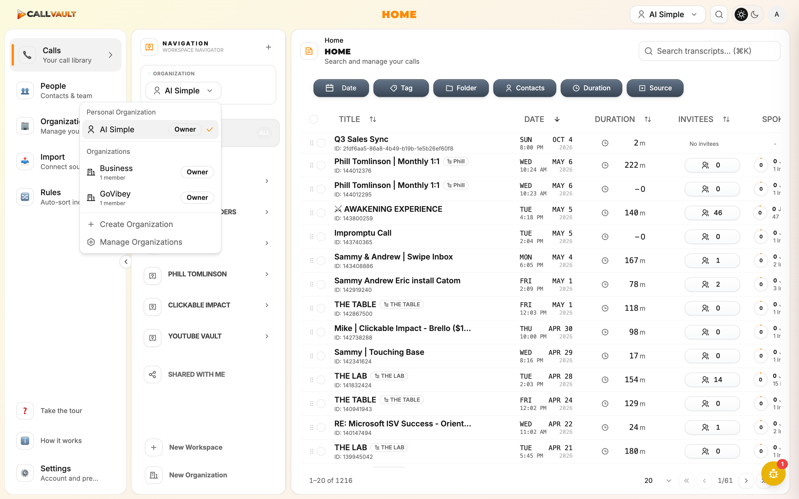

- [ ] **QA-18** — People page contacts table sometimes shows skeleton rows that don't resolve to data
  - **Surface/Route:** `/people`
  - **Persona:** A
  - **Steps to reproduce:**
    1. Click /people in sidebar after being on `/`
    2. Watch the table briefly
  - **Observed:** Briefly showed 8 skeleton rows (light gray bands) before populating with actual contacts. During the sweep, one navigation showed skeletons that never resolved to data — likely a cache/refresh edge case.
  - **Expected:** Skeletons resolve to actual data on every navigation, OR show an empty-state if no data exists.
  - **Severity:** P3
  - **Maps to:** BACKLOG
  - **Screenshot:** 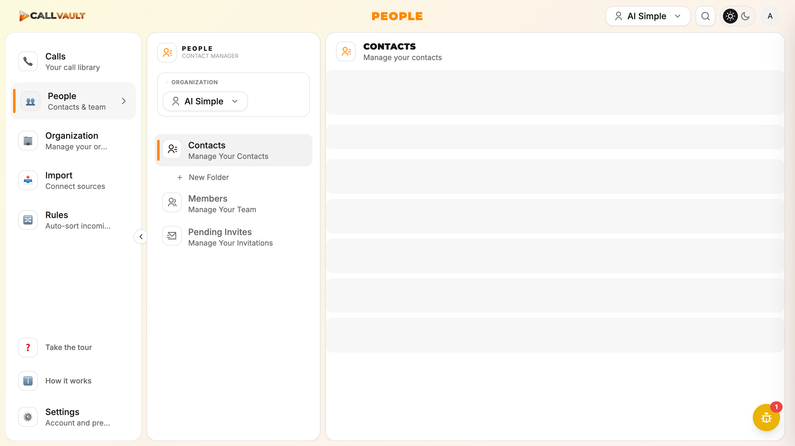

- [ ] **QA-19** — Persona B free-tier canary `so***@vibeos.com` already has an account from prior testing
  - **Surface/Route:** `/login` (sign-up mode) — Supabase Auth backend
  - **Persona:** B
  - **Steps to reproduce:**
    1. Sign up with `so***@vibeos.com`
    2. In parallel, sign up with a guaranteed-new email `qa***-***@vibeos.com`
    3. Compare the Supabase `/auth/v1/signup` response bodies
  - **Observed:** The `so***@vibeos.com` response has `"role":""` and `"identities":[]` (empty array). The throwaway-email response has `"role":"authenticated"` and a populated `identities` array. This is the Supabase obfuscated-existing-account response pattern (returns a success-shaped fake user object when the email is already registered, to prevent enumeration).
  - **Expected:** Per D-01 edge case, document the existing-account state and use a throwaway alternative. Do NOT delete production account state from the sweep itself. Phase 31 implementer must decide whether to delete `so***@vibeos.com` or keep it as a permanent canary.
  - **Severity:** P1
  - **Maps to:** Phase 31
  - **Related:** AUTH-03
  - **Screenshot:** 
  - **Backend log:**
    ```
    # Existing-account response (so***@vibeos.com):
    POST .../auth/v1/signup → HTTP 200
    body: {"id":"b56574cd-...","role":"","identities":[], "user_metadata":{}, ...}

    # Truly-new response (qa***-***@vibeos.com):
    POST .../auth/v1/signup → HTTP 200
    body: {"id":"56965ead-...","role":"authenticated","identities":[{...populated...}], "user_metadata":{...populated...}, ...}
    ```

- [ ] **QA-20** — Sign-in with wrong password gives NO user feedback (silent failure)
  - **Surface/Route:** `/login` (sign-in mode)
  - **Persona:** B
  - **Steps to reproduce:**
    1. Navigate to `/login` (sign-in mode is default)
    2. Fill email = `so***@vibeos.com`, password = a deliberately-wrong value
    3. Click "Sign in"
  - **Observed:** Backend returns HTTP 400 with `{"code":"invalid_credentials","message":"Invalid login credentials"}`, but the frontend shows NO error toast, NO inline error, NO indication that sign-in failed. Form stays in its initial state. Button briefly disables then re-enables.
  - **Expected:** A toast or inline error showing "Invalid email or password" (or the backend's "Invalid login credentials" message). The toast system clearly works (it fires for client-side password-length validation per Plan 03 Finding 7) — the auth handlers just aren't using it.
  - **Severity:** P0
  - **Maps to:** Phase 31
  - **Related:** AUTH-04 (extends to sign-in error path)
  - **Screenshot:** 
  - **Backend log:**
    ```
    POST https://vltmrnjsubfzrgrtdqey.supabase.co/auth/v1/token?grant_type=password → HTTP 400
    body: {"code":"invalid_credentials","message":"Invalid login credentials"}
    ```

- [ ] **QA-21** — No public landing page; root `/` redirects unauthed users to `/login`
  - **Surface/Route:** `/` (root)
  - **Persona:** B
  - **Steps to reproduce:**
    1. Sign out / clear cookies
    2. Navigate to `https://app.callvaultai.com`
  - **Observed:** Redirects to `https://app.callvaultai.com/login` immediately. No marketing page, no "What is CallVault" landing, no public pricing reference.
  - **Expected:** This may be intentional — the marketing site is likely a separate domain (callvaultai.com) and `app.callvaultai.com` is the application subdomain. Worth confirming with the product owner whether `app.callvaultai.com/` should host any unauthed content (e.g., the public pricing page that AUTH-02 expects), OR whether AUTH-02's "pricing page before signup" should be a step INSIDE the signup flow (e.g., between clicking "Sign up" and seeing the email/password form).
  - **Severity:** P2
  - **Maps to:** Phase 31
  - **Related:** AUTH-02 (architectural question for design)
  - **Screenshot:** 

- [ ] **QA-22** — `share-call` Edge Function returns identical 404 for "wrong recipient" and "doesn't exist" (backend signal destruction)
  - **Surface/Route:** `supabase/functions/share-call` Edge Function (consumed by `/s/:token`)
  - **Persona:** C
  - **Steps to reproduce:**
    1. As Persona A, create a share link addressed to email X
    2. Sign in to a different CallVault account (any account where email != X)
    3. Open the `/s/:token` URL
    4. Observe the network response from `/functions/v1/share-call?token={token}`
  - **Observed:** Edge Function returns HTTP 404 with `{"error":"Shared call not found","code":"CALL_NOT_FOUND"}` for the wrong-account case. This is the SAME response as a genuinely invalid/expired token. The frontend has no way to know which case applies, so it cannot ever render the Phase 32 SHARE-02 desired message ("This call was shared with na***@gmail.com — sign out and sign in with that email") without a backend response shape change.
  - **Expected:** Edge Function should return a distinguishable response shape for the wrong-account case — e.g., HTTP 403 with `{"error":"Wrong recipient","code":"WRONG_RECIPIENT","recipient_masked":"na***@gmail.com"}`. This is the only way the frontend can render the SHARE-02 target UI.
  - **Severity:** P0
  - **Maps to:** Phase 32
  - **Related:** SHARE-02 (backend prerequisite — frontend cannot fix alone)
  - **Screenshot:** 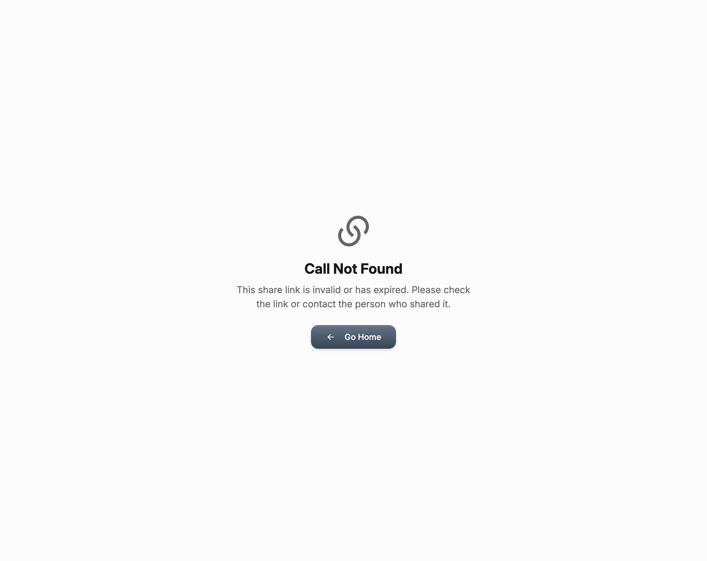
  - **Backend log:**
    ```
    network: GET /functions/v1/share-call?token={token} → 404
             body: {"error":"Shared call not found","code":"CALL_NOT_FOUND"}
    console: [ERROR] Share link fetch failed {token: {token}, status: 404, error: Object}
    ```
    The Edge Function clearly KNOWS the token exists (it was just used by the owner-side render in Plan 02), so it MUST be returning 404 because it's filtering by `recipient_email = current_user.email` and finding zero rows. That filter could just as easily return 403 with the masked recipient.

- [ ] **QA-23** — Phase 29 sweep created a throwaway test signup account in production; clean up via Supabase Auth admin panel
  - **Surface/Route:** Supabase Auth admin panel (production project `vltmrnjsubfzrgrtdqey`)
  - **Persona:** B (created during Plan 29-03 throwaway signup test)
  - **Steps to reproduce:**
    1. Sign in to Supabase Auth admin for the production project
    2. Search users for `qa***-***@vibeos.com` (e.g., `qa-sweep-{timestamp}@vibeos.com` — exact timestamp can be retrieved from Plan 29-03 notes file)
    3. Confirm the row is unconfirmed (no `email_confirmed_at`), has no organizations, and no payment method
    4. Delete the user row
  - **Observed:** During Plan 29-03 sweep, a throwaway signup was created with a timestamped email (`qa-sweep-{ts}@vibeos.com`) to verify that brand-new signups work at the API level (they do — Supabase returned `role: authenticated` with a populated identities array). The account was never confirmed via email, has no associated data, and represents minimal data footprint, but does live in the auth.users table.
  - **Expected:** Decision needed — delete the account, OR keep it as a permanent free-tier canary alongside `so***@vibeos.com`. No security impact either way.
  - **Severity:** P3
  - **Maps to:** BACKLOG
  - **Screenshot:** 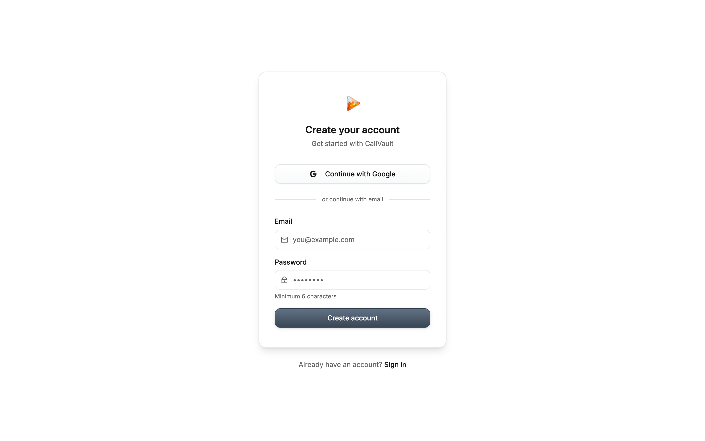

---

## Future Requirements (captured to BACKLOG, not v2.2)

- Public share-link option (no account required to view)
- "View without account" mode on shared-call landing page (coming-soon CTA in v2.2; live in v2.3+)
- Markdown rendering throughout app surfaces

---

## Out of Scope

- Real-time collaboration features
- Mobile native app
- Cross-org admin view
- Import from other users as a source
- Ownership transfer
- MCP marketplace / third-party tool integrations
- MCP rate limiting / usage analytics dashboard

---

## Traceability

| Req ID | Description | Phase | Status | Sweep Status |
|--------|-------------|-------|--------|--------------|
| QA-01 | Dev-browser QA sweep + regression catalog | Phase 29 | Active | Confirmed |
| AUTH-01 | Email signup completes successfully (silent-success mode discovered) | Phase 31 | Active | Confirmed |
| AUTH-02 | Pricing page shown before account creation | Phase 31 | Active | Confirmed |
| AUTH-03 | Payment gate enforced before onboarding | Phase 31 | Active | Cannot-verify |
| AUTH-04 | Signup failure surfaces useful error message | Phase 31 | Active | Confirmed |
| AUTH-05 | Google sign-in error path explains actual issue | Phase 31 | Active | Cannot-verify |
| SHARE-01 | Public landing page replaces bare signin redirect | Phase 32 | Active | Confirmed |
| SHARE-02 | Wrong-account error shows which email was authorized (backend signal destruction discovered) | Phase 32 | Active | Confirmed |
| SHARE-03 | Share Call modal visual cleanup | Phase 32 | Active | Confirmed |
| SHARE-04 | Single-call share works end-to-end | Phase 32 | Active | Confirmed |
| BUG-01 | UUID/legacy-ID root cause (unblocks tags + folders) | Phase 30 | Active | Confirmed |
| BUG-02 | Workspace update 406 PGRST116 | Phase 36 | Active | No-repro |
| BUG-03 | Cache invalidation on mutations | Phase 36 | Active | No-repro |
| BUG-04 | Date sort chronological | Phase 36 | Active | Confirmed |
| BUG-05 | Manual paste/upload UI exposed | Phase 36 | Active | Confirmed |
| BUG-06 | Import History button | Phase 36 | Active | No-repro |
| BUG-07 | Import "+" button | Phase 36 | Active | Confirmed |
| BUG-08 | Hall of Fame / Manager Reviews auto-create removed | Phase 36 | Active | No-repro |
| BUG-09 | Dialog accessibility | Phase 36 | Active | Confirmed |
| VIS-01 | Sidebar canonical selection pattern | Phase 33 | Active | Confirmed |
| VIS-02 | 2nd-pane workspace selector canonical pattern | Phase 33 | Active | Confirmed |
| VIS-03 | Settings tab list canonical pattern | Phase 33 | Active | Confirmed |
| VIS-04 | Call Detail modal tabs canonical pattern | Phase 33 | Active | Confirmed |
| VIS-05 | Settings > Organizations replaced with dropdown | Phase 33 | Active | Confirmed |
| BRAND-01 | Sidebar order: CALLS → IMPORT → RULES → PEOPLE → ORGANIZATION | Phase 34 | Active | Confirmed |
| BRAND-02 | All sidebar titles UPPERCASE | Phase 34 | Active | Confirmed |
| BRAND-03 | Workspace title bold-only (remove italic) | Phase 34 | Active | Cannot-verify |
| BRAND-04 | Org box full width with equal padding | Phase 34 | Active | Confirmed |
| BRAND-05 | Top-bar org selector width matches 2nd pane | Phase 34 | Active | Confirmed |
| BRAND-06 | "ALL" link darkened for visibility | Phase 34 | Active | Cannot-verify |
| BRAND-07 | Doubled X close button fixed | Phase 34 | Active | No-repro |
| BRAND-08 | Global search rounded corners + brand polish | Phase 34 | Active | Confirmed |
| BRAND-09 | Memberships card spurious borders removed | Phase 34 | Active | Cannot-verify |
| BRAND-10 | Settings > Organizations header shows org name + info | Phase 34 | Active | Confirmed |
| TABLE-01 | Shared column removed from 3rd pane | Phase 35 | Active | Confirmed |
| TABLE-02 | Folders column reflects assignment (depends on BUG-01) | Phase 35 | Active | Confirmed |
| TABLE-03 | Standardized column alignment | Phase 35 | Active | Cannot-verify |
| FILTER-01 | Folder filter removed | Phase 35 | Active | Confirmed |
| FILTER-02 | Duration filter removed | Phase 35 | Active | Confirmed |
| FILTER-03 | Contacts filter queries full contacts DB | Phase 35 | Active | Cannot-verify |
| FILTER-04 | Source filter overflow + second row fix | Phase 35 | Active | Confirmed |
| DND-01 | Drag target position-stable | Phase 35 | Active | Cannot-verify |
| DND-02 | Drag target enlarged to left ⅓–½ of card | Phase 35 | Active | Cannot-verify |
| CARD-01 | Whole workspace card clickable | Phase 35 | Active | Confirmed |
| CARD-02 | Same applied to org cards and similar patterns | Phase 35 | Active | Cannot-verify |
| SEC-01A | polar-webhook DRY refactor | Phase 37 | Active | Not-tested |
| SEC-01B | polar-webhook async MCP provisioning (EdgeRuntime.waitUntil) | Phase 37 | Active | Not-tested |
| SEC-01C | polar-webhook strip CORS | Phase 37 | Active | Not-tested |
| SEC-01D | polar-webhook generic error responses | Phase 37 | Active | Not-tested |
| SEC-01E | fathom-oauth-callback + file-upload-transcribe → _shared/auth.ts | — | ✓ Validated (2026-05-11) | Not-tested |
| SEC-02A | Migrate 25-30 remaining functions to _shared/auth.ts | Phase 37 | Active | Not-tested |
| SEC-02B | Fresh edge-function audit (Critical/High findings fixed) | Phase 37 | Active | Not-tested |
| SEC-03A | npm audit returns zero high/critical (resolve lodash) | Phase 38 | Active | Not-tested |
| SEC-03B | Resolve 4 moderate npm audit findings where clean | Phase 38 | Active | Not-tested |
| SEC-03C | React Query cache cross-org leak verification | Phase 38 | Active | Confirmed |
| SEC-03D | OAuth token handling review (server-side only) | Phase 38 | Active | Not-tested |
| SEC-04A | Document service-role usage per function (35 functions) | Phase 38 | Active | Not-tested |
| SEC-04B | Defense-in-depth org_id/user_id filter audit | Phase 38 | Active | Not-tested |
| SEC-04C | RLS regression smoke test on CI | Phase 38 | Active | Not-tested |
| SEC-05A | supabase functions list snapshot (deployed vs source) | Phase 37 | Active | Not-tested |
| SEC-05B | Cross-reference orphan callers before delete | Phase 37 | Active | Not-tested |
| SEC-05C | Delete confirmed-dead functions from production | Phase 37 | Active | Not-tested |
| SEC-06 | zoom-webhook HMAC constant-time comparison | Phase 37 | Active | Not-tested |
| SEC-07 | zoom-webhook + polar-webhook timestamp replay window | Phase 37 | Active | Not-tested |
| SEC-08 | file-upload-transcribe magic-byte validation + streaming | Phase 37 | Active | Not-tested |
| SEC-09 | fathom-oauth-callback OAuth tokens encrypted at rest | Phase 37 | Active | Not-tested |
| SEC-10 | send-org-invite HTML escape on email body interpolation | Phase 37 | Active | Not-tested |
| SEC-11 | share-call legacy data path org-membership check | Phase 37 | Active | Not-tested |
| SEC-12 | polar-webhook event-ID idempotency table | Phase 37 | Active | Not-tested |
| FEAT-01 | Fathom Mirror (read from fathom_raw_calls) | Phase 39 | Active | Not-tested |
| FEAT-02 | Fathom re-import / overwrite existing calls | Phase 40 | Active | Not-tested |
| DEBT-01 | PAY-05 — gate 2 remaining ungated AI features | Phase 41 | Active | Not-tested |
| DEBT-02 | MCP-04 — operational config completed | Phase 41 | Active | Not-tested |
| DEBT-03 | Close 13 deferred v2.0 human-verification items | Phase 41 | Active | Not-tested |
| QA-02 | Auth routes don't redirect signed-in users | BACKLOG | Active | Confirmed |
| QA-03 | Sign-in password field shows pre-filled autofill dots | BACKLOG | Active | Confirmed |
| QA-04 | Settings deep-link URLs redirect to /settings/account | Phase 33 | Active | Confirmed |
| QA-05 | /call/:callId deep-link redirects to / | Phase 36 | Active | Confirmed |
| QA-06 | Sidebar uses emoji icons instead of Remix Icons (HARD-CONSTRAINT violation) | Phase 34 | Active | Confirmed |
| QA-07 | CSP worker-src missing — blob: workers blocked globally | Phase 38 | Active | Confirmed |
| QA-08 | Analytics shows stub charts + count mismatch (22 vs 1,216) | Phase 36 | Active | Confirmed |
| QA-09 | Top-bar central title "HOME" on every route (doesn't update) | Phase 34 | Active | Confirmed |
| QA-10 | /organization central title abbreviated to "ORG" | Phase 34 | Active | Confirmed |
| QA-11 | "Copy And_remove" raw enum value leak in Business org settings | Phase 36 | Active | Confirmed |
| QA-12 | Cmd+K empty-state has repetitive placeholder text | BACKLOG | Active | Confirmed |
| QA-13 | Cmd+K search takes 3-4 seconds to return results | Phase 36 | Active | Confirmed |
| QA-14 | Call Detail uses centered overlay (violates same-plane architecture) | Phase 36 | Active | Confirmed |
| QA-15 | Invitees tab heading says "PARTICIPANTS" (label mismatch) | BACKLOG | Active | Confirmed |
| QA-16 | Workspace Detail "ADVANCED SETTINGS" label has no content | BACKLOG | Active | Confirmed |
| QA-17 | Org switcher dropdown repeats "owner" label redundantly | BACKLOG | Active | Confirmed |
| QA-18 | People page contacts table sometimes shows skeleton rows that don't resolve | BACKLOG | Active | Confirmed |
| QA-19 | Persona B canary so***@vibeos.com already has account from prior testing | Phase 31 | Active | Confirmed |
| QA-20 | Sign-in with wrong password gives NO user feedback (silent failure) | Phase 31 | Active | Confirmed |
| QA-21 | No public landing page; root / redirects unauthed users to /login | Phase 31 | Active | Confirmed |
| QA-22 | share-call Edge Function returns identical 404 for wrong-recipient and not-exists | Phase 32 | Active | Confirmed |
| QA-23 | Phase 29 throwaway test signup account in production needs cleanup | BACKLOG | Active | Confirmed |

---

*Last updated: 2026-05-11 — SEC-01–05 split into 17 atomic items (SEC-01A–E, SEC-02A–B, SEC-03A–D, SEC-04A–C, SEC-05A–C) verified against live codebase. SEC-01E already done (verified). Plus SEC-06 through SEC-12 (deferred Phase 28 High findings). Plus Phase 29 QA Sweep added 22 new QA-NN findings (QA-02 through QA-23 — P0: 2, P1: 4, P2: 8, P3: 8). Total: 73 + 22 = 95 active requirements + 1 validated → 13 phases, 100% coverage.*
