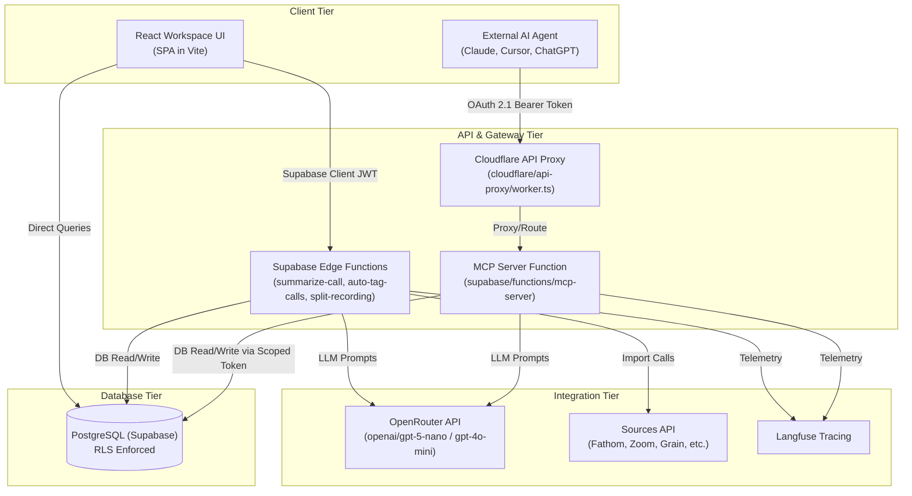

# CallVault System Architecture Analysis

**Analysis Date:** 2026-05-26  
**Scope:** Client Interface, Supabase Edge Functions, MCP Server, External AI Integrations, Supabase Database  

---

## Executive Summary

CallVault has transitioned from an in-app RAG vector-search chat system to a unified call vault storage, transcript visualization, and AI analysis platform. The system uses a clean multi-tenant organization boundaries structure.

**Key Architecture Pivot:** Legacy local vector embeddings (`transcript_chunks` with `embedding` columns, search pipelines, and local chat streams) have been completely retired. CallVault now exposes a **Model Context Protocol (MCP) Server** at `supabase/functions/mcp-server/` that serves as a public AI gateway. This allows external AI clients (like Claude Desktop, ChatGPT, Perplexity, or Cursor) to securely query transcripts, run AI-driven analyses, and manage folders and tags on behalf of users, authenticated via an OAuth 2.1 authorization server integrated directly with Supabase.

---

## 1. System Communication Flow

CallVault operates across three key tiers: the frontend workspace client, the serverless edge functions API gateway (including the MCP server), and the PostgreSQL/Supabase database.



---

## 2. Model Context Protocol (MCP) Server

The AI system is structured around the Model Context Protocol (MCP) server running as a Supabase Edge Function (`supabase/functions/mcp-server/index.ts`).

### 2.1 Authentication & Scoping
- **OAuth 2.1 Flow:** External clients register dynamically (`mcp-oauth-register`), request user consent (`/oauth/consent`), and exchange authentication codes (`mcp-oauth-metadata`) for workspace- or organization-scoped tokens stored in the `mcp_tokens` table.
- **Audience & Vanity Domain Routing:** The Cloudflare Worker at `cloudflare/api-proxy/worker.ts` acts as a vanity domain proxy for `api.callvaultai.com` and `mcp.callvaultai.com`, serving well-known discovery documents (`/.well-known/oauth-protected-resource/mcp`) and routing requests to avoid host mismatch errors.
- **Service Role Execution:** The MCP server is executed with the Supabase `service-role` key. Security boundaries are strictly enforced via the workspace or organization scope retrieved from the verified token metadata before executing any tool queries.

### 2.2 Exposed Tools (36 Total)
The MCP server exposes 17 read and 19 write tools. All tools adhere to the standard JSON-RPC 2.0 protocol over HTTP:

- **Core Read Tools:**
  - `list_calls`: Retrieves paginated calls scoped to the token's allowed workspaces.
  - `search_calls`: Searches calls by keyword across titles, transcripts, and summaries.
  - `get_transcript`: Retrieves the full transcript text for a specific recording.
  - `get_recording_context`: Gathers metadata, AI summary, speakers, and tags.
- **AI Analysis Read Tools:**
  - `extract_action_items`: AI-generated action items (with read-through caching).
  - `ask_call`: Q&A grounded in transcript content (uncached, GPT-4o-mini).
  - `get_sentiment`: Sentiment analysis (overall, talk ratios, notable moments).
  - `get_coaching_notes`: Strengths, improvement areas, and suggestions with examples.
- **Write Tools:**
  - Recording Management: `rename_call`, `move_calls_to_workspace`, `delete_call`, `copy_calls_to_organization`.
  - Folders & Tags: `create_folder`, `add_call_to_folder`, `remove_call_from_folder`, `create_tag`, `tag_call`, `untag_call`.
  - Share Links: `create_share_link`, `revoke_share_link`.

---

## 3. Core Edge Functions & AI Pipelines

Standard edge functions handle transactional workflows and background AI operations. Each function verifies user JWTs via the shared helper `authenticateRequest` in `supabase/functions/_shared/auth.ts` (with defense-in-depth checks).

### 3.1 Summarization & AI Analyses Caching
AI-heavy fields (summaries, action items, sentiment, coaching notes) are cached directly in the `recordings` database table to eliminate repetitive latency and API costs.
- **Function:** `supabase/functions/summarize-call/index.ts`
- **Execution:** Uses Vercel AI SDK's `generateText` with OpenRouter models (primarily `openai/gpt-5-nano`).
- **Prompt Isolation:** Transcripts are truncated to the first 15k characters prior to LLM submission for efficiency.
- **Observability:** Telemetry data for all AI calls is pushed to Langfuse via the tracer in `supabase/functions/_shared/langfuse.ts`.

### 3.2 Recording Operations
- **Split Recordings (`split-recording`):** Splits a recording at a specified segment. The service clears the cached summary and spawns two separate records in the `recordings` table, mapping their new workspace associations.

### 3.3 Integration Sync Pipelines
- Specialized functions handle authentication, callback routing, and background sync for integrations:
  - Fathom: `fathom-oauth-url`, `fathom-oauth-callback`, `fathom-reconcile`, `fathom-webhook`.
  - Zoom: `zoom-sync-meetings`, `zoom-webhook`.
  - Grain: `grain-sync-recordings`, `grain-webhook`.
  - Plaud: `plaud-sync-recordings`.
  - Read AI: `read-ai-sync-meetings`, `read-ai-webhook`.
  - Fireflies: `fireflies-sync-meetings`, `fireflies-webhook`.
  - YouTube: `youtube-import`.

---

## 4. Supabase Database Schema

The database uses a unified, normalized table structure:

- **`recordings`:** The single source of truth (SSoT) for all calls. 
  - Schema details: `id` (UUID), `title` (TEXT), `recording_start_time` (TIMESTAMPTZ), `recording_end_time` (TIMESTAMPTZ), `duration` (INT), `source_app` (TEXT), `full_transcript` (TEXT), `summary` (TEXT), `owner_user_id` (UUID), `organization_id` (UUID), `source_metadata` (JSONB).
  - Deprecation: Vector columns and legacy chunking indices have been fully dropped.
- **`workspace_entries`:** Junction table linking a recording UUID to a specific workspace ID (`workspace_id`), facilitating multi-workspace visibility for calls.
- **`mcp_tokens`:** Stores active tokens, scope (`workspace` or `organization`), user mapping (`user_id`), target workspace (`workspace_id`), target organization (`org_id`), and capabilities configuration.
- **`call_participants`:** Maps speaker name, email, and participant type to specific recordings (replacing legacy unstructured speaker lists).

---

## 5. Client (Frontend) Architecture

The frontend is a React SPA structured around a clear separation between views and data-access layers.

### 5.1 Service Layer (`src/services/`)
- All database operations are decoupled from React components and placed in pure TypeScript files.
- Example: `src/services/recordings.service.ts` encapsulates calls to the Supabase client:
  ```typescript
  export async function getRecordingById(id: string, organizationId: string): Promise<RecordingDetail | null> {
    const { data, error } = await supabase
      .from('recordings')
      .select('...')
      .eq('id', id)
      .eq('organization_id', organizationId)
      .maybeSingle();
    if (error) throw new Error(...);
    return data;
  }
  ```

### 5.2 Custom Query Hooks (`src/hooks/`)
- React Query (`@tanstack/react-query`) hooks wrap service layer functions.
- Centralized query keys are configured in `src/lib/query-config.ts` (e.g., `queryKeys.calls.detail(id)`) to manage caching and invalidation cleanly.
- Mutation hooks handle optimistic updates, loading states, and notification triggers.

### 5.3 Routing and Deep-Linking
- Call details are always rendered inside a modal overlay (`CallDetailDialog.tsx`), rather than as standalone pages.
- Deep linking is handled through parameters: a URL like `/call/:callId` triggers a client redirect to `/?callId=:callId` in `src/pages/CallDetailPage.tsx`, opening the corresponding overlay on the main dashboard view (`src/pages/TranscriptsNew.tsx`).

---

*System architecture documentation: 2026-05-26*
