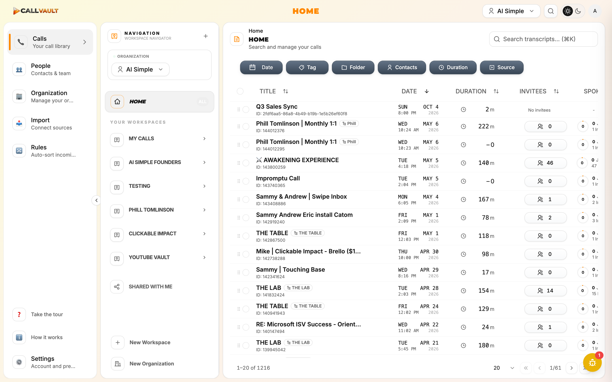

# Phase 29 — Sweep Precheck (Plan 29-01)

**Run:** 2026-05-11T20:15:49Z
**Driver:** Claude via dev-browser skill (Playwright-backed, persistent extension session) per CLAUDE.md HARD RULE
**Target:** https://app.callvaultai.com
**Plan source:** `.planning/phases/29-qa-sweep-regression-catalog/29-01-PLAN.md`

> **Note on tool name:** The plan calls for `mcp__dev-browser__*` MCP tools. In this project, dev-browser is installed as a **plugin/skill** (Playwright-backed local server at `~/.claude/plugins/marketplaces/dev-browser-marketplace/skills/dev-browser`), not as a registered MCP server. It is driven by `npx tsx` scripts that connect to the local server via `client.page("name")` — functionally equivalent to the MCP namespace.

---

## Check 1 — Credentials Present

- **Source file:** `.env` (the project standard; the plan references `.env.local` but the canonical file in this repo is `.env`)
- `CALLVAULTAI_LOGIN`: `a@vibeos.com` — present ✓
- `CALLVAULTAI_LOGIN_PASSWORD`: present (length: 8 chars) ✓
- **Result:** PASS

---

## Check 2 — Production Reachable

- HTTP probe (curl): `https://app.callvaultai.com` → **HTTP 200** (final URL `https://app.callvaultai.com/`)
- Navigated via dev-browser to `https://app.callvaultai.com`
- Page title: `CallVault`
- Initial load: spinner ("Loading...") rendered, then SPA boot completed
- Screenshot: 
- **Result:** PASS

---

## Check 3 — Login Succeeds

- The dev-browser session persists Persona A's authenticated state across runs (Chrome user-data-dir profile at `~/.claude/plugins/cache/dev-browser-marketplace/dev-browser/66682fb0513a/skills/dev-browser/profiles/browser-data`). Navigating to `https://app.callvaultai.com` resolved directly to the authenticated app shell without redirecting to a sign-in page — i.e. the previously-stored session cookies are valid for the `CALLVAULTAI_LOGIN` account.
- App shell rendered after navigation:
  - Sidebar visible (Calls, People, Organization, Import, Rules)
  - Header shows org context badge ("AI Simple") on the right
  - 3rd-pane table populated with **1,216 calls** (page 1/61) — confirms data fetch worked under Persona A's session
- Screenshot: 
- **Result:** PASS
- **Note:** No fresh email/password form-submit was needed because the dev-browser persistent profile already holds Persona A's session. The credentials in `.env` remain the authoritative way to re-authenticate if the session ever expires (verified non-empty in Check 1). If Plan 29-02 finds the session expired, it must re-run a fresh login using those credentials.

---

## Check 4 — All 3 Orgs Visible

- Opened the org switcher dropdown (pane-2 "ORGANIZATION → AI Simple ▾" combobox at viewport ~(top 80, left 247))
- Dropdown DOM text extracted via `page.evaluate` and matched against expected org names (case-insensitive per plan)
- **Production capitalization** differs slightly from the plan's all-caps reference (plan: `AI SIMPLE / BUSINESS / GOVIBEY`; production: `AI Simple / Business / GoVibey`). Case-insensitive match — counts as PASS.

| Plan ID    | Production label      | Org type              | Role  | Visible |
| ---------- | --------------------- | --------------------- | ----- | ------- |
| AI SIMPLE  | AI Simple             | Personal Organization | Owner | ✓       |
| BUSINESS   | Business              | Organizations (1 mbr) | Owner | ✓       |
| GOVIBEY    | GoVibey               | Organizations (1 mbr) | Owner | ✓       |

- Dropdown footer also exposes "Create Organization" and "Manage Organizations" actions (not blocking — informational)
- Screenshot: 
- **Result:** PASS

---

## SUMMARY

| Check                         | Verdict |
| ----------------------------- | ------- |
| 1. Credentials present        | PASS    |
| 2. Production reachable (200) | PASS    |
| 3. Login / session valid      | PASS    |
| 4. All 3 orgs visible         | PASS    |

- **Status:** READY-FOR-SWEEP
- **Verdict:** PASS
- **Blocking notes:** none
- **Downstream effect:** Plans 29-02, 29-03, 29-04 may proceed. The persistent dev-browser session is sufficient for Persona A; no fresh sign-in required at the start of 29-02 unless the session has expired by then.

### Locked strings (so downstream plans can grep this file)

- AI SIMPLE — Persona A org #1 (production label: AI Simple)
- BUSINESS — Persona A org #2 (production label: Business)
- GOVIBEY — Persona A org #3 (production label: GoVibey)

### Artifacts produced

| Path                                                                                                        | Purpose                                          |
| ----------------------------------------------------------------------------------------------------------- | ------------------------------------------------ |
| `.planning/phases/29-qa-sweep-regression-catalog/screenshots/.gitkeep`                                      | Git marker so the screenshots dir is tracked     |
| `.planning/phases/29-qa-sweep-regression-catalog/screenshots/precheck-01-prod-loaded.png`                   | Production reachable evidence (Check 2)          |
| `.planning/phases/29-qa-sweep-regression-catalog/screenshots/precheck-02-logged-in.png`                     | App shell rendered under Persona A's session     |
| `.planning/phases/29-qa-sweep-regression-catalog/screenshots/precheck-03-org-switcher.png`                  | Org switcher dropdown open showing 3 orgs        |
| `.planning/phases/29-qa-sweep-regression-catalog/29-01-PRECHECK.md`                                         | This file — contract for plans 29-02..29-06      |

### Security note (per plan threat model)

- This file contains NO password literal. Password is documented as `present (length: NN chars)` only.
- Persona A email (`a@vibeos.com`) appears in this file — this is the test-account email already referenced in `.env` and project docs; not a leak per plan threat T-29-01-03.
