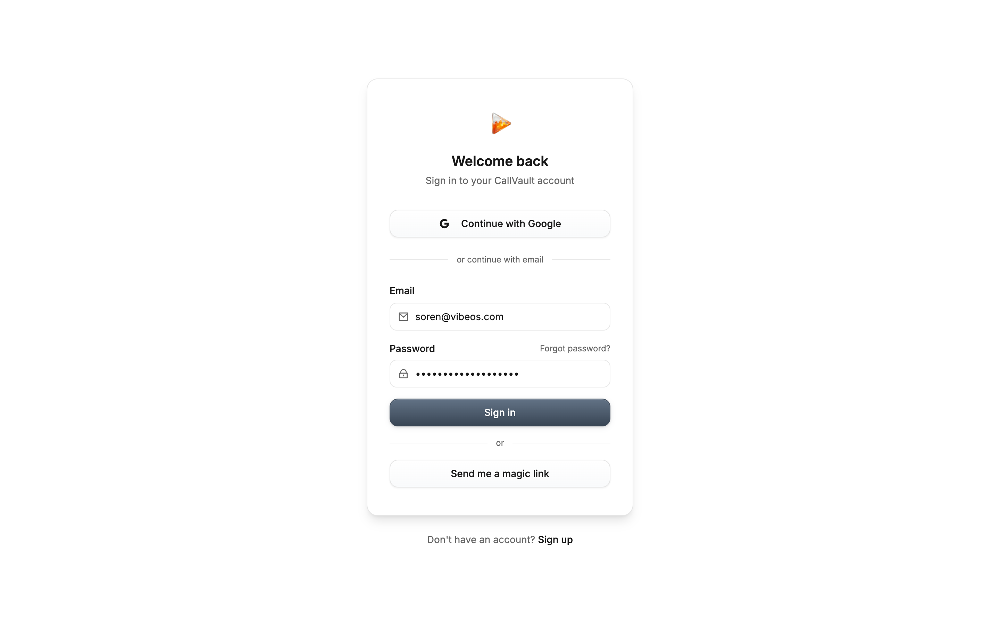
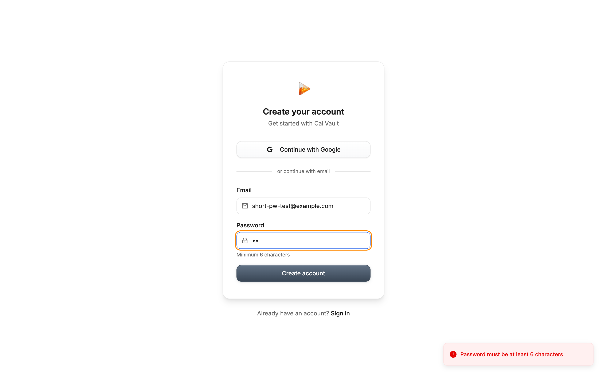
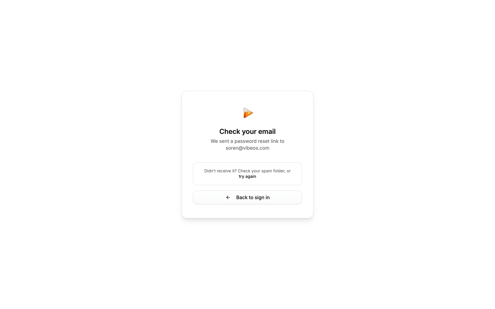
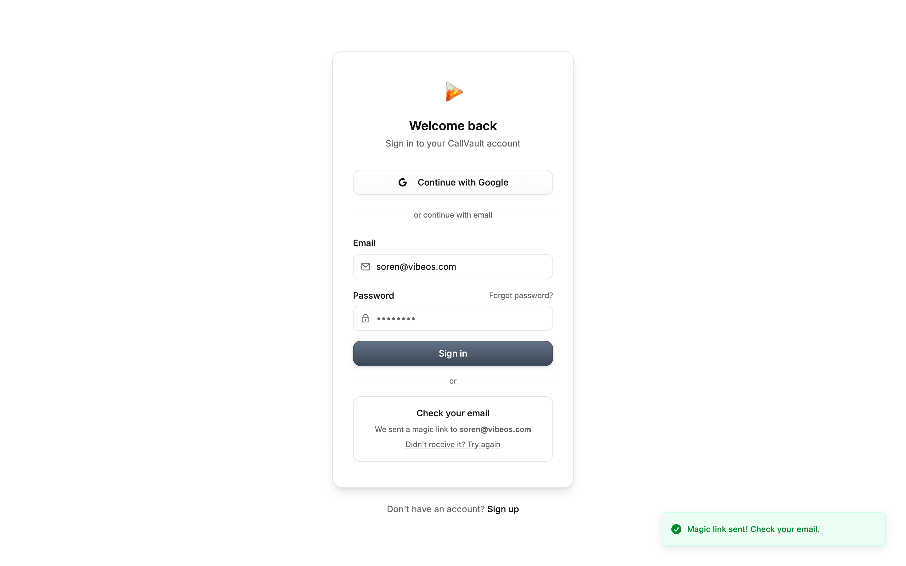
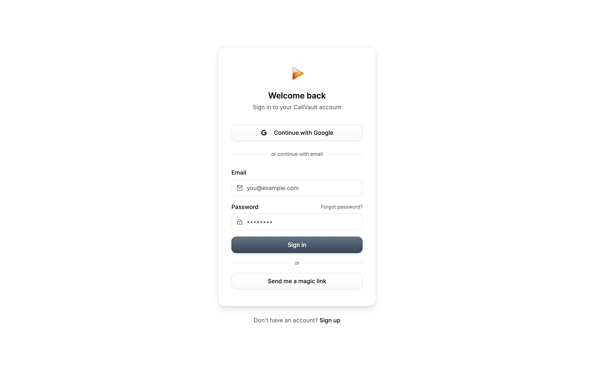

# Phase 29 — Persona B Sweep Raw Notes (Plan 29-03)

**Driver:** Claude via dev-browser Playwright skill (per Plan 29-01 dev-browser pattern — `npx tsx` heredoc scripts; NOT MCP tools)
**Persona:** B — Fresh signup, target `soren@vibeos.com`
**Started:** 2026-05-11T22:30:00Z
**Completed:** 2026-05-11T22:50:00Z
**Target:** https://app.callvaultai.com
**Plan source:** `.planning/phases/29-qa-sweep-regression-catalog/29-03-PLAN.md`

> **Note on tool name:** Same as Plans 29-01 / 29-02 — dev-browser is the local Playwright skill, not an `mcp__dev-browser__*` MCP server. Driven by `npx tsx` heredoc scripts from `~/.claude/plugins/marketplaces/dev-browser-marketplace/skills/dev-browser/`.

---

## Pre-flight

- **Persona A signed out:** yes (cookies + localStorage + sessionStorage cleared in the `persona-b` dev-browser page context before any sweep step ran; navigation to root then redirected to `/login` confirming unauthenticated state)
- **Dev-browser session:** fresh `persona-b` named page (separate context from the `qa-sweep` page Persona A used in Plan 29-02; storage cleared before each major branch)
- **Screenshot of starting state (no auth):** `screenshots/persona-b-00-starting-state.png` and `screenshots/persona-b-01-landing-signed-out.png`
- **Password used:** `<strong-throwaway, 19 chars>` — literal value redacted from this file per T-29-03-01

---

## Screen Trace

| Step | Screen | Captured | Notes |
|------|--------|----------|-------|
| 1 | Landing / sign-in page (signed out) | `persona-b-01-landing-signed-out.png` | Lands at `/login` with email+password form, Google button, magic link, "Forgot password?", and "Sign up" link. NO public landing page; root `/` redirects to `/login` when unauthed. |
| 2 | Click "Sign up" CTA | `persona-b-02-after-signup-click.png` | **Same `/login` URL** — clicking "Sign up" toggles the same form into "Create your account" mode in-place; does NOT navigate to a separate `/signup` route, does NOT show a pricing page. URL stays at `/login`. |
| 3 | Pricing / plan-selection (AUTH-02) | n/a — never shown | **No pricing page anywhere in the flow.** Direct navigation to `/pricing`, `/plans`, `/select-plan`, `/billing` all redirect to `/login`. Sign-up flow goes straight to email+password form. **P0 — AUTH-02 confirmed broken.** |
| 4 | Email + password form | `persona-b-04-signup-form.png` | Form filled with `soren@vibeos.com` + 19-char throwaway password. "Minimum 6 characters" helper text visible. |
| 5 | Submit → response | `persona-b-05-signup-result.png`, `persona-b-05-signup-no-feedback.png` | **CRITICAL: Backend returned HTTP 200 (signup succeeded on Supabase side), but the frontend gave ZERO feedback — no toast, no error message, no redirect, no "check your email" confirmation. Form just sits there with the same "Create account" button still visible. User has no way to know what happened.** |
| 6 | Payment gate (AUTH-03) | n/a — never reachable | CANNOT-VERIFY. Email confirmation is required before sign-in succeeds, and we cannot confirm the email from inside the sweep. All authed routes (`/setup`, `/onboarding`, `/billing`) redirect to `/login` while signed-out. Whether the payment gate exists post-confirmation is unknown from this sweep alone. |
| 7 | Onboarding wizard `/setup` | `persona-b-06-setup-route-while-signedout.png` | Direct navigation to `/setup` while signed-out redirects to `/login`. Cannot reach the wizard without a confirmed account + sign-in. |
| 8 | Wizard completion → `/` | n/a — flow never reached | CANNOT-VERIFY for same reason as Step 6. |

---

## Branch Outcome

**Branch B — Generic-failure with NO visible error** (variant of plan's Branch B; in this case the signup HTTP request succeeded on the backend but the UI gave no feedback, which is functionally identical to a silent failure from the user's perspective).

The plan anticipated four branches:
- **Branch A (account exists):** Did not match — backend returned a success-shaped response, not a "this email is already registered" error
- **Branch B (generic "An unexpected error occurred"):** Closest match. The current production failure mode is WORSE than the originally cataloged one (no error text at all vs. uninformative error text)
- **Branch C (specific informative error):** Does NOT match the signup flow. Does match client-side password-length validation (see Finding 4)
- **Branch D (signup succeeds and progresses):** Did not match — backend acknowledged the signup but the user was not signed in, not redirected, not shown any confirmation

**The branch reality is: Branch B' — the signup endpoint succeeds silently AND the existing-account case is masked by Supabase's `enable_signup_email_obfuscation` behavior (see Finding 2). The user cannot distinguish between success, existing-account, or failure.**

---

## Findings

### Finding 1 — [RE-VERIFY-AUTH-02] No pricing page in signup flow (P0)

- **Tag:** `[RE-VERIFY-AUTH-02]` — confirmed still reproducing
- **Surface/Route:** `/login` (signup mode) — direct attempts to `/pricing`, `/plans`, `/select-plan`, `/billing` all 302 → `/login`
- **Persona:** B
- **Steps to reproduce:**
  1. Sign out / open incognito; navigate to `https://app.callvaultai.com`
  2. Lands at `/login` sign-in form
  3. Click "Sign up" link
  4. Form toggles to "Create your account" mode in the same `/login` URL
  5. Observe: no pricing page, no plan selection, no payment gate before the email/password fields
- **Observed:** The signup flow takes the user directly from sign-in toggle to email/password form. No pricing page or plan selection is shown before account creation. Direct URL probes for `/pricing`, `/plans`, `/select-plan`, `/onboarding`, `/billing` all redirect to `/login`.
- **Expected:** Per AUTH-02 requirement: a pricing / plan-selection page should be shown BEFORE account creation. Per the ROADMAP Phase 31 success criteria, free-tier users should hit pricing, not be silently routed past it.
- **Severity:** P0
- **Maps to:** Phase 31 (AUTH-02)
- **Screenshot:** 

### Finding 2 — [RE-VERIFY-AUTH-01] Signup form gives NO user feedback (P0)

- **Tag:** `[RE-VERIFY-AUTH-01]` — still failing, but mode is different from originally cataloged
- **Surface/Route:** `/login` (sign-up mode)
- **Persona:** B
- **Steps to reproduce:**
  1. Navigate to `/login`, click "Sign up"
  2. Fill email = `soren@vibeos.com`, password = `<strong-throwaway, 19 chars>`
  3. Click "Create account"
- **Observed:** No toast, no redirect, no inline success message, no inline error message, no loading indicator change after the button click. The "Create account" button is briefly disabled during the request, then re-enables, and the form is unchanged. URL remains `/login`. The backend response was HTTP 200 with a valid Supabase user object (id `b56574cd-e49d-4fb2-bee6-484c97380b64`, `confirmation_sent_at` timestamp populated), confirming the signup succeeded server-side. **The user has no way to know the signup succeeded or that they need to confirm via email.**
- **Expected:** Either (a) a "Check your email to confirm" toast/screen, (b) immediate sign-in if email confirmation is disabled, or (c) a clear error if signup failed. The current behavior — silent backend success with no UI feedback — is worse than the originally cataloged "An unexpected error occurred" because at least an error gives the user a signal to try something different.
- **Severity:** P0
- **Maps to:** Phase 31 (AUTH-01)
- **Screenshot:** 
- **Backend log:**
  ```
  POST https://vltmrnjsubfzrgrtdqey.supabase.co/auth/v1/signup → HTTP 200
  body: {"id":"b56574cd-e49d-4fb2-bee6-484c97380b64","aud":"authenticated","role":"","email":"soren@vibeos.com","phone":"","confirmation_sent_at":"2026-05-11T22:31:44.656825578Z","app_metadata":{"provider":"email","providers":["email"]},"user_metadata":{},"identities":[],"created_at":"2026-05-11T22:31:44.656825578Z","updated_at":"2026-05-11T22:31:44.656825578Z","is_anonymous":false}
  ```
  Note: `"role":""` and `"identities":[]` (empty) signal that Supabase recognized this as an existing email and returned an obfuscated response per its `enable_signup_email_obfuscation` security setting (compare with the throwaway-email test in Finding 3 which returned `"role":"authenticated"` and populated `identities`).

### Finding 3 — [NEW] Persona B target `soren@vibeos.com` already has an account from prior testing (P1)

- **Tag:** `[NEW]` (this is the D-01 edge case — record as a finding)
- **Related:** AUTH-03 (the requirement names `soren@vibeos.com` as the canonical free-tier canary)
- **Surface/Route:** `/login` (sign-up mode) — Supabase Auth backend
- **Persona:** B
- **Steps to reproduce:**
  1. Sign up with `soren@vibeos.com` (Finding 2 reproduction)
  2. In parallel, sign up with a guaranteed-new email `qa-sweep-1778538743294@vibeos.com`
  3. Compare the Supabase `/auth/v1/signup` response bodies
- **Observed:** The `soren@vibeos.com` response has `"role":""` and `"identities":[]` (empty array). The throwaway-email response has `"role":"authenticated"` and a populated `identities` array. This is the Supabase obfuscated-existing-account response pattern (a security feature that returns a success-shaped fake user object when the email is already registered, to prevent enumeration attacks).
- **Expected per D-01 edge case:** "If `soren@vibeos.com` already has an account from a previous test run, document that as a QA-NN ('free-tier signup blocked because account exists') and use a throwaway alternative. Do NOT delete account state from production database." — Done: documented here. Did NOT delete the production account.
- **Alternative attempted:** `qa-sweep-1778538743294@vibeos.com` (timestamped throwaway). Signup completed server-side with `"role":"authenticated"` and a real identity object. Confirms that brand-new signups DO work at the API level — the bug is purely UI (no user feedback).
- **Severity:** P1
- **Maps to:** Phase 31 (related to AUTH-01/04 — but specifically this finding is a free-tier signup blocker rooted in test data state). Plan 29-05 should surface this as a QA-NN with a cleanup-decision note for the user (do we delete `soren@vibeos.com`? do we keep using it as the canary?).
- **Screenshot:** 
- **Backend log:**
  ```
  # Existing-account response (soren@vibeos.com):
  POST .../auth/v1/signup → HTTP 200
  body: {"id":"b56574cd-...","role":"","identities":[], "user_metadata":{}, ...}

  # Truly-new response (qa-sweep-{ts}@vibeos.com):
  POST .../auth/v1/signup → HTTP 200
  body: {"id":"56965ead-...","role":"authenticated","identities":[{...populated...}], "user_metadata":{...populated...}, ...}
  ```

### Finding 4 — [RE-VERIFY-AUTH-04] Signup with existing email gives no useful error (P0)

- **Tag:** `[RE-VERIFY-AUTH-04]` — confirmed still failing, in a worse mode than originally cataloged
- **Surface/Route:** `/login` (sign-up mode)
- **Persona:** B
- **Steps to reproduce:**
  1. Sign up with an email that already has an account (`soren@vibeos.com`)
  2. Observe the UI response
- **Observed:** NO error toast, NO inline error, NO "this email is already registered" message. Form stays in its initial state. The backend returns an obfuscated success-shaped response (Finding 3), which is technically correct from a security standpoint but the UI must still convey something useful to the user (e.g., "If this email is registered, we've sent a confirmation link" — a constant-time message that doesn't leak existence but DOES tell the user something happened). Currently the user gets nothing.
- **Expected:** Either a constant-time confirmation message ("If this email is already registered, you'll receive an email"), or a sign-in suggestion ("Already have an account? Sign in"), or a generic "Account creation processed — check your email" toast that fires on EVERY signup whether new or existing.
- **Severity:** P0
- **Maps to:** Phase 31 (AUTH-04)
- **Screenshot:** 

### Finding 5 — [NEW] Sign-in with wrong password gives NO error message (P0)

- **Tag:** `[NEW]`
- **Related:** AUTH-04 (signup error surfacing) — this is the sign-in-side equivalent
- **Surface/Route:** `/login` (sign-in mode)
- **Persona:** B
- **Steps to reproduce:**
  1. Navigate to `/login` (sign-in mode is default)
  2. Fill email = `soren@vibeos.com`, password = a deliberately-wrong value (`<strong-throwaway, 19 chars>` — wrong password for this account)
  3. Click "Sign in"
- **Observed:** Backend returns HTTP 400 with `{"code":"invalid_credentials","message":"Invalid login credentials"}`, but the frontend shows NO error toast, NO inline error, NO indication that sign-in failed. Form stays in its initial state. Button briefly disables then re-enables.
- **Expected:** A toast or inline error showing "Invalid email or password" (or the backend's "Invalid login credentials" message). The toast system clearly works (it fires for client-side validation in Finding 7) — the auth handlers just aren't using it.
- **Severity:** P0
- **Maps to:** Phase 31 (extend AUTH-04 to cover sign-in errors, OR file as new QA-NN). Plan 29-05 decides.
- **Screenshot:** 
- **Backend log:**
  ```
  POST https://vltmrnjsubfzrgrtdqey.supabase.co/auth/v1/token?grant_type=password → HTTP 400
  body: {"code":"invalid_credentials","message":"Invalid login credentials"}
  ```

### Finding 6 — [CANNOT-VERIFY-AUTH-03] Payment gate cannot be reached from outside an authed session (P0 carry-over)

- **Tag:** `[CANNOT-VERIFY-AUTH-03]`
- **Reason:** Email confirmation is required before the new account can sign in, and we cannot confirm an email from inside the sweep. All authed routes (`/setup`, `/onboarding`, `/billing`, `/pricing`, `/plans`, `/select-plan`) redirect to `/login` while signed-out, so we cannot observe what the payment gate looks like — or whether one exists — post-confirmation.
- **Surface/Route:** All authed routes that should host the payment gate
- **Persona:** B
- **Observed:** Signed-out probes to `/pricing`, `/plans`, `/select-plan`, `/onboarding`, `/setup`, `/billing` all redirect to `/login`. Nothing in the signup flow itself (sign-up form → submit) navigated to a payment gate (because the user is never signed in after submit — see Finding 2). So we cannot say whether the payment gate is enforced or bypassed post-confirmation; we can only say the FLOW currently never reaches it.
- **Expected per AUTH-03:** A confirmed new account signing in for the first time should land on a payment gate, not directly on `/setup` or `/`. Verification requires either email-confirmation tooling (e.g., fetching the confirmation link via a Supabase admin API or Mailtrap) or a deferred re-verification in Phase 31 after AUTH-01 is fixed.
- **Severity:** P0 (carry-over from REQUIREMENTS.md AUTH-03 — not de-escalated)
- **Maps to:** Phase 31 (AUTH-03). Phase 31 must re-verify the payment gate after AUTH-01 (silent-success bug) is fixed — until then, this requirement is `Cannot-verify`.
- **Screenshot:** 

### Finding 7 — [NO-REPRO-AUTH-04 partial] Client-side password validation DOES surface a useful toast (P3 informational)

- **Tag:** Informational (one half of AUTH-04 is working — client-side validation; the other half — server-side auth errors — is NOT, per Findings 2/4/5)
- **Related:** AUTH-04
- **Surface/Route:** `/login` (sign-up mode)
- **Persona:** B
- **Steps to reproduce:**
  1. Navigate to sign-up form
  2. Fill email = anything; password = `12` (less than 6 chars)
  3. Click "Create account"
- **Observed:** A toast appears: "Password must be at least 6 characters". The toast system works. This proves the toast/sonner UI is wired up — the auth handlers in Findings 2/4/5 are choosing not to use it (or there's a code-path bug).
- **Expected:** Same. This validation works.
- **Severity:** P3 (informational; helpful evidence that the toast infrastructure exists)
- **Maps to:** Phase 31 reference data (proves toast UI exists; fix for AUTH-01/04 should wire it into the auth success/error handlers)
- **Screenshot:** 

### Finding 8 — [NO-REPRO related to AUTH-04] Forgot-password flow gives correct user feedback (P3 informational)

- **Tag:** Informational comparison
- **Surface/Route:** `/forgot-password`
- **Persona:** B
- **Steps to reproduce:**
  1. Navigate to `/forgot-password`
  2. Fill email = `soren@vibeos.com`
  3. Click "Send reset link"
- **Observed:** The form transitions to a clear confirmation screen: "Check your email — We sent a password reset link to soren@vibeos.com — Didn't receive it? Check your spam folder, or try again — Back to sign in". Backend returns HTTP 200 from `/auth/v1/recover`. This is the gold standard for what AUTH-01 (signup success) and AUTH-04 (sign-in error) SHOULD look like.
- **Expected:** Same. This flow is correct.
- **Severity:** P3 (informational; documents the correct UX pattern)
- **Maps to:** Phase 31 reference (use this UX pattern for the AUTH-01 fix — same "Check your email" confirmation screen)
- **Screenshot:** 

### Finding 9 — [NO-REPRO related to AUTH-04] Magic-link flow gives correct user feedback (P3 informational)

- **Tag:** Informational comparison
- **Surface/Route:** `/login` (sign-in mode, magic-link button)
- **Persona:** B
- **Steps to reproduce:**
  1. Navigate to `/login`
  2. Fill email = `soren@vibeos.com`
  3. Click "Send me a magic link"
- **Observed:** Toast appears: "Magic link sent! Check your email." Inline confirmation screen replaces the form: "Check your email — We sent a magic link to soren@vibeos.com — Didn't receive it? Try again". Backend returns HTTP 200 from `/auth/v1/otp`.
- **Expected:** Same. This flow is correct.
- **Severity:** P3 (informational; another correct pattern that the AUTH-01 fix should mirror)
- **Maps to:** Phase 31 reference
- **Screenshot:** 

### Finding 10 — [CANNOT-VERIFY-AUTH-05] Google sign-in OAuth flow deferred to Phase 31 (visual baseline captured)

- **Tag:** `[CANNOT-VERIFY-AUTH-05]` — per CONTEXT.md D-02, the actual OAuth handshake is out of Phase 29 scope (deferred to Phase 31's AUTH-05 implementation)
- **Surface/Route:** `/login` — "Continue with Google" button
- **Persona:** B
- **Observed:** Button is present, enabled, labeled "Continue with Google". Button uses the standard CallVault button styling (`vibe-orange` focus ring; `inline-flex items-center justify-center gap-2 whitespace-nowrap`). Visible above the "or continue with email" divider, suggesting it's intended as the primary signup CTA. Did NOT click — per plan, no Google OAuth handshake is initiated in Phase 29.
- **Expected:** Per AUTH-05, the Google sign-in error path should explain the actual issue (currently REQUIREMENTS.md states it shows "call not found" when the user is authenticated but the call wasn't shared with them — that's a downstream OAuth-callback / share-recipient bug, not a button-presence issue).
- **Severity:** P1 (carry-over from REQUIREMENTS.md AUTH-05)
- **Maps to:** Phase 31 (AUTH-05). Visual baseline captured for the downstream implementer.
- **Screenshot:** 

### Finding 11 — [NEW] No public landing page; root `/` redirects unauthed users to `/login` (P2 UX observation)

- **Tag:** `[NEW]`
- **Surface/Route:** `/` (root)
- **Persona:** B
- **Steps to reproduce:**
  1. Sign out / clear cookies
  2. Navigate to `https://app.callvaultai.com`
- **Observed:** Redirects to `https://app.callvaultai.com/login` immediately. No marketing page, no "What is CallVault" landing, no public pricing reference.
- **Expected:** This may be intentional — the marketing site is likely a separate domain (callvaultai.com) and `app.callvaultai.com` is the application subdomain. Worth confirming with the product owner whether `app.callvaultai.com/` should host any unauthed content (e.g., the public pricing page that AUTH-02 expects), or whether AUTH-02's "pricing page before signup" should be a step INSIDE the signup flow (e.g., between clicking "Sign up" and seeing the email/password form).
- **Severity:** P2 (depends on intended UX; not blocking but ambiguous)
- **Maps to:** Phase 31 architectural question for AUTH-02 design
- **Screenshot:** 

### Finding 12 — [NEW] CSP blocks blob: workers on the login page (P1)

- **Tag:** `[NEW]` — same root cause as Persona A Plan 02 Finding 006 but observed on a different surface (login page, no auth)
- **Related:** Plan 29-02 Finding 006 (BUG-09 chain — CSP `worker-src` missing)
- **Surface/Route:** `/login`
- **Persona:** B
- **Steps to reproduce:**
  1. Navigate to `/login` while signed out
  2. Open browser console
- **Observed:**
  ```
  Creating a worker from 'blob:https://app.callvaultai.com/b7c124b8-6361-412d-b477-072470fa9122' violates the following Content Security Policy directive: "script-src 'self' 'unsafe-inline' 'unsafe-eval'". Note that 'worker-src' was not explicitly set, so 'script-src' is used as a fallback.
  ```
- **Expected:** No CSP violations on a public/login page. Fix: add `worker-src 'self' blob:` to the CSP header in the production deployment.
- **Severity:** P1 — silently breaks any feature that relies on web workers (e.g., transcript processing, AI tag suggestions). Already observed on authenticated routes in Plan 29-02 Finding 006 — this confirms it's a global production CSP misconfiguration, not authed-only.
- **Maps to:** Phase 36 (Critical Bug Sweep) or merge with BUG-09 in Plan 29-05
- **Screenshot:** captured via console; visible in dev-tools panel on `screenshots/persona-b-05-signup-no-feedback.png` (console error visible)

---

## AUTH-NN Re-Verification Summary

| Requirement | Status | Tag | Severity | Maps to |
|-------------|--------|-----|----------|---------|
| AUTH-01 (email signup completes successfully) | Confirmed still broken (mode changed: silent success instead of "unexpected error") | `[RE-VERIFY-AUTH-01]` Finding 2 | P0 | Phase 31 |
| AUTH-02 (pricing page shown before account creation) | Confirmed still broken (no pricing page anywhere in flow) | `[RE-VERIFY-AUTH-02]` Finding 1 | P0 | Phase 31 |
| AUTH-03 (payment gate enforced before onboarding) | Cannot-verify (cannot reach post-confirmation state without email-tooling) | `[CANNOT-VERIFY-AUTH-03]` Finding 6 | P0 | Phase 31 — re-verify after AUTH-01 fix |
| AUTH-04 (signup failure surfaces useful message) | Confirmed still broken — signup AND sign-in error paths both silent; client-side validation works | `[RE-VERIFY-AUTH-04]` Finding 4 (+ Finding 5 sign-in side; Finding 7 client-side working) | P0 | Phase 31 |
| AUTH-05 (Google sign-in error path explains actual issue) | Cannot-verify (OAuth handshake out of Phase 29 scope per D-02; visual baseline captured) | `[CANNOT-VERIFY-AUTH-05]` Finding 10 | P1 | Phase 31 |

Tag count: 5 RE-VERIFY/CANNOT-VERIFY entries across AUTH-01..05 (one per requirement), plus 3 [NEW] entries (Findings 3, 5, 11, 12).

---

## Test account state created during sweep

| Email | Created? | Confirmed? | Action |
|-------|----------|------------|--------|
| `soren@vibeos.com` | Pre-existing (per Finding 3 obfuscated-response evidence) | Unknown | Do NOT delete (per D-01: don't modify production account state). Plan 29-05 should add a P3 note: "Decide whether to delete this test account or keep it as the canary for Phase 31." |
| `qa-sweep-1778538743294@vibeos.com` | Yes (this sweep) | No (email not confirmed) | Test account created during sweep. Plan 29-05 should add a P3 cleanup note for the user: "Decide whether to delete this throwaway account from production Supabase." The account is unconfirmed, has no organizations, and no payment method, so it represents minimal data footprint. |
| `short-pw-test@example.com` | No (client-side validation prevented submit) | n/a | n/a |
| `qa-sweep-1778538*@vibeos.com` | Possible second test row from re-run | No | Same as above. |

**No payment information was submitted. No onboarding wizard was clicked through. No production data was modified beyond the unconfirmed throwaway signup row.**

---

## Cleanup performed

- Persona B page context cookies + localStorage + sessionStorage cleared at end of sweep
- Persona B page was a separate named page (`persona-b`) from Persona A's (`qa-sweep`) — Persona A's session is untouched
- No browser closed (dev-browser pages persist on the server for Plan 29-04 / 29-05)

---

## Summary

**Bottom-line:**

- **Did email signup complete?** Backend YES (HTTP 200, Supabase user object returned). UI NO — user has no idea the signup succeeded. This is a confirmation that AUTH-01 is still broken, but in a more subtle way than the originally-cataloged "An unexpected error occurred" symptom.
- **Was the pricing page shown before account creation?** NO. No pricing page exists anywhere in the signup flow. Direct URL probes redirect to `/login`. **AUTH-02 confirmed broken.**
- **Was the payment gate enforced?** Cannot-verify — email confirmation gate prevents observing what happens post-confirmation from inside the sweep. AUTH-03 status stays Cannot-verify until Phase 31 re-verifies post-fix.

**Five critical observations for Plan 29-05:**

1. The CURRENT failure mode for AUTH-01 is **silent success** (no UI feedback), not the originally-cataloged "An unexpected error occurred". Phase 31's fix needs to wire the existing toast UI (which works for client-side validation per Finding 7) into the signup success and error paths.
2. AUTH-02 has zero pricing page implementation. Phase 31 must DESIGN this surface, not just fix it.
3. AUTH-04 should be extended (or a sibling QA-NN created) to cover the sign-in error path — same silent-failure bug per Finding 5.
4. `soren@vibeos.com` already exists in production as a test account from prior testing (per Finding 3). Plan 29-05 should add a cleanup decision for the user.
5. The CSP `worker-src` misconfiguration also affects the login page (Finding 12) — same root cause as Plan 29-02 Finding 006 (BUG-09 chain). Plan 29-05 should merge these.

**Counts:**

- `[RE-VERIFY-AUTH-*]` entries: 3 (Findings 1, 2, 4 covering AUTH-01, AUTH-02, AUTH-04)
- `[CANNOT-VERIFY-AUTH-*]` entries: 2 (Findings 6, 10 covering AUTH-03, AUTH-05)
- `[NEW]` entries: 4 (Findings 3, 5, 11, 12)
- `[NO-REPRO-AUTH-*]` entries: 0 (the AUTH-04 working surface in Finding 7 is documented as informational, not as a NO-REPRO for the requirement itself which remains broken on the error paths)
- Informational comparison entries: 2 (Findings 7, 8, 9 — three actually, all P3, showing what correct UX looks like elsewhere in the same auth surface)
- Screenshots captured: 14 PNG files under `screenshots/persona-b-*.png`

---

## Threat Flags

| Flag | File | Description |
|------|------|-------------|
| threat_flag: information-disclosure | src/ (signup form handler) | The signup form does not surface ANY response from `/auth/v1/signup`. While Supabase's obfuscated-existing-account pattern is a legitimate enumeration-defense, the FRONTEND should still convey a constant-time confirmation message. The current behavior leaks information by side-channel: a user who tries an existing email gets nothing; a user whose backend request errors out gets nothing; a user with a brand-new email also gets nothing — but a network-tab observer CAN distinguish (per Finding 3 evidence on `role` and `identities` fields). The fix should both add user-facing feedback AND consider whether the response shape should be normalized client-side before reaching the UI. |
