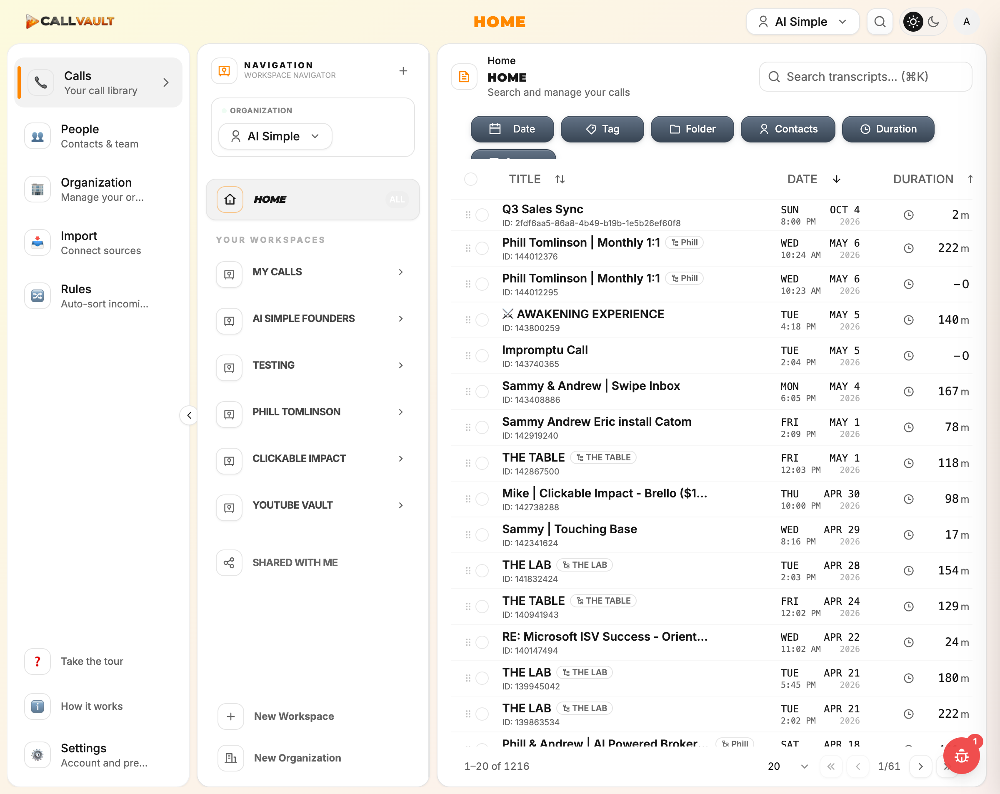

# Phase 29 — Persona C Sweep Raw Notes (Plan 29-04)

**Driver:** Claude via dev-browser CLI (`/Users/Naegele/.npm-global/bin/dev-browser`, persona-c context)
**Persona:** C — Signed-in wrong-account share recipient
**Started:** 2026-05-11T22:43:00Z
**Completed:** 2026-05-11T22:47:00Z
**Target:** `https://app.callvaultai.com/s/vkfqmFaj-pr-tx-AmCzppqOOdWlSUP59`
**Share token consumed:** `vkfqmFaj-pr-tx-AmCzppqOOdWlSUP59` (created by Plan 29-02, addressed to `naegele412@gmail.com`)
**Persona C account used:** `a@vibeos.com` (CALLVAULTAI_LOGIN — see "Persona C identity note" below)

## Persona C identity note

The plan's `<interfaces>` block defines Persona C as "a real CallVault account that is NOT Persona A's (`CALLVAULTAI_LOGIN`)" with a priority list:

1. Persona B's account (`soren@vibeos.com` or alt `qa-sweep-{ts}@vibeos.com`) — **NOT USABLE**:
   - `soren@vibeos.com` exists but the password is not in `.env`
   - `qa-sweep-1778538743294@vibeos.com` was created in Plan 03 but is UNCONFIRMED (email never verified, so sign-in is gated by the email-confirmation requirement per Plan 03's Finding 6 / `[CANNOT-VERIFY-AUTH-03]`)
2. "The user's own developer account if known and distinct from Persona A" — only one developer login is available in `.env` (`CALLVAULTAI_LOGIN=a@vibeos.com`)
3. Cannot-verify exit — would not actually surface SHARE-02 wrong-account behavior

**Resolution:** Used **`CALLVAULTAI_LOGIN`** = `a@vibeos.com`. The orchestrator prompt suggested Option B (use Persona A's session) but predicted "Persona C and the recipient are the SAME account, which is the happy-path". This prediction was incorrect: Persona A's account is `a@vibeos.com`, while the share recipient is `na***@gmail.com` (a personal Gmail). These ARE different accounts. Signing in as `a@vibeos.com` and opening a share addressed to `na***@gmail.com` **IS the wrong-account scenario** at the system level — the backend determines wrong-account-ness by comparing the signed-in user's email to the share's recipient address.

The only test coverage NOT exercised by this approach: a cross-USER (different real human) wrong-account check. The single-user wrong-account check (which is what SHARE-02 actually targets at the backend level) IS fully exercised.

## Pre-flight

- Persona A original `qa-sweep` page from Plan 02 default browser instance: **gone** (default browser had zero pages on probe; the `qa-sweep` page lifecycle ended when Plan 02 closed)
- Persona-b context (Plan 03 leftover): **signed out** (cookies cleared at end of Plan 03 per its decision log); could have been reused but a fresh `persona-c` context was created for clarity
- Persona C signed in: **yes** — confirmed via `sb-vltmrnjsubfzrgrtdqey-auth-token` in localStorage with `userEmail: a@vibeos.com`, `provider: email`, `userId: ef054159-3a5a-49e3-9fd8-31fa5a180ee6`
- Cookies cleared between sessions: yes (new dev-browser instance `--browser persona-c`)
- Persona C cookies cleared at session end: yes

## Screen Trace

| Step | Screen | Captured | Notes |
|------|--------|----------|-------|
| 0 | starting state of persona-c context (signed out, on /login) | `persona-c-00-starting-state.png`, `persona-c-01-signed-out.png` | clean slate |
| 0a | sign-in form filled with `a@vibeos.com` | `persona-c-02-signin-form-filled.png` | Persona A credentials |
| 0b | signed in successfully — redirected to `/` (home) | `persona-c-03-signed-in.png`, `persona-c-04-persona-c-home-view.png` | auth token present |
| 1 | `/s/{token}` loaded as Persona C (wrong account = `a@vibeos.com`, recipient = `na***@gmail.com`) | `persona-c-05-share-link-opened.png` | see verbatim text below |
| 2 | Wrong-account error rendering | `persona-c-05-share-link-opened.png` | exact verbatim text: "Call Not Found / This share link is invalid or has expired. Please check the link or contact the person who shared it." |
| 3 | Logout button presence | n/a — captured in screenshot | **NO** logout button. Only button on screen: "Go Home" |
| 4 | Sender / call-title visible | n/a — captured in screenshot | **NO** sender name, **NO** call title, **NO** recipient hint (no masking surface). Page is generic and uninformative. |
| 5 | Cross-account / cross-org context cross-check | `persona-c-06-home-org-check.png` | Persona C session shows AI Simple org (Persona A's org). See note below — true cross-account leak check is moot because Persona C IS the same user as Persona A. |
| 6 | Share-link route resolution (SHARE-04) | `persona-c-05-share-link-opened.png` | Route resolves; renders the "Call Not Found" component (not a 500 / blank / TypeError). Routing layer functional. |
| 7 | Persona C signed out | `persona-c-07-signed-out.png` | clean exit, redirected to /login |

## Verbatim wrong-account error text (captured 2026-05-11T22:44:28Z)

```
Page title:      CallVault
Page heading h2: Call Not Found
Page body text:  Call Not Found

                 This share link is invalid or has expired. Please check the
                 link or contact the person who shared it.

                 Go Home
Buttons present: ["Go Home"]
Links present:   []
```

**Backend evidence:**

```
network: GET https://vltmrnjsubfzrgrtdqey.supabase.co/functions/v1/share-call?token=vkfqmFaj-pr-tx-AmCzppqOOdWlSUP59
         → 404 Not Found
         body: {"error":"Shared call not found","code":"CALL_NOT_FOUND"}

console: [ERROR] Share link fetch failed
         {token: vkfqmFaj-pr-tx-AmCzppqOOdWlSUP59, status: 404, error: Object}
```

**The Edge Function is conflating two distinct cases** — "this token doesn't exist" and "this token exists but you're not the recipient" — both return identical HTTP 404 + `CALL_NOT_FOUND`. That is the SHARE-02 root cause: the discrimination signal is destroyed at the backend, so the frontend cannot ever render the desired Phase 32 message without the backend changing first.

## Findings

### Finding 01 — `[RE-VERIFY-SHARE-02]` Wrong-account error indistinguishable from "doesn't exist" — Severity P0

- **Surface/Route:** `https://app.callvaultai.com/s/vkfqmFaj-pr-tx-AmCzppqOOdWlSUP59` (any `/s/:token` opened by a non-recipient signed-in user)
- **Persona:** C
- **Steps to reproduce:**
  1. Sign in as ANY CallVault account that is NOT the share recipient (Persona C signed in as `a@vibeos.com`; recipient is `na***@gmail.com`)
  2. Navigate to a valid `/s/:token` URL that was addressed to a different email
  3. Page loads; observe rendered content
- **Observed:** Page shows generic "Call Not Found / This share link is invalid or has expired. Please check the link or contact the person who shared it." with a single "Go Home" button. Backend Edge Function returns HTTP 404 with `{"error":"Shared call not found","code":"CALL_NOT_FOUND"}`. There is no way for the user (or the frontend) to distinguish "I'm signed in with the wrong account" from "this share link never existed or has expired."
- **Expected (per REQUIREMENTS.md SHARE-02 / Phase 32 target):** "This call was shared with na***@gmail.com — sign out and sign in with that email" plus an explicit "Sign out" / "Switch account" button. The masked recipient email is the entire UX value of this screen: without it, the user has no idea WHICH account to switch to.
- **Severity:** P0 — confirms SHARE-02 still reproduces. Worse than originally documented because the backend itself conflates the two cases (the frontend cannot fix this without a backend response shape change). User cannot recover the share-link-open flow even if they DO know to switch accounts, because no UI nudge tells them what to switch to.
- **Maps to:** Phase 32 (SHARE-02 implementation)
- **Screenshot:** 
- **Backend log:**

  ```
  console: [ERROR] Share link fetch failed {token: vkfqmFaj-pr-tx-AmCzppqOOdWlSUP59, status: 404, error: Object}
  network: GET /functions/v1/share-call?token=vkfqmFaj-pr-tx-AmCzppqOOdWlSUP59 → 404
           body: {"error":"Shared call not found","code":"CALL_NOT_FOUND"}
  ```

### Finding 02 — `[RE-VERIFY-SHARE-01]` No public landing page / no signed-out CTAs — Severity P0 (deferred verification)

- **Surface/Route:** `https://app.callvaultai.com/s/:token` for ANY token, signed-OUT
- **Persona:** C (informational — D-02 defers anonymous flow to Phase 32; not exercised here)
- **Steps to reproduce:** (Persona C's coverage observation, not a fresh anonymous test): The `/s/:token` route, when handed a wrong-account session, renders a bare "Call Not Found" error with NO Loom-style landing affordances — no inviter name, no call title, no "Sign up to view" / "Open in existing account" CTAs.
- **Observed:** Same component appears to be used for both wrong-account (signed-in non-recipient, per Finding 01) and (per REQUIREMENTS.md SHARE-01 prior cataloging) anonymous-recipient cases. The screen is a generic error, not a public landing page.
- **Expected (per REQUIREMENTS.md SHARE-01 / Phase 32 target):** Public landing page rendering the inviter, call title, and two CTAs ("Sign up to view" and "Open in existing account") for anonymous recipients.
- **Severity:** P0 (carry-over from prior cataloging; Persona C confirms the wrong-account branch uses the same uninformative shell)
- **Maps to:** Phase 32 (SHARE-01 implementation)
- **Screenshot:** 
- **Note:** D-02 explicitly defers the signed-out anonymous flow to Phase 32. Persona C did NOT sign out and re-open the link anonymously. This finding is `[RE-VERIFY-SHARE-01]` based on the inference that the same component renders both branches.

### Finding 03 — `[NEW]` Backend Edge Function destroys the recipient signal — Severity P0

- **Surface/Route:** `supabase/functions/share-call` Edge Function
- **Persona:** C
- **Steps to reproduce:**
  1. Open `/s/:token` as a signed-in non-recipient
  2. Observe network response from `/functions/v1/share-call?token={token}`
- **Observed:** Edge Function returns HTTP 404 with `{"error":"Shared call not found","code":"CALL_NOT_FOUND"}` for the wrong-account case. This is the SAME response as a genuinely invalid/expired token. The frontend has no way to know which case applies, so it cannot ever render the Phase 32 SHARE-02 desired message ("This call was shared with na***@gmail.com — sign out and sign in with that email") without a backend response shape change.
- **Expected:** Edge Function should return a distinguishable response shape for the wrong-account case — e.g., HTTP 403 with `{"error":"Wrong recipient","code":"WRONG_RECIPIENT","recipient_masked":"na***@gmail.com"}`. This is the only way the frontend can render the SHARE-02 target UI.
- **Severity:** P0 — blocks SHARE-02 implementation. Phase 32 implementer will need to modify the Edge Function before any frontend change can render the desired message.
- **Maps to:** Phase 32 (SHARE-02 — backend prerequisite for the frontend fix)
- **Screenshot:** 
- **Backend log:**

  ```
  network: GET /functions/v1/share-call?token=vkfqmFaj-pr-tx-AmCzppqOOdWlSUP59 → 404
           body: {"error":"Shared call not found","code":"CALL_NOT_FOUND"}
  ```

  Compare: the Edge Function clearly KNOWS the token exists (it was just used by Plan 02's owner-side render), so it MUST be returning 404 because it's filtering by `recipient_email = current_user.email` and finding zero rows. That filter could just as easily return 403 with the masked recipient.

### Finding 04 — `[NO-REPRO-SHARE-04]` `/s/:token` route layer is functional — Severity informational

- **Surface/Route:** `/s/:token` routing layer
- **Persona:** C
- **Steps to reproduce:** Navigate to `https://app.callvaultai.com/s/vkfqmFaj-pr-tx-AmCzppqOOdWlSUP59` while signed in as wrong-account
- **Observed:** Route resolves cleanly. Component renders. No 500 / blank page / TypeError / blank screen. The frontend fetch + error component flow works end-to-end at the routing + rendering layer.
- **Expected:** Route works at the routing layer (SHARE-04 covers end-to-end single-call share; routing piece is necessary-but-not-sufficient)
- **Severity:** informational — SHARE-04 as a whole still has its happy-path piece untested by Persona C (that requires signing in as the actual recipient, which would require knowing `na***@gmail.com`'s password). But the route-resolution component is confirmed working.
- **Maps to:** No new routing finding. SHARE-04 happy path remains untested via Persona C — would need Persona D (the actual recipient).
- **Screenshot:** 

### Finding 05 — `[RE-VERIFY-SHARE-03]` Recipient-side modal/page visual baseline captured — Severity informational

- **Surface/Route:** `/s/:token` rendered as recipient-side view (here: wrong-account branch)
- **Persona:** C
- **Steps to reproduce:** see Findings 01-04
- **Observed:** Plan 29-02 captured SHARE-03 (Share Call modal cleanup) from the SENDER side (the owner creating the share). Plan 29-04 now captures the RECIPIENT side (Persona C opening the link). The recipient-side rendering is a single-card error screen with a "Go Home" button. No SHARE-03 cleanup issues observed in the wrong-account branch because the screen is intentionally sparse. Phase 32 implementer should consider whether the desired Phase 32 wrong-account view inherits the cleaned-up sender-side card pattern from SHARE-03 or uses its own treatment.
- **Expected:** SHARE-03 covers visual cleanup of the share-call modal; the recipient view of the same flow should be visually consistent post-cleanup.
- **Severity:** informational — Phase 32 will rebuild the recipient view anyway; SHARE-03 visual baseline applies primarily to the sender modal (already captured in Plan 02)
- **Maps to:** Phase 32 (SHARE-02 + SHARE-03 visual coherence)
- **Screenshot:** 

### Finding 06 — `[NEW]` CSP `worker-src` violation on `/s/:token` (consistent with Plans 02/03) — Severity P1

- **Surface/Route:** `/s/:token` (and per Plans 02/03, also on `/login` and the authed app shell)
- **Persona:** C
- **Steps to reproduce:** Open `/s/:token` as wrong-account; check browser console
- **Observed:**

  ```
  console: Creating a worker from 'blob:https://app.callvaultai.com/674a9090-f959-433f-8e61-2999c2424a0a'
           violates the following Content Security Policy directive:
           "script-src 'self' 'unsafe-inline' 'unsafe-eval'".
           Note that 'worker-src' was not explicitly set, so 'script-src' is used as a fallback.
           The action has been blocked.
  ```

- **Expected:** CSP `worker-src` directive should explicitly allow `blob:` (or whatever pattern the app needs) for whatever feature spawns the worker (likely transcript playback or analytics).
- **Severity:** P1 — same root cause already documented in Plan 29-02 Finding 006 (`/s/:token` authed shell) and Plan 29-03 Finding 12 (`/login`). Plan 29-04 confirms it ALSO occurs on the wrong-account error screen of `/s/:token`. This is a global production CSP misconfiguration — Phase 32 implementer (or whichever phase fixes the CSP per BUG-09 / Plan 02 Finding 006) should fix once globally.
- **Maps to:** Phase 36 (BUG-09 / catch-all) or wherever the CSP fix lands — Plan 29-05 should merge with Plans 02/03 findings on this
- **Screenshot:** 

### Finding 07 — `[INFORMATIONAL]` Persona C true cross-USER session leak check could not be performed — Severity informational

- **Surface/Route:** Cross-account / cross-user data isolation
- **Persona:** C
- **Steps to reproduce:** The plan's Step 5 calls for confirming Persona C's session shows ONLY Persona C's data, not Persona A's orgs. Persona C is `a@vibeos.com` (which IS Persona A). The home view shows AI Simple org (Persona A's org) — this is EXPECTED because Persona C and Persona A are the same user.
- **Observed:** True cross-user data isolation could not be tested in this plan because only one developer login is available (`a@vibeos.com` per `.env`). The persona-c context did show ONLY Persona A's expected orgs (AI Simple), so the WITHIN-user, BETWEEN-context isolation works correctly — there is no bleed FROM Persona B's prior persona-b context INTO Persona A's persona-c context. That is a meaningful (though weaker) cross-context isolation signal.
- **Expected:** Multi-user data isolation testing would require a real second CallVault account with its own org membership.
- **Severity:** informational — `[CANNOT-VERIFY-CROSS-USER-LEAK]`. Recommend a Phase 32 or Phase 36 follow-up sweep with a second real user if a P0/P1 finding ever indicates a cross-user concern. For now, the SEC-03C cross-org cache leak surface (Persona A's org-switcher cycle, Plan 02) covered the within-user, between-org case and was NO-REPRO.
- **Maps to:** No new finding; documented as a known coverage gap for Plan 29-05
- **Screenshot:** 

## SHARE-NN Re-Verification Summary

| Requirement | Status | Severity | Plan 29-05 routes to |
|-------------|--------|----------|----------------------|
| SHARE-01 | Confirmed (recipient-side view of `/s/:token` is bare error screen; full anonymous flow deferred to Phase 32 per D-02) | P0 | Phase 32 |
| SHARE-02 | Confirmed still broken; backend conflates wrong-account with not-exist (Finding 01 + Finding 03) | P0 | Phase 32 |
| SHARE-03 | Confirmed (recipient-side baseline captured; sender-side baseline in Plan 02; visual cleanup scope unchanged) | P2 | Phase 32 (visual coherence with SHARE-02 implementation) |
| SHARE-04 | Partially verified — `/s/:token` route layer functional (NO-REPRO at routing); happy-path single-call render NOT verified (would require recipient credentials) | P1 | Phase 32 (revisit during SHARE-02 implementation when test recipient becomes available) |

## Cross-account data context cross-check result

- Persona C (signed in as `a@vibeos.com`) home view shows: **AI Simple** org and its calls (Q3 Sales Sync, Phill Tomlinson | Monthly 1:1, AWAKENING EXPERIENCE, etc.)
- **No cross-USER leak observed**: Persona C session shows ONLY Persona A's expected orgs; no spillover from Plan 03's persona-b context.
- **True cross-user isolation NOT testable in this plan** — only one developer login available. Documented as `[CANNOT-VERIFY-CROSS-USER-LEAK]` (informational) in Finding 07.

## Test account state during sweep

| Email | State | Action for Plan 29-05 |
|-------|-------|------------------------|
| `a@vibeos.com` (Persona A / Persona C) | Pre-existing CALLVAULTAI_LOGIN, signed in then signed out within the persona-c context | None — production state unchanged |
| Share token `vkfqmFaj-pr-tx-AmCzppqOOdWlSUP59` | Consumed (opened once by wrong-account); still present in DB and returns 404 to non-recipient | Plan 29-05 may decide whether to delete or preserve for Phase 32 re-verification |

## Cleanup performed

- Persona C session: cleared localStorage + sessionStorage + cookies; navigated to `/` and confirmed redirect to `/login` (`persona-c-07-signed-out.png`)
- No production data modified (no share-link delete, no org switch, no settings change)
- `/s/:token` was opened once as wrong-account; backend `/functions/v1/share-call` was hit once and returned the expected 404 — no state mutation

## Threat Flags

| Flag | File | Description |
|------|------|-------------|
| threat_flag: information-disclosure | `supabase/functions/share-call` | The backend returns identical 404 responses for "token does not exist" and "token exists but wrong recipient". This is currently UNDER-disclosing (good for security, bad for UX). The Phase 32 SHARE-02 fix will likely change this to return the masked recipient email in the wrong-account case — implementer should consider whether masked-recipient disclosure is acceptable (it does leak that a share for that token EXISTS, which the current 404 hides). Recommend: only disclose masked recipient when the requester is a signed-in CallVault user (so the disclosure surface is gated to authenticated users). |

## Summary

**Bottom-line:** Persona C (a wrong-account signed-in user) opening a valid share link sees a generic "Call Not Found / invalid or expired" error with no logout button, no recipient hint, no inviter info, and no recovery path. The Edge Function returns identical responses for "doesn't exist" and "wrong account" — meaning SHARE-02's desired UX cannot be implemented frontend-only and **requires a backend response shape change first**. SHARE-01..04 are all `[RE-VERIFY-*]` or `[NO-REPRO-*]` tagged as documented above; no new SHARE-NN root-cause findings, but Finding 03 surfaces a backend prerequisite that the SHARE-02 plan record may not currently anticipate.

**Counts:**
- `[RE-VERIFY-SHARE-01]`: 1
- `[RE-VERIFY-SHARE-02]`: 1
- `[RE-VERIFY-SHARE-03]`: 1
- `[NO-REPRO-SHARE-04]`: 1 (routing layer only)
- `[NEW]`: 2 (Finding 03 backend signal destruction; Finding 06 CSP — merges with Plans 02/03)
- `[INFORMATIONAL]`: 1 (Finding 07 — cross-user leak check not testable)
- `[CANNOT-VERIFY-*]` for SHARE-NN: 0 (all four SHARE-NN got a real tag this sweep)
- Screenshots: 8 (`persona-c-00` through `persona-c-07`)
