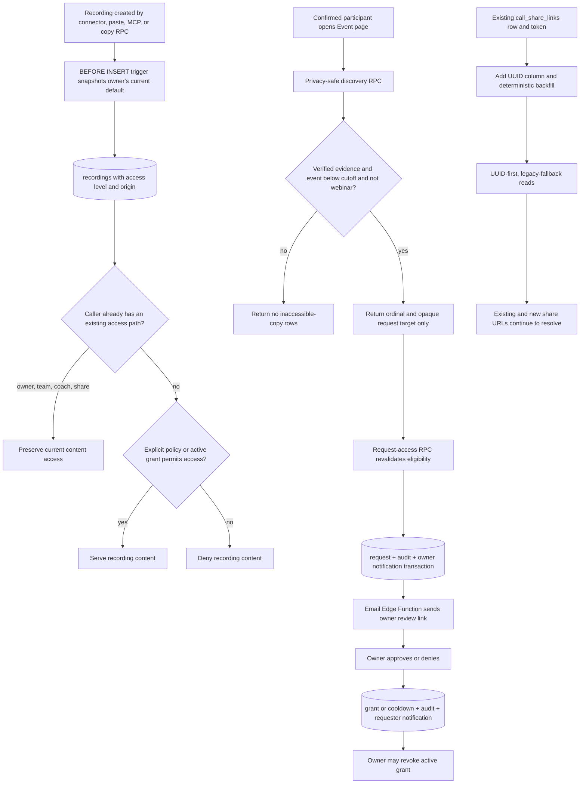

# Phase 38: Access Policy, Share-Link Key Migration, Request Flow - Research

**Researched:** 2026-09-19  
**Domain:** PostgreSQL/Supabase authorization, UUID compatibility migration, privacy-safe discovery, React access-management UI  
**Confidence:** HIGH

<user_constraints>
## User Constraints (from CONTEXT.md)

### Locked Decisions

### Recording access
- **D-01:** New recordings are Private by default. Existing explicit team access and existing share links continue to work.
- **D-02:** A recording has one access level: Private, Attendees, Invitees, Organization, Anyone with link, or Public.
- **D-03:** Settings provides an account-wide default under Privacy & Access. Its initial value is Private, and each new recording inherits the current default.
- **D-04:** A recording owner can override the inherited default for an individual recording.
- **D-05:** Changing the account default affects future recordings only. Existing recordings retain their current policy.
- **D-06:** Only the recording owner can change that recording's access level.

### Participant discovery
- **D-07:** A confirmed participant may see inaccessible copies of the same meeting as anonymous numbered rows, each with a Request access action.
- **D-08:** An inaccessible row never reveals the recording owner, provider, title, transcript, or summary.
- **D-09:** Discovery is limited to confirmed participants supported by verified participation evidence. Calendar invitees and organization membership alone do not qualify.
- **D-10:** Participant discovery is disabled for provider-identified webinars and events with at least 50 confirmed participants.
- **D-11:** For those large events, access is possible only through a direct invitation or share link.

### Request and approval flow
- **D-12:** A request creates a persistent in-app notification for the owner and sends an email with a direct review link.
- **D-13:** The review shows the requester's name, verified email, meeting title and date, and the evidence connecting the requester to the meeting.
- **D-14:** A request does not include a free-form message.
- **D-15:** An approval remains active until the recording owner revokes it.
- **D-16:** Approvals, denials, and revocations are logged.
- **D-17:** A denied requester receives a notification without a private denial reason and must wait 30 days before requesting the same recording again.

### Settings presentation
- **D-18:** The account-wide default lives in Settings > Privacy & Access.
- **D-19:** The recording page has an Access button beside Share. It opens a compact panel containing the access level, active grants, pending requests, and revocation controls.
- **D-20:** The panel always displays: “This controls your recording only. Other attendees control their own copies.”
- **D-21:** Selecting Public requires confirmation.
- **D-22:** Inherited policies display “Using default: [level].” Overrides display “Custom” and provide Reset to default.

### the agent's Discretion
- Choose additive schema, RLS, RPC, service, hook, component, and email implementation details that satisfy the locked behavior and repository constraints.
- Choose internal names and the precise compact-panel composition while preserving the labels and controls above.
- Write concise notification and email copy consistent with CallVault's brand rules.
- Choose a safe UUID migration or compatibility bridge for `call_share_links`; existing tokens and current access paths must keep working.

### Deferred Ideas (OUT OF SCOPE)

None — discussion stayed within phase scope.
</user_constraints>

<phase_requirements>
## Phase Requirements

| ID | Description | Research Support |
|----|-------------|------------------|
| ACCESS-01 | Recording policy supports private, attendees, invitees, organization, link, and public. | Add a constrained policy column, origin marker, owner-only RPCs, and a centralized read predicate. |
| ACCESS-02 | Confirmed participants can see event existence metadata independently of recording content. | Use verified identity aliases plus confirmed participation evidence; expose only an event-safe RPC projection. |
| ACCESS-03 | Content remains denied unless an existing or explicit policy path permits it. | Preserve current RLS paths and add narrowly scoped predicates; never authorize recording content through event membership alone. |
| ACCESS-04 | A participant can see anonymous other-copy rows without owner or content disclosure. | Return an ordinal and opaque/requestable recording reference from a server-side RPC, with no protected columns. |
| ACCESS-05 | A participant can request access; the owner can grant, deny, revoke, and the lifecycle is logged. | Add request, grant, audit, notification, and idempotent owner mutation RPCs with a 30-day denial cooldown. |
| ACCESS-06 | The UI states that a policy applies only to this copy. | Implement the approved settings and compact Access panel contract, including the exact notice. |
| ACCESS-07 | Share links use recording UUIDs directly or through a bridge. | Use an expand/backfill/dual-read bridge that preserves every existing row and token. |
| ACCESS-08 | Existing share tokens, coach access, and team access continue unchanged. | Keep legacy identifiers during the phase, make RLS additions additive, and regression-test each current access path. |
| ACCESS-09 | Discovery is disabled for provider webinars and events with at least 50 confirmed participants. | Normalize explicit provider webinar evidence and enforce the cutoff inside both discovery and request RPCs. |
| EVT-06 | Cross-organization copy and routing preserve `event_id`. | Redefine all current copy/routing functions so each recording INSERT carries `v_source.event_id`; prove with real-DB tests. |
</phase_requirements>

## Summary

Phase 38 should be implemented as an additive authorization layer around `recordings`, followed by an expand/backfill/dual-read bridge for `call_share_links`. The repository currently stores share-link ownership through `call_share_links.call_recording_id BIGINT` and resolves it against `recordings.fathom_provider_id`; frontend and MCP callers still coerce recording IDs to numbers. Existing share tokens must therefore remain on their existing rows while a nullable UUID foreign key is added and backfilled. The numeric key must remain during this phase as a compatibility field. [VERIFIED: repository migration and source audit]

The privacy boundary belongs in PostgreSQL RPCs and RLS, not in client filtering. A caller qualifies for anonymous other-copy discovery only when a verified identity alias matches confirmed participation evidence. Calendar invitation and organization membership alone are insufficient. Discovery and request creation must independently enforce the provider-webinar rule and the `>= 50` confirmed-participant cutoff, and their result shape must omit owner, provider, title, transcript, summary, and raw evidence. [VERIFIED: Phase 38 CONTEXT.md and UI-SPEC.md]

The account default must be snapshotted by a database `BEFORE INSERT` trigger on `recordings`. This is the only code-independent interception point shared by connector ingestion, paste/MCP ingestion, and SQL copy/routing functions. A setting change then naturally affects future rows only. Per-recording owner RPCs set the custom/default-origin state and write audit data. [VERIFIED: repository ingest and data-movement source audit]

**Primary recommendation:** Ship Phase 38 in expand-contract order: additive schema and trigger, deterministic backfills, UUID dual-read compatibility, locked-down RPC/RLS functions, service/hook/UI integration, then production migration and Edge Function deployment with pre/post-deploy probes.

## Architectural Responsibility Map

| Capability | Primary Tier | Secondary Tier | Rationale |
|------------|--------------|----------------|-----------|
| Account default snapshot | Database / Storage | API / Backend | A recording INSERT trigger covers every ingest path and makes the snapshot atomic. |
| Per-recording policy update | Database / Storage | Frontend | Owner-only RPC validates transitions; UI presents the state. |
| Recording authorization | Database / Storage | API / Backend | RLS and security-definer helpers are the authoritative boundary. |
| Anonymous other-copy discovery | Database / Storage | Frontend | RPC filters participation and returns a privacy-minimized projection; UI only renders rows. |
| Request/grant/deny/revoke | Database / Storage | API / Backend | Transactional RPCs own lifecycle state and audit; Edge Function owns email delivery. |
| In-app notification | Database / Storage | Frontend | Persistent row is created with the lifecycle transaction and rendered by the existing notification UI. |
| Owner/requester email | API / Backend | External email provider | Authenticated Edge Function builds trusted content and sends through the existing Resend integration. |
| Share-link UUID bridge | Database / Storage | API / Backend | Schema/backfill preserve tokens; Edge Function and MCP perform UUID-first, legacy-fallback reads. |
| Access settings and panel | Browser / Client | Database / Storage | React renders the approved contract through services and TanStack Query hooks. |
| Cross-org `event_id` retention | Database / Storage | API / Backend | The copy/routing PostgreSQL functions perform the INSERT and must carry the field. |

## Project Constraints (from AGENTS.md)

- Work remains on `v2.2-event-resolution`; production frontend deploys only when `main` is deliberately pushed. The v2.2 completion plan separately authorizes required additive production Supabase changes. [VERIFIED: AGENTS.md, STATE.md, V2.2-COMPLETION-PLAN.md]
- Use npm only. The locked frontend stack is React 18, Vite 5, React Router v6, TanStack Query, Zustand v5, Tailwind, shadcn/ui, Remix Icons, and `motion/react`; Lucide, FontAwesome, `framer-motion`, pnpm, bun, and yarn are banned. [VERIFIED: AGENTS.md]
- Services are pure async TypeScript, hooks are TanStack Query wrappers, and components do not call Supabase or services directly. [VERIFIED: AGENTS.md and src/CLAUDE.md]
- Recording identifier conversion may use only `toRecordingUuid()` / `toRecordingUuidBatch()` at UUID/BIGINT boundaries; `parseInt`, `Number`, and string coercion are forbidden for recording identity. [VERIFIED: AGENTS.md]
- All mutations that affect call lists call `invalidateCallListCaches(queryClient)` in `onSettled`. [VERIFIED: AGENTS.md]
- Edge Functions authenticate with `authenticateRequest(req, supabase, corsHeaders)` from `_shared/auth.ts`; do not duplicate auth code. [VERIFIED: AGENTS.md and supabase/CLAUDE.md]
- Integration tests use the real dedicated test Supabase project and must reject the production project reference. Supabase may not be mocked. [VERIFIED: AGENTS.md and repository integration-test helper]
- Database changes are additive migrations. Deploy Edge Functions with `supabase functions deploy <name> --use-api`; Docker is not used. [VERIFIED: AGENTS.md and supabase/CLAUDE.md]
- MCP results remain `content[].text` markdown. `mcp-server` remains one Edge Function with internal tool modules. [VERIFIED: AGENTS.md]
- UI copy follows “AI-ready, not AI-powered” and the One-Click Promise. [VERIFIED: AGENTS.md]
- Build claims, deployment claims, and test claims require fresh command or endpoint evidence. [VERIFIED: AGENTS.md]

## Standard Stack

No new package is required. Keep the lockfile versions and existing utilities. [VERIFIED: package.json and npm dependency tree]

### Core

| Library / system | Installed version | Purpose | Why Standard |
|------------------|-------------------|---------|--------------|
| PostgreSQL through Supabase | hosted project / CLI 2.101.0 | Schema, constraints, triggers, RLS, transactional RPCs | Existing data and authorization platform. [VERIFIED: repository configuration] |
| `@supabase/supabase-js` | 2.90.1 | Typed service calls and Edge Function database access | Existing client; no phase-specific upgrade required. [VERIFIED: npm dependency tree] |
| `@tanstack/react-query` | 5.90.16 | Query/mutation lifecycle and cache invalidation | Existing hook boundary and optimistic-update pattern. [VERIFIED: npm dependency tree] |
| React | 18.3.1 | Settings, discovery rows, Access panel, owner review | Locked frontend stack. [VERIFIED: npm dependency tree and AGENTS.md] |
| Zod | 3.25.76 | Edge Function request validation | Existing validation library used in Edge Functions. [VERIFIED: npm dependency tree and source audit] |

### Supporting

| Library / system | Installed version | Purpose | When to Use |
|------------------|-------------------|---------|-------------|
| Vite | 5.4.21 | Production build | Full frontend verification. [VERIFIED: npm dependency tree] |
| Vitest | 4.0.16 | Unit and real-DB integration tests | Service, hook, RLS, migration, and Edge Function tests. [VERIFIED: npm dependency tree] |
| Playwright | 1.57.0 | Browser verification | Desktop/mobile UI, deep links, keyboard and focus behavior. [VERIFIED: npm dependency tree] |
| Resend via existing Edge Function pattern | existing integration | Owner/requester email | Send trusted server-built access emails after the DB transaction. [VERIFIED: `send-org-invite` and email-verification source audit] |

### Alternatives Considered

| Instead of | Could Use | Tradeoff |
|------------|-----------|----------|
| Recording INSERT trigger | Patch every ingest caller | Caller patching is easy to miss and cannot enforce direct SQL/RPC inserts; do not use it as the primary mechanism. |
| Expand/backfill/dual-read bridge | Destructive BIGINT replacement | A direct replacement can orphan existing share rows and tokens and prevents safe rollback. |
| RPC-only discovery projection | Client query plus filtering | Client filtering retrieves forbidden fields and creates a disclosure boundary in untrusted code. |
| Database transaction plus email follow-up | Client inserts notification and emails | Client orchestration can forge recipients/evidence and cannot make request/audit state atomic. |

**Installation:** none.

## Package Legitimacy Audit

This phase installs no external package, so the package-legitimacy gate is not applicable. Existing lockfile dependencies remain unchanged. [VERIFIED: recommended design and package audit]

## Current-State Findings

### Share links are still on a legacy recording key

- `call_share_links` was created with `call_recording_id BIGINT`; generated Supabase types contain no UUID recording foreign key. [VERIFIED: `20260108000001_create_single_call_share_tables.sql` and `src/types/supabase.ts`]
- `useSharing.ts` and `ShareCallDialog.tsx` convert string recording IDs using `parseInt`, and `share-call` resolves a link through `recordings.fathom_provider_id`. [VERIFIED: frontend and Edge Function source audit]
- MCP create/list tools also use `fathom_provider_id`; the create tool cannot link a non-Fathom recording. [VERIFIED: MCP source audit]
- The existing Shared With Me RPC/UI surface returns the legacy numeric ID and leaves the canonical UUID empty. [VERIFIED: migration and Transcripts UI source audit]
- MCP share creation currently formats `/shared/<token>` while the application route and dialog use `/s/<token>`; Phase 38 must normalize this and add a route regression test. [VERIFIED: MCP and router source audit]

### Participation evidence exists, but writers do not populate the final semantics

- `recordings.event_id`, `call_participants.event_id`, `call_participants.role`, and `call_participants.has_confirmed_speech` exist. [VERIFIED: generated types and Phase 37 migrations]
- Calendar invitees are inserted with `sources=['calendar_invitees']`; transcript speakers are inserted with transcript evidence, but the audited writer does not consistently set `role` or `has_confirmed_speech`. [VERIFIED: connector pipeline source audit]
- The dedicated test project contained 5,015 recordings but no recording event links, confirmed-speech participant rows, or populated participant roles at research time. Tests must therefore create explicit Phase 38 fixtures. [VERIFIED: dedicated test Supabase aggregate query on 2026-09-19]
- `user_participates_in_event` is broader than D-09 because it can match an email without requiring verified caller identity and confirmed evidence. Do not reuse it as the access-discovery authorization predicate. [VERIFIED: current migration definition and Phase 38 D-09]

### Copy/routing functions drop `event_id`

The latest definitions of `copy_recording_to_org`, `copy_recording_to_organization`, and `route_recording_cross_org` omit `event_id` from their recording INSERT lists. All three definitions must be updated together because later migrations replace earlier function bodies. [VERIFIED: `20260730160000_fix_cross_org_copy_dedup.sql` and migration history]

### Existing access paths are broader than owner-only storage

Current recording reads include owner, organization-admin, and workspace/team membership paths, while recording updates are owner-scoped. Phase 38 must add policy access without deleting these read paths. Coach tables and share links still contain legacy-key dependencies that require regression proof. [VERIFIED: current recording, workspace, coach, and share migrations]

## Architecture Patterns

### System Architecture Diagram



### Recommended Project Structure

```text
supabase/migrations/
├── *_phase38_access_policy_schema.sql       # enum/checks, default trigger, request/grant/audit tables
├── *_phase38_access_policy_rls_rpcs.sql     # helpers, RLS, discovery and lifecycle RPCs
├── *_phase38_share_link_uuid_bridge.sql     # nullable UUID, backfill, indexes, compatibility RPC
└── *_phase38_copy_event_preservation.sql    # all current copy/routing definitions
supabase/functions/
├── recording-access/index.ts                # trusted email dispatch/retry boundary
├── share-call/index.ts                      # UUID-first, legacy-fallback behavior
└── mcp-server/tools/{read,write}/            # UUID-safe share operations
src/services/
├── access-policy.service.ts
├── recording-access.service.ts
└── sharing.service.ts
src/hooks/
├── useAccessPolicy.ts
├── useRecordingAccess.ts
└── useSharing.ts
src/components/
├── settings/PrivacyAccessSettings.tsx
├── sharing/RecordingAccessPanel.tsx
└── events/OtherRecordingCopies.tsx
```

File names may follow nearby repository conventions, but the database/service/hook/component boundaries should remain as shown. [VERIFIED: repository conventions and approved UI contract]

### Component Responsibilities

| Component | Responsibility | Must not do |
|-----------|----------------|-------------|
| Recording default trigger | Snapshot the owner's current setting on every INSERT | Read browser state or require each caller to send a default |
| Authorization helpers/RLS | Decide whether a caller may read recording content | Return discovery metadata or trust a client-supplied user ID |
| Discovery RPC | Validate verified participation/cutoff and return the minimal anonymous shape | Return a general `recordings` row |
| Lifecycle RPCs | Request, approve, deny, revoke, audit, and create in-app notification atomically | Send email inside the database transaction |
| Email Edge Function | Authenticate, load trusted data, send/retry email | Accept owner address, meeting title, or evidence from the browser |
| Access services | Typed Supabase/RPC calls only | Import React or manage component state |
| TanStack hooks | Query keys, optimistic state, rollback, invalidation | Contain raw policy SQL or bypass services |
| React surfaces | Render the approved settings/panel/discovery/review contract | Filter protected records client-side |
| Share compatibility layer | UUID-first writes/reads with legacy fallback | Generate replacement tokens or drop the BIGINT key |

### Pattern 1: Snapshot the account default at INSERT

Add `user_settings.default_recording_access_level` with `private` as the default. Add constrained `recordings.access_level` and `recordings.access_policy_origin` (`default` or `custom`). Backfill existing recordings to `private/default`, then make the level non-null. A `BEFORE INSERT` trigger reads the owner setting and assigns it, falling back to `private` when no settings row exists. [VERIFIED: D-01 through D-05 and ingest-path audit]

The trigger must apply to copied recordings too. A cross-org copy is a new recording owned in the target account, so it snapshots that target owner's current default while preserving `event_id`. Each copy can then diverge independently. [VERIFIED: D-03, D-20, EVT-06]

### Pattern 2: One centralized content-read predicate

Create a stable helper such as `can_read_recording(p_recording_id uuid, p_user_id uuid)` that composes existing owner/admin/workspace/team/coach/share paths with policy and active-grant paths. Existing RLS policies may remain separate during the phase, but their union must be explicit in tests and no current path may be replaced accidentally. [VERIFIED: current RLS and ACCESS-03/08]

Policy semantics should be:

| Level | New authorization path |
|-------|------------------------|
| Private | None beyond existing paths and active direct grants. |
| Attendees | Verified caller identity plus confirmed attendance/speech/host evidence. |
| Invitees | Verified caller identity plus calendar invitation or stronger evidence. |
| Organization | Active organization membership for the recording's organization. |
| Anyone with link | Valid active share token; do not grant broad table SELECT. |
| Public | A deliberately whitelisted public response surface; do not expose the raw `recordings` row to `anon`. |

Owner/admin/team/coach/share authorization remains additive and independent of the selected level. [VERIFIED: ACCESS-01/03/08]

### Pattern 3: Verified participant evidence

Resolve the caller from `auth.uid()` to an owned identity and verified identity alias, then match that canonical identity/email to `call_participants`. Confirmed evidence may include `has_confirmed_speech=true`, a transcript-speaker source, or provider host/recorded-by evidence. Calendar invitee evidence alone and organization membership alone must not qualify for anonymous discovery. [VERIFIED: identity schema, participant writer audit, D-09]

Forward writers should set normalized roles/evidence: transcript speakers become confirmed speakers, calendar invitees remain invitees, and provider hosts/organizers receive a host/organizer role. A deterministic backfill may promote transcript-speaker and recorded-by evidence already present in stored source fields, but it must never infer confirmed attendance from a calendar invitation. [VERIFIED: existing provenance fields and D-09]

### Pattern 4: Privacy-minimized discovery

Use a security-definer RPC that returns only an ordinal, request state/cooldown state, and an opaque or UUID request target. It must not return owner ID/name, provider, title, transcript, summary, source IDs, or participant roster. It must suppress the entire result when any provider explicitly classifies the event as a webinar or the count of distinct confirmed participant identities is at least 50. Request creation repeats every eligibility check. [VERIFIED: D-07 through D-11]

The UI must never put protected fields in DOM text, accessible names, test IDs, URLs, analytics, or logs. Numbering is presentation-only and must not reveal provider ordering. [VERIFIED: approved UI-SPEC.md]

### Pattern 5: Transactional request lifecycle

Use three tables:

1. `recording_access_requests`: recording, requester, verified-email snapshot, minimal evidence snapshot, status, request/resolution timestamps, resolver, and denial cooldown.
2. `recording_access_grants`: recording, grantee, source request, grantor, created/revoked timestamps, revoker; one active grant per recording/grantee.
3. `recording_access_audit_log`: append-only request/approve/deny/revoke event with actor, target IDs, timestamp, and minimal metadata.

An authenticated requester may read their own request status; a recording owner may read requests, grants, and audit rows for their recording. Clients should not insert lifecycle rows directly. Security-definer RPCs must lock the request row, check `auth.uid()`, validate allowed state transitions, create notifications/audit atomically, and be idempotent under retries. [VERIFIED: D-12 through D-17 and Supabase database-function guidance]

Denial sets a server-calculated 30-day cooldown. The requester notification contains no private denial reason. Approval creates an active grant until `revoked_at` is set; revocation never deletes the audit history. [VERIFIED: D-15 through D-17]

### Pattern 6: Persistent notification first, email second

Commit request, audit, and owner `user_notifications` rows in the database transaction. Then invoke an authenticated Edge Function that loads owner/request/recording data server-side and sends the email through the existing provider pattern. The client must not supply the owner's email, meeting title, or participation evidence. Email failure must not remove the saved request; store a delivery/outbox status so retry is idempotent and duplicate requests do not create duplicate mail. [VERIFIED: existing notification/email code and D-12]

Owner review deep links should use the canonical call route with a request query parameter, preserving the app's current auth `returnTo` behavior. The owner review alone may show the requester's name, verified email, meeting title/date, and evidence; the participant discovery list may not. [VERIFIED: UI-SPEC.md and router audit]

### Pattern 7: Expand/backfill/dual-read share-link bridge

1. Add nullable `call_share_links.recording_id UUID REFERENCES recordings(id) ON DELETE CASCADE` plus an index.
2. Backfill only when `(call_recording_id, user_id)` maps unambiguously to `(recordings.fathom_provider_id, recordings.owner_user_id)`.
3. Permit either UUID or legacy BIGINT during the bridge with a check requiring at least one key.
4. Make every new write use UUID; update `share-call`, MCP create/list, frontend sharing service, and Shared With Me to read UUID first and legacy fallback second.
5. Keep the original row, token, status, recipient, access logs, and numeric key intact.
6. Add a versioned UUID-native Shared With Me RPC; retain the legacy RPC wrapper until there are no legacy-only rows and all callers have moved.
7. Do not drop `call_recording_id` in Phase 38.

This preserves existing URLs and supplies UUID support for non-Fathom recordings. [VERIFIED: current share schema/callers and ACCESS-07/08]

### Pattern 8: Owner-only policy mutations

Use owner-only RPCs for setting a custom level and resetting to the account default. The custom RPC sets `access_policy_origin='custom'`; reset snapshots the owner's current default and sets origin `default`. Changing the account default updates only `user_settings`, never existing recordings. Require explicit UI confirmation before the Public mutation. [VERIFIED: D-03 through D-06 and D-21/22]

### Pattern 9: Preserve `event_id` in every current copy function

The new migration must redefine `copy_recording_to_org(UUID,UUID,UUID,BOOLEAN)`, `copy_recording_to_organization(UUID,UUID)`, and `route_recording_cross_org(UUID,UUID,UUID,BOOLEAN,UUID)` from their latest bodies, adding `event_id` to the target column list and `v_source.event_id` to the SELECT/VALUES list. Do not patch an obsolete historical definition. [VERIFIED: current function signatures and migration history]

### Anti-Patterns to Avoid

- **Client-side discovery filtering:** it fetches protected columns before hiding them and makes leakage likely.
- **Event membership as content permission:** event existence and recording content have deliberately separate boundaries.
- **Invitation as confirmed attendance:** it violates D-09 and exposes copies to no-shows.
- **AI/auto-tag webinar inference:** `WEBINAR` tags are not authoritative provider metadata; use explicit normalized provider evidence.
- **Destructive share-key replacement:** changing or recreating rows can invalidate tokens and logs.
- **Numeric coercion of UUIDs:** existing `parseInt` sharing paths must be removed, not replicated.
- **Broad `anon` SELECT on recordings:** public/link levels need a whitelisted response surface.
- **Client inserts into notifications/audit:** these rows must be produced by trusted transaction code.
- **Email inside the critical DB transaction:** a provider failure would break or duplicate the access lifecycle.
- **Replacing all recording SELECT policies at once:** additive RLS is safer and preserves ACCESS-08 paths.

## Don't Hand-Roll

| Problem | Don't Build | Use Instead | Why |
|---------|-------------|-------------|-----|
| Authentication | Token parsing in each RPC/Edge Function | `auth.uid()` in SQL and shared `authenticateRequest` in Edge Functions | Existing hardened boundary and consistent error behavior. |
| Recording ID conversion | `parseInt`, `Number`, string casts | UUID-native columns and `toRecordingUuid()` / batch helper only where bridging is unavoidable | Prevents UUID/BIGINT mismatches. |
| Authorization transaction | Multiple client-side inserts/updates | PostgreSQL RPC with constraints, row locks, and audit insert | Enforces state transitions atomically. |
| Optimistic mutation rollback | Ad hoc component state | TanStack Query mutation callbacks and query cache | Existing tested lifecycle. [CITED: https://tanstack.com/query/latest/docs/framework/react/guides/optimistic-updates] |
| Email delivery | Browser call to provider API | Existing authenticated Edge Function + Resend pattern | Keeps secrets and recipient lookup server-side. [CITED: https://supabase.com/docs/guides/functions/examples/send-emails] |
| Public data exposure | Raw anonymous table policy | Narrow view/RPC/Edge response with an explicit field allowlist | Prevents accidental transcript/summary leakage. |
| Share-token migration | Token regeneration script | In-place nullable UUID backfill | Existing tokens and audit relationships stay stable. |

**Key insight:** this phase is an authorization migration. Database constraints and server-side projections must make forbidden states and disclosures impossible even when the client is stale, malicious, or retried.

## Runtime State Inventory

| Category | Items Found | Action Required |
|----------|-------------|-----------------|
| Stored data | Production/test `call_share_links` rows may contain only BIGINT keys; existing recordings lack access-level snapshots; participant evidence fields are sparsely populated; access requests/grants do not exist. | Add schema, deterministic backfills, unresolved-row count checks, and test fixtures. Do not regenerate tokens. [VERIFIED: migrations, generated types, test-project aggregates] |
| Live service config | Production Supabase has migrations aligned through `20260910010000`; Edge Functions `share-call` and `mcp-server` must be redeployed explicitly after compatible DB changes. Vercel frontend remains isolated on the feature branch. | Record linked project ref, exact pending migration set, post-migration history, function deployment IDs, and endpoint responses. [VERIFIED: linked migration check and completion plan] |
| OS-registered state | None. No launchd/systemd/browser registration embeds these database keys or policies. | None; verified by architecture and repo deployment model. [VERIFIED: repository deployment documentation] |
| Secrets/env vars | Integration tests use test Supabase URL/keys; one share-call test path currently falls back to production-named environment variables. Resend/Supabase service credentials remain external secrets. | Remove production fallback, require test-only variables, hard-reject the production project ref, and never print secret values. [VERIFIED: integration-test source audit] |
| Build artifacts / installed packages | `src/types/supabase.ts` will be stale after schema changes; generated Vite artifacts do not update schema types. | Regenerate types after applying the migration to the intended project, review the diff, then type-check/build. [VERIFIED: repository scripts and generated type file] |

## Rollout, Backfill, and Rollback

### Migration sequence

1. **Preflight:** verify branch/worktree, clean commit boundary, linked production project ref, remote/local migration alignment, and exact pending migrations. [VERIFIED: V2.2-COMPLETION-PLAN.md]
2. **Schema expansion:** add policy fields/default trigger, lifecycle tables, nullable share UUID, indexes, constraints, functions, and RLS. Avoid column/table drops. [VERIFIED: additive-production policy]
3. **Backfill:** set existing recording policy to private/default; fill UUID share keys only for unique owner-scoped matches; normalize only deterministic participant evidence.
4. **Assertions:** abort if duplicate/ambiguous share mappings exist, if a share row has neither key, or if lifecycle tables lack RLS.
5. **Compatibility deploy:** deploy UUID-first Edge Function/MCP readers while legacy fallback still exists.
6. **Application integration:** services/hooks/UI use UUID-native APIs and approved UI contract on the feature branch.
7. **Post-deploy proof:** old token, UUID-only new token, revoke, wrong recipient, RLS denial, discovery cutoff, lifecycle, copy/routing, migration history, and live endpoint health.

### Rollback design

- Roll application/Edge Function code back to legacy-compatible readers without removing new columns; old rows/tokens remain valid because no row or numeric key was rewritten. [VERIFIED: recommended expand-contract design]
- Disable new policy/discovery/request UI with application rollback while retaining additive DB objects. New restrictive RLS should be rolled back only through a forward migration that restores the previously captured definitions. [VERIFIED: Supabase migration practice]
- Never roll back by dropping a column that may already contain production request/grant data. Use a forward corrective migration. [VERIFIED: additive production policy]
- Keep a pre-migration inventory of row counts, unresolved share mappings, RLS policies, function definitions, and grants so rollback success is measurable.

## Common Pitfalls

### Pitfall 1: Trigger bypass on an ingest path
**What goes wrong:** a new recording has null or caller-specific policy behavior.  
**Why it happens:** policy initialization is added to selected services rather than the table.  
**How to avoid:** non-null DB default plus owner-setting INSERT trigger; test connector, paste/MCP, and copy paths.  
**Warning signs:** code searches show repeated access-level literals in ingest callers.

### Pitfall 2: Discovery leaks through shape or metadata
**What goes wrong:** hidden owner/provider/title data reaches the browser, logs, analytics, or accessible labels.  
**Why it happens:** a broad recording SELECT is filtered in React.  
**How to avoid:** server RPC returns a dedicated minimal composite/table shape; inspect network payload and DOM.  
**Warning signs:** discovery TypeScript types contain recording/owner objects.

### Pitfall 3: Broad participant helper is reused
**What goes wrong:** invitees or organization members discover inaccessible copies.  
**Why it happens:** the existing event-participation helper was designed for event visibility, not D-09.  
**How to avoid:** a Phase 38 helper that requires verified caller identity and confirmed evidence.  
**Warning signs:** eligibility predicate checks only email presence or event membership.

### Pitfall 4: Off-by-one large-event cutoff
**What goes wrong:** a 50-person event remains discoverable.  
**How to avoid:** enforce `confirmed_count < 50`; test 49 and 50 exactly in discovery and request RPCs.  
**Warning signs:** condition uses `<= 50`.

### Pitfall 5: Old share tokens resolve only until cleanup
**What goes wrong:** UUID-native code ignores legacy-only rows or token rows are recreated.  
**How to avoid:** preserve rows/tokens, UUID-first fallback, unresolved-row telemetry, and old-token tests.  
**Warning signs:** migration inserts new token values or sets the numeric key null immediately.

### Pitfall 6: Policy replaces team/coach/share access
**What goes wrong:** choosing Private locks out an already-authorized teammate or coach.  
**How to avoid:** policy paths are additive to the current authorization union; keep a full matrix regression test.  
**Warning signs:** migration drops existing SELECT policies before equivalent helpers are proven.

### Pitfall 7: Notification can be forged
**What goes wrong:** authenticated clients create arbitrary owner notifications.  
**Why it happens:** a permissive INSERT policy is treated as service-role-only without checking table grants.  
**How to avoid:** revoke direct lifecycle/notification inserts as needed and insert through trusted RPC/service role; add an unauthorized-insert test.  
**Warning signs:** browser service calls `.from('user_notifications').insert(...)`.

### Pitfall 8: Email retry duplicates owner alerts
**What goes wrong:** one request sends several emails.  
**How to avoid:** unique pending request constraint plus delivery/outbox idempotency key.  
**Warning signs:** email dispatch is coupled to every client mutation retry.

### Pitfall 9: Copy function fix targets an obsolete body
**What goes wrong:** a later migration definition still drops `event_id`.  
**How to avoid:** copy the latest three current function definitions into the new migration and test each signature.  
**Warning signs:** only `copy_recording_to_org` is changed.

### Pitfall 10: Tests silently touch production
**What goes wrong:** destructive RLS/migration tests use production fallback variables.  
**How to avoid:** test-only env variables and explicit project-ref rejection before any client is created.  
**Warning signs:** `VITE_SUPABASE_TEST_URL ?? VITE_SUPABASE_URL` remains in integration code.

## Code Examples

### Pinned security-definer RPC

```sql
-- Source: https://supabase.com/docs/guides/database/functions
create or replace function public.request_recording_access(p_recording_id uuid)
returns uuid
language plpgsql
security definer
set search_path = ''
as $$
begin
  -- Schema-qualify every object, revalidate eligibility, lock state,
  -- then insert request + audit + owner notification atomically.
  null;
end;
$$;

revoke execute on function public.request_recording_access(uuid) from public, anon;
grant execute on function public.request_recording_access(uuid) to authenticated;
```

Supabase documents security-invoker as the default and requires an explicit `search_path` for security-definer functions; function execution grants must be restricted explicitly. [CITED: https://supabase.com/docs/guides/database/functions]

### UUID bridge backfill shape

```sql
-- Source: repository schema audit; final migration must include ambiguity assertions.
update public.call_share_links as link
set recording_id = recording.id
from public.recordings as recording
where link.recording_id is null
  and recording.fathom_provider_id = link.call_recording_id
  and recording.owner_user_id = link.user_id;
```

The implementation must first prove the join is one-to-one for every updated row and report rows that remain unresolved. [VERIFIED: current schema uniqueness risk]

### TanStack optimistic default update

```ts
// Source: https://tanstack.com/query/latest/docs/framework/react/guides/optimistic-updates
onMutate: async (nextDefault) => {
  await queryClient.cancelQueries({ queryKey: accessKeys.default() });
  const previous = queryClient.getQueryData(accessKeys.default());
  queryClient.setQueryData(accessKeys.default(), nextDefault);
  return { previous };
},
onError: (_error, _next, context) => {
  queryClient.setQueryData(accessKeys.default(), context?.previous);
},
onSettled: () => {
  void queryClient.invalidateQueries({ queryKey: accessKeys.default() });
  void invalidateCallListCaches(queryClient);
},
```

Use the repository's exact TypeScript types and hook conventions; the snippet illustrates the cancel/snapshot/rollback/invalidate sequence. [CITED: https://tanstack.com/query/latest/docs/framework/react/guides/optimistic-updates]

## State of the Art

| Old Approach | Current Approach for Phase 38 | Impact |
|--------------|-------------------------------|--------|
| BIGINT provider ID identifies a share link | UUID foreign key with temporary legacy fallback | All providers can share while old tokens remain valid. |
| Client/helper email membership implies participation | Verified caller identity plus confirmed provenance evidence | Invitees and org members cannot discover inaccessible copies. |
| Access decisions scattered across existing policies | Centralized tested authorization union plus additive RLS | Easier to prove ACCESS-03/08 and avoid path loss. |
| Client orchestrates multi-row lifecycle | Transactional RPC plus asynchronous email delivery | Idempotent request/grant/audit behavior. |
| Per-ingest default assignment | Database INSERT trigger | Every current and future ingest path gets the same snapshot behavior. |

**Deprecated/outdated:**
- Numeric recording coercion in sharing code must be removed from new writes. [VERIFIED: AGENTS.md]
- Client-side direct Supabase calls in `useSharing.ts` must move behind a pure service. [VERIFIED: service/hook constraint]
- The legacy Shared With Me RPC may remain only as a compatibility wrapper during the bridge. [VERIFIED: ACCESS-07/08]

## Assumptions Log

| # | Claim | Section | Risk if Wrong |
|---|-------|---------|---------------|
| — | None. Recommendations derive from locked decisions, direct repository inspection, dedicated test-project inspection, or cited official documentation. | — | — |

## Open Questions

1. **Which provider fields are authoritative webinar evidence?**
   - What we know: the current normalized schema has no consistently populated provider-webinar boolean, while source-specific metadata such as Zoom meeting type exists. The generic `WEBINAR` auto-tag is not provider proof. [VERIFIED: schema/source audit]
   - What's unclear: the exact metadata mapping for every supported provider.
   - Recommendation: add a normalized boolean/evidence field set only from explicit provider metadata; treat unknown as not provider-identified, while the 50-person cutoff remains mandatory. Add provider fixtures for every supported mapping before enabling that mapping.

Public access itself should use a dedicated `public-recording` Edge/API response that verifies `access_level='public'` and returns an explicit content allowlist. The application may route to that endpoint with the recording UUID because publication is affirmative, but PostgreSQL `anon` must not receive raw-table SELECT. This is an implementation recommendation within the agent's discretion, not an unresolved product decision. [VERIFIED: D-02, ACCESS-03, and current Edge Function architecture]

The remaining webinar-mapping question does not block schema/RLS/request planning; the recommended normalized evidence field preserves the strict privacy boundary.

## Environment Availability

| Dependency | Required By | Available | Version | Fallback |
|------------|-------------|-----------|---------|----------|
| Node.js | Build/tests/scripts | ✓ | 26.8.2 | — |
| npm | Package scripts | ✓ | 11.19.1 | — |
| Supabase CLI | migrations/types/functions | ✓ | 2.101.0 | `--use-api` deployment path is required |
| Git | migration/branch evidence | ✓ | 2.50.1 | — |
| Dedicated test Supabase | real-DB integration/RLS | ✓ | project ref `swjzxiddcrtaqixsfaac` | No production fallback |
| Production Supabase link | additive migration preflight only | ✓ | known linked project | Never use as an integration-test fallback |
| Playwright browsers | UI proof | ✓ | package 1.57.0 | install browser binaries if local cache is absent |

The Supabase CLI reported a newer release, but Phase 38 does not require an upgrade; avoid introducing a tooling upgrade into the authorization migration. [VERIFIED: local CLI output]

## Validation Architecture

### Test Framework

| Property | Value |
|----------|-------|
| Unit/integration framework | Vitest 4.0.16 |
| Browser framework | Playwright 1.57.0 |
| Unit config | `vitest.config.ts` and repository setup files |
| Integration environment | real dedicated Supabase only; `VITEST_INTEGRATION_OK=true`, one worker |
| Quick unit command | `npm test -- <target-test-files>` |
| Integration command | `npm run test:integration` |
| Type command | `npm run type-check` |
| Lint command | `npm run lint` |
| Build command | `npm run build` |
| Browser command | `npm run test:e2e -- <phase-38-spec>` |

### Required Wave 0 Test Safety Work

- Remove every integration-test fallback from test Supabase variables to production variables, especially in the share-call test client. [VERIFIED: integration source audit]
- Centralize a guard that parses the Supabase host/project ref and exits before creating a client when it equals production (`vltmrnjsubfzrgrtdqey`) or when test credentials are absent. [VERIFIED: existing integration helper and production safeguard]
- Create deterministic event/recording/identity/verified-alias/participant fixtures; the current test project has no suitable Phase 38 event/confirmed-participant state. [VERIFIED: test-project aggregate query]
- Extend RLS regression inventory with the new request/grant/audit tables and bespoke tests for share links/notifications, which are not sufficiently covered by the current cross-org table matrix. [VERIFIED: `src/test/rls-regression.test.ts` audit]
- Add a migration-shape/static test that checks all three current copy/routing signatures carry `event_id` and that no Phase 38 migration drops the legacy share key. [VERIFIED: migration audit]

### Phase Requirements → Test Map

| Req ID | Behavior | Test Type | Automated command / proof | File Exists? |
|--------|----------|-----------|---------------------------|--------------|
| ACCESS-01 | Six levels validate; account default snapshots on new rows; owner override/reset; default change future-only | real-DB integration + unit | targeted access-policy integration and hook/component tests | ❌ Wave 0 |
| ACCESS-02 | Confirmed participant sees event-safe existence data independent of content access | real-DB RPC integration | targeted discovery RPC suite | ❌ Wave 0 |
| ACCESS-03 | Event membership alone never returns recording content; default deny remains | RLS regression + Edge integration | `npm run test:integration` plus RLS target | Extend existing |
| ACCESS-04 | Anonymous numbered rows expose no protected fields | RPC integration + browser/network/DOM | discovery integration and Playwright spec | ❌ Wave 0 |
| ACCESS-05 | request → owner notify/email → approve/deny → grant/revoke/audit; 30-day cooldown | real-DB lifecycle + Edge + browser | targeted lifecycle and notification suites | ❌ Wave 0 |
| ACCESS-06 | exact copy-only notice; default/custom/reset/Public confirmation | unit + Playwright desktop/mobile | targeted components and phase E2E spec | ❌ Wave 0 |
| ACCESS-07 | old BIGINT token works; UUID-only non-Fathom link works; same token preserved | migration + Edge + MCP integration | share-call and MCP targeted integration | Extend existing |
| ACCESS-08 | owner, team/workspace, org admin, coach, active share paths unchanged | authorization matrix | RLS/integration matrix | Extend existing |
| ACCESS-09 | invitee/org-only denied; webinar denied; 49 allowed; 50 denied; direct share still works | RPC/RLS integration | discovery cutoff matrix | ❌ Wave 0 |
| EVT-06 | all three copy/routing functions preserve exact event UUID and copies have independent policy | real-DB integration | extend data-movement dedup suite | Extend existing |

### Concrete Verification Matrix

#### Database and migration

- Apply all pending migrations to the dedicated test project from a known migration-history state.
- Assert table/column types, foreign keys, indexes, check/unique constraints, RLS enabled flags, policies, function `prosecdef`, pinned `proconfig`, and function EXECUTE grants.
- Create a legacy-only share row before the migration; after migration assert the same row ID/token/status/recipient/log links remain and UUID is backfilled.
- Create an ambiguous/unmapped legacy-key fixture and prove the migration reports or safely leaves it unresolved instead of choosing an arbitrary recording.
- Re-run migration/history commands and prove no unexpected pending item or repair occurred.

#### Account defaults and ingestion

- New user/no settings row → Private.
- Each of six saved defaults → next inserted recording inherits it with origin `default`.
- Change default → old recordings unchanged, next recording uses new value.
- Owner custom override → level/origin update; non-owner update/RPC denied.
- Reset → snapshots current default and origin returns to `default`.
- Exercise connector-style INSERT, paste/MCP INSERT, `copy_recording_to_org`, `copy_recording_to_organization`, and `route_recording_cross_org` so the trigger is proven across all paths.

#### Authorization and RLS

- Matrix identities: owner, unrelated user, organization member, organization admin, workspace/team member, coach, verified confirmed attendee, verified invitee-only user, active-grant user, revoked-grant user, token recipient, anonymous.
- Run the matrix for all six policy values.
- Prove existing team, coach, and token paths work even when level is Private.
- Prove event membership and discovery eligibility never provide transcript/summary/content SELECT by themselves.
- Prove direct client INSERT/UPDATE/DELETE against request/grant/audit rows and forged notification insertion fail.

#### Discovery privacy

- Confirmed transcript speaker and provider host qualify; invitation-only and org-only users do not.
- Network/RPC payload contains only the allowlisted discovery fields.
- DOM, accessible tree, console, analytics/test IDs, and URL contain no owner/provider/title/transcript/summary/source identifier.
- At 49 distinct confirmed identities discovery/request works; at 50 it returns no rows and request RPC rejects.
- Provider-identified webinar returns no rows regardless of size; direct active share token still works.

#### Request lifecycle and notifications

- Duplicate clicks/retries create one pending request, one owner notification, and one email-delivery job.
- Only the recording owner can approve/deny/revoke; a second action is idempotent or returns a stable state error.
- Approval creates one active grant and audit row; revocation ends access immediately and appends audit without deleting history.
- Denial sends generic requester notice, persists no private reason to the requester surface, and rejects a new request until exactly 30 days have elapsed.
- Owner deep link opens the correct recording/request after login; requester notification opens current status.
- Simulated email-provider failure leaves request/in-app notification committed and produces a retryable delivery status.

#### Share bridge

- Existing `/s/<token>` loads before and after migration with the same token.
- New UUID-only non-Fathom recording can create, list, resolve, and revoke a link.
- Wrong recipient, expired/revoked token, and anonymous access retain current outcomes.
- Frontend sharing, Shared With Me, `share-call`, MCP create/list, and MCP revoke use UUID-native data with legacy fallback.
- MCP emits the real `/s/<token>` route and `content[].text` markdown.

#### `event_id` copy preservation

- Each of the three current function signatures copies the exact source `event_id`.
- Null source event stays null.
- Dedup/retry returns the existing target without replacing its event association incorrectly.
- Source and destination policies remain independently editable; target policy follows the destination owner's current default at creation.

#### Static and application gates

- `rg` finds no recording-identity `parseInt`/`Number` in Phase 38 sharing paths.
- Generated Supabase types include every new column/table/RPC and compile with strict TypeScript.
- Targeted unit and integration suites pass, followed by full `npm run test:integration`, `npm run type-check`, `npm run lint`, and `npm run build`.
- Lint baseline must not gain warnings; report existing unrelated warnings separately rather than claiming a clean lint if the command exits nonzero.

#### UI and browser proof

- Desktop Popover and mobile Dialog screenshots for Settings, inherited/default, custom/reset, pending request, active grant, denial cooldown, and Public confirmation states.
- Keyboard traversal, focus return, Escape, labels, RadioGroup semantics, disabled/loading states, and reduced-motion behavior.
- Access button is owner-only and appears beside Share; exact D-20 notice is always visible in the panel.
- Anonymous rows appear at the end of Call Overview and one click creates the request without protected content flash.

#### Production deployment proof

- Before change: record branch SHA, Supabase target ref, `supabase migration list --linked`, exact pending list, and current old-token response.
- Apply only reviewed additive Phase 38 migrations; immediately re-run migration history and SQL introspection.
- Deploy changed Edge Functions explicitly with `--use-api` and capture deployment output.
- Probe a pre-existing token, a UUID-native token, auth rejection, and health endpoints against actual production URLs.
- Run read-only production assertions for unresolved legacy rows, orphan grants/requests, duplicate active grants, RLS flags, and function grants.
- Do not push `main` or deploy the frontend during this phase; that remains the milestone release boundary. [VERIFIED: V2.2-COMPLETION-PLAN.md]

### Sampling Rate

- **Per database task:** migration static test + targeted dedicated-test-project integration.
- **Per service/hook task:** targeted Vitest files in under 30 seconds where possible.
- **Per UI task:** targeted unit test plus one focused Playwright state.
- **Per wave merge:** `npm run type-check`, relevant unit tests, and `npm run test:integration` for backend waves.
- **Phase gate:** full unit suite, full integration suite, type-check, lint, build, Phase 38 Playwright spec, migration introspection, and production-safe probes are green with captured output.

### Wave 0 Gaps

- [ ] Access-policy trigger/RPC real-DB integration suite.
- [ ] Discovery privacy/cutoff real-DB integration suite.
- [ ] Request/grant/audit/notification lifecycle integration suite.
- [ ] Share UUID bridge migration and MCP regression suite.
- [ ] Phase 38 RLS regression cases for every new table and existing access path.
- [ ] Data-movement `event_id` assertions for all three functions.
- [ ] Access settings/panel/discovery component tests.
- [ ] Phase 38 Playwright desktop/mobile/deep-link spec.
- [ ] Test-environment production-ref hard stop applied to all integration clients.

## Security Domain

### Applicable ASVS Categories

| ASVS Category | Applies | Standard Control |
|---------------|---------|------------------|
| V2 Authentication | yes | Supabase Auth JWT, `auth.uid()`, verified identity aliases, shared Edge auth helper |
| V3 Session Management | yes | Supabase client/session handling; preserve `returnTo` across authenticated deep links |
| V4 Access Control | yes, primary | RLS, owner checks, additive authorization union, restricted security-definer RPC grants |
| V5 Input Validation | yes | SQL enums/checks/foreign keys plus Zod at Edge Function boundaries |
| V6 Cryptography | yes | Supabase-managed JWT/TLS and existing high-entropy share tokens; no custom crypto |
| V7 Error Handling and Logging | yes | Generic unauthorized/not-found responses, append-only audit, no protected discovery logging |
| V8 Data Protection | yes, primary | Minimal discovery projection, server-side evidence, verified email handling, no content leakage |
| V9 Communications | yes | HTTPS Supabase/Edge/email provider endpoints |
| V10 Malicious Code | limited | npm lockfile unchanged; no new packages |
| V13 API Security | yes | authenticated Edge Function, explicit RPC EXECUTE grants, idempotency, rate/cooldown enforcement |

### Known Threat Patterns

| Pattern | STRIDE | Standard Mitigation |
|---------|--------|---------------------|
| Caller supplies another requester/owner ID | Spoofing | Derive actor from JWT/`auth.uid()`; load owner server-side. |
| Non-owner changes a policy or resolves a request | Elevation of privilege | Owner predicate in RPC and RLS; direct writes revoked. |
| Invitee enumerates inaccessible recordings | Information disclosure | Verified confirmed-evidence predicate and minimal discovery shape. |
| Large webinar reveals attendee/copy graph | Information disclosure | Provider-webinar and `>=50` checks inside discovery and request RPCs. |
| UUID guessing reveals recording content | Information disclosure | UUID is only an identifier; all content reads still pass RLS/authorization. |
| Forged notification or audit row | Tampering | Trusted RPC/service-role insert; append-only audit; direct client writes denied. |
| Replay creates duplicate requests/grants/emails | Tampering / Denial of service | Unique pending/active constraints, row lock, idempotency key, cooldown. |
| Security-definer search-path hijack | Elevation of privilege | `SET search_path=''`, schema-qualified objects, explicit EXECUTE grants. [CITED: https://supabase.com/docs/guides/database/functions] |
| Public level exposes full table row | Information disclosure | Allowlisted public response endpoint, no raw `anon` SELECT. |
| Production integration test mutation | Tampering | Hard-coded production-ref rejection and mandatory test-only environment variables. |

Supabase RLS should be enabled on every exposed table, and database functions require their own execution restrictions because function access is separate from table RLS. [CITED: https://supabase.com/docs/guides/api/securing-your-api]

## Sources

### Primary (HIGH confidence)

- Repository migrations, generated Supabase types, services/hooks/components, Edge Functions, MCP tools, router, integration helpers, and RLS tests — current implementation and risk surface. [VERIFIED: direct code reads]
- Dedicated test Supabase aggregate queries and linked migration history on 2026-09-19 — fixture availability and migration alignment. [VERIFIED: Supabase CLI/API queries]
- `38-CONTEXT.md`, `38-UI-SPEC.md`, `REQUIREMENTS.md`, `ROADMAP.md`, `STATE.md`, and `V2.2-COMPLETION-PLAN.md` — binding phase behavior and rollout policy. [VERIFIED: planning docs]
- [Supabase Database Functions](https://supabase.com/docs/guides/database/functions) — security invoker/definer, search path, function privileges. [CITED: official documentation]
- [Supabase Row Level Security](https://supabase.com/docs/guides/database/postgres/row-level-security) — authenticated predicates and security-definer helpers. [CITED: official documentation]
- [Supabase Securing Your API](https://supabase.com/docs/guides/api/securing-your-api) — RLS on exposed tables and API/function security. [CITED: official documentation]
- [Supabase Edge Function Auth](https://supabase.com/docs/guides/functions/auth) — JWT authorization boundary. [CITED: official documentation]
- [Supabase Send Emails](https://supabase.com/docs/guides/functions/examples/send-emails) — Edge Function/Resend delivery pattern. [CITED: official documentation]
- [Supabase Database Migrations](https://supabase.com/docs/guides/deployment/database-migrations) — migration-file and history workflow. [CITED: official documentation]
- [Supabase Type Generation](https://supabase.com/docs/guides/api/rest/generating-types) — regenerate TypeScript definitions after schema changes. [CITED: official documentation]
- [TanStack Query Optimistic Updates](https://tanstack.com/query/latest/docs/framework/react/guides/optimistic-updates) — cancel, snapshot, rollback, invalidate flow. [CITED: official documentation]

### Secondary (MEDIUM confidence)

- None required; critical recommendations were verified against source, live test-project metadata, or official documentation.

### Tertiary (LOW confidence)

- None.

## Metadata

**Confidence breakdown:**
- Standard stack: HIGH — installed versions and repo constraints were inspected directly.
- Architecture: HIGH — derived from locked decisions, current schema/callers, and official Supabase security patterns.
- Migration design: HIGH — every legacy share caller and latest copy/routing function definition was audited.
- Participation backfill: MEDIUM — deterministic existing evidence is known, but provider-specific webinar mappings require implementation-time fixtures.
- Pitfalls: HIGH — tied to concrete current code paths and authorization requirements.

**Research date:** 2026-09-19  
**Valid until:** 2026-10-19 for repository structure; re-check migration history and production row counts immediately before deployment.
