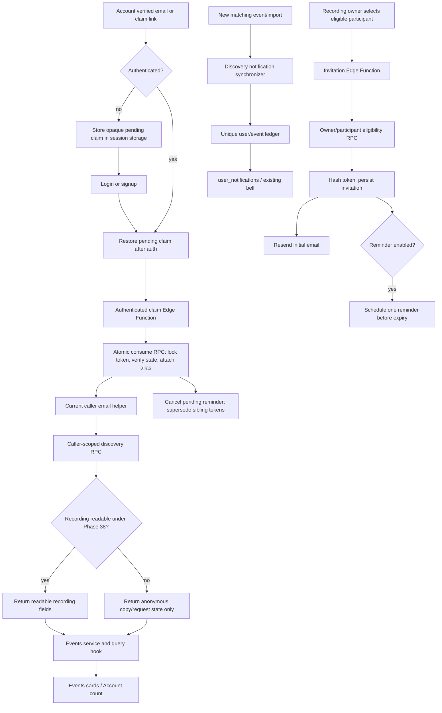

# Phase 39: Discovery and Claim - Research

**Researched:** 2026-09-20
**Domain:** Verified-email event discovery, participation claims, and privacy-preserving cross-organization access
**Confidence:** HIGH

<user_constraints>
## User Constraints (from CONTEXT.md)

### Locked Decisions

### Discovered Events Experience
- **D-01:** After an email is verified or claimed, Account Settings persistently shows “We found N events” with a **View events** action.
- **D-02:** **View events** opens a new dedicated Events page rather than a filtered Calls view or a results panel inside Settings.
- **D-03:** The Events page uses event cards. Each card may show the event date and time, how the user is connected, readable recordings, anonymous restricted-copy counts, request status, and allowed actions.
- **D-04:** Events needing an action appear first. Events already available follow. Each group is ordered newest first.
- **D-05:** A private recording's title, owner, provider, transcript, summary, and other restricted details remain hidden. A title may appear only when it comes from a recording the user can already access.

### Participation Invitations
- **D-06:** Only the recording owner may send a participation claim invitation.
- **D-07:** **Invite to claim** appears beside each eligible unclaimed participant in the recording's existing Participants section.
- **D-08:** Invitations are sent to one participant at a time. This phase does not add bulk-select or invite-everyone actions.
- **D-09:** An invitation shows its status and sent date. Manual resend becomes available after 7 days.
- **D-10:** For each invitation, the owner may optionally enable one automatic reminder. Automatic reminders are off by default and do not repeat indefinitely.
- **D-11:** The invitation recipient must come from the recording's existing participant data. There is no free-form email invitation field in this flow.

### Secure Email Claim
- **D-12:** Email ownership is proven with an expiring, single-use claim link. A second six-digit code is not required.
- **D-13:** The claim link expires after 7 days and cannot be replayed after successful use.
- **D-14:** If the link is opened while signed into an account with a different primary email, the user may add and verify the invited email on that current account, then finish the claim.
- **D-15:** If the recipient is signed out or new, the claim destination survives login or signup. Authentication then completes the claim automatically and opens the dedicated Events page.

### Claim Scope and Ongoing Discovery
- **D-16:** Proving ownership of an email claims all current participant matches for that email, not only the event that generated the invitation.
- **D-17:** The verified email continues matching future imports automatically. New matching events appear on the Events page without another claim.
- **D-18:** A future matching event creates one in-app notification. Phase 39 does not send continuing email notifications or daily email digests for new matches.
- **D-19:** A user can disconnect a claimed verified email from Settings after confirmation. Disconnecting stops future discovery and removes event visibility derived only from that email, without deleting or rewriting the original participant records.

### Locked Privacy and Identity Boundaries
- **D-20:** Discovery uses only the signed-in user's confirmed primary account email and explicitly verified email aliases. Unverified addresses, display-name similarity, organization membership, and calendar invitation alone are insufficient.
- **D-21:** A claim establishes identity and participation only. Recording content remains governed by Phase 38 policy, existing access paths, or an approved request.
- **D-22:** Phase 39 must preserve Phase 38's anonymous-copy response shape, verified-participation checks, webinar and large-event protections, and generic unavailable responses. It may not expose attendee rosters through discovery.
- **D-23:** Existing organization-scoped `get_people_summary` and `get_recordings_for_person` contracts remain intact; Phase 39 adds the caller-scoped cross-organization variant required by DISCO-01.

### the agent's Discretion
- Choose the exact route, card composition, loading skeleton, empty state, pagination strategy, and concise copy for the dedicated Events page while preserving D-01 through D-05.
- Choose additive schema, RLS, RPC, service, hook, notification, token-storage, and email implementation details that satisfy the decisions and repository constraints.
- Choose the exact reminder scheduling mechanism and cancellation behavior, provided there is at most one optional automatic reminder per invitation and manual resend is unavailable until day 7.
- Choose safe handling for expired, already-used, revoked, or superseded links using generic messages that do not confirm private event or account details.

### Deferred Ideas (OUT OF SCOPE)
- Bulk participant invitations and “invite everyone” — excluded in favor of deliberate one-person-at-a-time invitations.
- Repeating automatic reminders or account-wide reminder defaults — excluded; each invitation may opt into one reminder only.
- Ongoing email alerts or daily digests for newly discovered events — excluded; use in-app notifications in Phase 39.
- Previewing private event details before authentication — excluded by the privacy boundary.

### Reviewed Todos (not folded)
- “Apply 15-min compliance posture fixes” — generic keyword match with no Phase 39 discovery/claim connection.
- “Resync updated Fathom call metadata” — connector maintenance unrelated to verified-email discovery or participation claims.
</user_constraints>

<phase_requirements>
## Phase Requirements

| ID | Description | Research Support |
|----|-------------|------------------|
| DISCO-01 | `get_people_summary` and `get_recordings_for_person` gain an event-aware, cross-org variant scoped to the caller's own verified email addresses. Existing org-scoped signatures are preserved. | Add distinctly named caller-scoped RPCs backed by a shared current-email helper; return only event/card projections and accessible recording fields; leave both legacy signatures and result shapes untouched. [VERIFIED: `.planning/REQUIREMENTS.md`, `supabase/migrations/20260309120000_call_participants.sql`] |
| DISCO-02 | A non-user whose email appears in `call_participants` can be invited to claim their participation, verified by email ownership. | Add an owner-authorized invitation Edge Function, hash-only single-use tokens, an atomic consume RPC, and verified-alias attachment. Recipient and eligibility come from the selected participant row. [VERIFIED: `.planning/phases/39-discovery-and-claim/39-CONTEXT.md`, `supabase/functions/confirm-email-alias-verification/index.ts`] |
| DISCO-03 | Claiming grants existence visibility and the ability to request access. It grants no content by default. | Route all readable recording fields through the Phase 38 access predicate and reuse its anonymous request-copy projection; test that transcript, summary, owner, provider, roster, and titles from inaccessible recordings remain absent. [VERIFIED: `supabase/migrations/20260919000002_phase38_access_policy_rls_rpcs.sql`, `.planning/phases/38-access-policy-share-link-key-migration-request-flow/38-VERIFICATION.md`] |
</phase_requirements>

## Summary

Phase 39 should be implemented as a narrow verified-email discovery layer over the Phase 34 identity evidence ledger and Phase 38 access policy. The key authorization primitive must be the caller's **current confirmed primary email plus active verified email aliases**, normalized to lowercase. It cannot rely on `call_participants.identity_id`: live inspection found zero participant identity links in both TEST and production, and disconnect must remove access immediately without rewriting historical participant rows. [VERIFIED: live TEST/prod Supabase introspection; `supabase/migrations/20260905140000_create_identities_and_link_tables.sql`]

The current database has two authorization gaps that planning must address together. `events` SELECT currently accepts any `call_participants.email` match to `auth.email()`, while Phase 38's verified-participant helpers require an `identity_id` link. The first is too permissive for D-20; the second is too restrictive for the actual data and for verified aliases. Introduce a private current-caller-email helper, use it in new discovery RPCs, and revise the affected Phase 38/event predicates so calendar-only participation remains denied while confirmed evidence works even when `identity_id` is null. Preserve the recording-owner branch and all content access checks. [VERIFIED: `supabase/migrations/20260831020000_fix_events_participation_rls_and_updated_at_trigger.sql`, `supabase/migrations/20260919000002_phase38_access_policy_rls_rpcs.sql`, live TEST/prod Supabase introspection]

Invitation claiming should be a server-owned, email-wide operation: an owner selects one eligible participant, the server derives the address, sends a seven-day hash-only token, and an authenticated consume endpoint attaches that verified email to the current user's identity. That one proof makes all current and future confirmed participant matches discoverable. Content remains behind Phase 38. Use the existing Resend REST pattern and its scheduled-send API for an optional single reminder before token expiry; no package or cron job is needed. [VERIFIED: `supabase/functions/send-org-invite/index.ts`; CITED: https://github.com/resend/resend-openapi/blob/main/resend.yaml]

**Primary recommendation:** Build one shared verified-email authorization seam, two narrow caller-scoped event RPCs, and an atomic claim/invitation lifecycle; then make every UI surface consume those contracts through the established service → hook → component layers. [VERIFIED: `src/CLAUDE.md`, `supabase/CLAUDE.md`]

## Architectural Responsibility Map

| Capability | Primary Tier | Secondary Tier | Rationale |
|------------|-------------|----------------|-----------|
| Current caller email set | Database / Auth | API / Backend | Only a SECURITY DEFINER function can safely combine the current confirmed `auth.users` email with active verified aliases without exposing other users' PII. [VERIFIED: current schema; CITED: https://supabase.com/docs/guides/database/functions] |
| Cross-org event discovery | Database / API | Frontend | Database RPCs own filtering, deduplication, privacy, and ordering; the frontend only renders the safe projection. [VERIFIED: Phase 38 RPC pattern] |
| Recording readability and request eligibility | Database | API / Frontend | Existing Phase 38 policy predicates remain the authority; cards consume their results. [VERIFIED: Phase 38 verification] |
| Invitation eligibility and send | API / Edge Function | Database | The Edge Function authenticates, invokes an owner-checked database operation, and sends email; the database locks participant and invitation state. [VERIFIED: `supabase/functions/_shared/auth.ts`, `supabase/functions/send-org-invite/index.ts`] |
| Claim token consume | API / Edge Function | Database / Auth | The link enters through the browser, but authenticated atomic mutation and alias conflict checks belong server-side. [VERIFIED: repository auth and alias-verification patterns] |
| Claim redirect preservation | Browser / Client | Auth | Session storage survives the auth round trip; the token is scrubbed from the visible URL and consumed after authentication. [VERIFIED: `src/pages/Login.tsx`, `src/components/ProtectedRoute.tsx`] |
| In-app discovery notifications | Database | Frontend | A uniqueness ledger guarantees once-per-user/event behavior; the existing notification hook and bell display the result. [VERIFIED: current `user_notifications` schema and notification UI] |
| Disconnect verified email | Database / API | Frontend | Alias deactivation and authorization revocation must be atomic; Settings supplies confirmation and invalidates caches. [VERIFIED: current alias schema and Account Settings pattern] |

## Project Constraints (from AGENTS.md)

- Keep application and frontend work on the v2.2 feature branch. Production Supabase changes may be additive and independently safe; do not merge or release the branch in this phase. [VERIFIED: `AGENTS.md`, `.planning/V2.2-COMPLETION-PLAN.md`]
- Use React 18, Vite 5, React Router 6, TanStack Query, Zustand 5, Tailwind, shadcn/ui, Remix Icons, and `motion/react`; use npm only. Do not introduce Lucide, FontAwesome, `framer-motion`, pnpm, bun, yarn, Docker, or frontend AI. [VERIFIED: `AGENTS.md`]
- Preserve service → TanStack Query hook → component separation. Components do not call services or Supabase directly. [VERIFIED: `AGENTS.md`, `src/CLAUDE.md`]
- Use `authenticateRequest(req, supabase, corsHeaders)` for Edge Function auth. [VERIFIED: `AGENTS.md`, `supabase/CLAUDE.md`]
- Add migrations; never edit an already-applied migration. Every new table/function needs explicit grants, RLS, comments, and real-database allow/deny integration coverage. [VERIFIED: `supabase/CLAUDE.md`]
- Integration tests use real Supabase projects and run sequentially; they must not mock Supabase. Production guards are mandatory. [VERIFIED: `AGENTS.md`, `src/test/rls-regression.test.ts`, `package.json`]
- Recording identifiers cross UUID/BIGINT boundaries only through `toRecordingUuid()` / `toRecordingUuidBatch()`, and source URLs use `resolveShareUrl()`. [VERIFIED: `AGENTS.md`]
- Every mutation invalidates the full call-list cache set via `invalidateCallListCaches(queryClient)` where call-list data is affected. [VERIFIED: `AGENTS.md`]
- Preserve MCP markdown result shape, category filtering, one-function topology, and intentional wildcard CORS. Phase 39 should not touch these contracts. [VERIFIED: `AGENTS.md`]
- Use ESM, strict TypeScript, `.js` extensions in server imports, `node:` built-ins, `const`, `unknown` with guards, type-only imports, `@/` frontend aliases, and `_shared/` Edge utilities. [VERIFIED: `AGENTS.md`]
- Use “AI-ready,” never positive “AI-powered” copy, and keep the claim/discovery flow within the One-Click Promise. [VERIFIED: `AGENTS.md`, `CLAUDE.md`]

## Current System Findings

### Live State and Rollout Boundary

| Observation | TEST | Production | Planning consequence |
|-------------|------|------------|----------------------|
| `events` rows | 295 | 0 | TEST needs deterministic fixtures within its existing event population; production discovery remains inert until event data exists. [VERIFIED: live Supabase introspection] |
| `identities` / verified email aliases | 14 / 14 | 0 / 0 | Test alias collisions and disconnect in TEST; do not assume production backfill exists. [VERIFIED: live Supabase introspection] |
| `call_participants.identity_id` populated | 0 | 0 | Never make discovery or Phase 38 participation depend on the identity link. [VERIFIED: live Supabase introspection] |
| Confirmed auth users | present | 24 | Primary-email authorization must read confirmation state without exposing `auth.users`. [VERIFIED: live Supabase introspection] |
| Phase 34/38 migrations | applied | applied through `20260919000009` | Phase 39 can be additive but must preserve all live function signatures. [VERIFIED: live migration history] |

Production currently has no event/identity rows, so an additive backend rollout has no user-visible discovery effect before the feature branch ships. This is the safe server-first boundary; it does not remove the need for production guards or contract probes. [VERIFIED: live production introspection; `.planning/V2.2-COMPLETION-PLAN.md`]

### Exact Data and Authorization Seams

| Seam | Current behavior | Required Phase 39 treatment |
|------|------------------|-----------------------------|
| `events` | `participants_and_owners_can_view_events` calls `user_participates_in_event(events.id, lower(auth.email()))` or permits an owned recording. The helper matches participant email without verified/confirmed evidence. [VERIFIED: `20260831020000_fix_events_participation_rls_and_updated_at_trigger.sql`] | Replace the participant branch with the new verified caller-email + confirmed-evidence predicate; preserve the owner branch. This closes direct-table leakage outside the new RPC. |
| `call_participants` | Has `event_id`, normalized-able `email`, `role`, `has_confirmed_speech`, `participant_type`, and nullable `identity_id`; current index is `(event_id,email)`. [VERIFIED: Phase 30/34 migrations] | Add an index supporting caller email → event lookup, such as `(lower(email), event_id)` with an email-present predicate. Keep historical rows immutable on disconnect. |
| `identity_aliases` | Records typed evidence and has a partial unique index on `(alias_type,value)` where `verified=true`; owner SELECT and service-role access exist. [VERIFIED: `20260905140000_create_identities_and_link_tables.sql`] | Treat active verified lowercase email aliases as current authorization evidence. Add a reversible disconnect state or use `verified=false`; preserve the partial uniqueness invariant and audit timestamps. |
| Alias verification | Confirmation creates/reuses an owned identity and inserts a verified alias, but it does not update historical participants. [VERIFIED: `confirm-email-alias-verification/index.ts`] | Factor the same ownership checks into claim consume; discovery must begin from the alias ledger immediately, independent of the async resolver. |
| Phase 38 confirmed participant | Joins participant → identity → verified alias and therefore fails when `identity_id` is null. [VERIFIED: `20260919000002_phase38_access_policy_rls_rpcs.sql`; live introspection] | Redefine against caller-owned email values plus confirmed participant evidence. Do not weaken the evidence rule. |
| Phase 38 event-size guard | Counts distinct linked identities with verified aliases, so unlinked participants are undercounted. [VERIFIED: `20260919000002_phase38_access_policy_rls_rpcs.sql`; live introspection] | Count distinct normalized participant emails/confirmed identities without requiring ownership linkage. Preserve webinar and `<50` protections. |
| Anonymous copies | Final RPC returns anonymous ordinals, recording/request state, and no title, owner, provider, transcript, or summary; the UI maps the target internally. [VERIFIED: Phase 38 migration and verification] | Reuse this server-side projection/logic in event results. Never fetch inaccessible recordings and redact client-side. |
| Legacy people RPCs | `get_people_summary(UUID)` and `get_recordings_for_person(UUID,TEXT,TEXT)` are organization-scoped SECURITY DEFINER functions with established output shapes. [VERIFIED: `20260309120000_call_participants.sql`] | Leave both definitions, grants, names, parameters, and output columns untouched. Use new names for caller-scoped event-aware RPCs. |

### Existing Frontend Seams

- `AccountTab.tsx` already renders the primary email and verified-alias workflow. Add the persistent discovered-event count/action and confirmed disconnect here, backed by a service and hook. [VERIFIED: `src/components/settings/AccountTab.tsx`, `src/services/identity-alias.service.ts`]
- `CallParticipantsTab.tsx` receives merged participant/speaker data, but the UUID participant query does not currently expose enough canonical row evidence for invitation eligibility. The service contract must carry a participant row ID and server-computed invitation eligibility/status; transcript-only merged speakers cannot be invited. [VERIFIED: `src/components/call-detail/CallParticipantsTab.tsx`, call-detail query source]
- `App.tsx` has protected application routes but no Events route. A public claim-entry route can capture a token, while the Events destination must remain protected. [VERIFIED: `src/App.tsx`]
- `Login.tsx` restores `?next` for password paths and stores some pending state, while the OAuth path returns to the root and `ProtectedRoute` only consumes pending share tokens. Claim destination preservation therefore needs an explicit OAuth/root restoration seam as well as email/password coverage. [VERIFIED: `src/pages/Login.tsx`, `src/components/ProtectedRoute.tsx`]
- `NotificationBell.tsx` and `useNotifications.ts` already display persistent `user_notifications`; Phase 39 should add a type/metadata contract without creating a parallel notification UI. [VERIFIED: notification source files and current schema]

## Standard Stack

No new dependency is required. Use only the installed stack and platform APIs. [VERIFIED: `package.json`, `package-lock.json`, Edge imports]

### Core

| Library / Platform | Verified version | Purpose | Why Standard |
|--------------------|------------------|---------|--------------|
| React | 18.3.1 (published 2024-04-26) | Events, Settings, Participants, and claim-state UI | Existing locked frontend. [VERIFIED: npm lockfile and npm registry] |
| React Router DOM | 6.30.1 (published 2025-05-20) | Public claim entry and protected Events navigation | Existing router and redirect patterns. [VERIFIED: npm lockfile, npm registry, `src/App.tsx`] |
| TanStack Query | 5.90.10 (published 2025-11-16) | Discovery/invitation queries, mutations, cache invalidation | Locked hook layer. [VERIFIED: npm lockfile and npm registry] |
| Supabase JS | 2.84.0 (published 2025-11-20) | Auth, RPC invocation, Edge clients | Existing data/auth client. [VERIFIED: npm lockfile and npm registry] |
| PostgreSQL / Supabase | hosted projects | RLS, SECURITY DEFINER RPCs, atomic token consume, notification uniqueness | Existing backend and the only tier that can enforce cross-org privacy atomically. [VERIFIED: repository architecture] |
| Deno | 2.6.10 locally | Invitation and claim Edge Functions | Existing Edge runtime. [VERIFIED: local command; `supabase/functions/`] |
| Resend HTTP API | existing integration | Initial claim email and optional scheduled reminder | Existing raw REST pattern avoids a package; API supports scheduled send and cancellation. [VERIFIED: `send-org-invite/index.ts`; CITED: https://github.com/resend/resend-openapi/blob/main/resend.yaml] |

### Supporting

| Library | Verified version | Purpose | When to Use |
|---------|------------------|---------|-------------|
| Zod | 3.25.76 frontend (published 2025-07-08); 3.23.8 Edge import | Validate RPC/Edge responses and request payloads | At every untrusted client/server boundary. [VERIFIED: lockfile, npm registry, and Edge imports] |
| Vitest | 4.0.16 (published 2025-12-16) | Unit, component, and real-DB integration tests | Default automated validation. [VERIFIED: npm lockfile and npm registry] |
| Playwright | 1.57.0 (published 2025-11-25) | Browser proof of redirect, privacy, and one-click completion | End-to-end auth/navigation flows. [VERIFIED: npm lockfile, npm registry, `playwright.config.ts`] |
| Web Crypto | platform API | 32-byte random claim tokens and SHA-256 hashes | Generate raw tokens only in the Edge Function and store only hashes. [VERIFIED: existing Deno runtime capability; repository token patterns] |

### Alternatives Considered

| Instead of | Could Use | Tradeoff |
|------------|-----------|----------|
| Existing raw Resend HTTP integration | Resend npm SDK | Adds an unnecessary dependency and legitimacy surface without improving this flow. Use HTTP. [VERIFIED: existing integration and official OpenAPI] |
| Resend scheduled reminder | `pg_cron` | Existing repository cron jobs depend on unavailable/broken GUC configuration. Scheduled email can be cancelled by provider ID and stays within the seven-day lifecycle. [VERIFIED: `.planning/STATE.md`; CITED: https://resend.com/blog/introducing-the-schedule-email-api] |
| Distinct new RPC names | Overload legacy RPC names | Overloads make PostgREST resolution and regression safety harder; D-23 requires intact old contracts. Use distinct names. [VERIFIED: legacy migration and locked decision] |
| Server-side safe projection | Fetch then redact in React | The raw response would already disclose private data. Redaction must happen before data leaves Postgres. [VERIFIED: Phase 38 architecture] |

**Installation:** None.

## Package Legitimacy Audit

This phase installs no external package. Package legitimacy and postinstall checks are therefore not applicable. [VERIFIED: Standard Stack analysis]

## Architecture Patterns

### System Architecture Diagram



### Recommended Project Structure

```text
src/
├── pages/Events.tsx                         # dedicated protected event surface
├── pages/ParticipationClaim.tsx             # public token capture / generic state
├── services/event-discovery.service.ts      # RPC and Edge calls, runtime validation
├── hooks/useEventDiscovery.ts               # queries, mutations, invalidation
├── components/events/                       # cards, groups, skeleton, empty state
├── components/settings/AccountTab.tsx       # count/action/disconnect integration
└── components/call-detail/CallParticipantsTab.tsx # invite/status integration
supabase/
├── migrations/<timestamp>_phase39_*.sql     # helpers, tables, RPCs, RLS, grants
└── functions/
    ├── send-participation-claim/index.ts     # owner-authenticated invitation send
    └── participation-claim/index.ts          # authenticated atomic consume
```

Names are recommendations within the phase's discretion; keep responsibilities and boundaries even if final names differ. [VERIFIED: repository conventions]

### Component Responsibilities

| Component | Responsibility | Must not do |
|-----------|----------------|-------------|
| Private current-email SQL helper | Return normalized confirmed primary + active verified aliases for `auth.uid()` | Accept a caller-supplied user ID or expose emails from other users. |
| Discovery RPC | Deduplicate events, apply confirmed participation and Phase 38 privacy, order, paginate, count | Return a participant roster or inaccessible recording metadata. |
| Invitation table/RPC | Persist lifecycle, owner, participant, token hash, expiry, reminder state; enforce row locks/uniqueness | Trust recipient email, owner ID, or status from the browser. |
| Send Edge Function | Authenticate, invoke eligibility/creation, send/schedule email, record delivery IDs | Query by free-form email or expose why another account owns an alias. |
| Consume Edge Function/RPC | Authenticate, hash token, consume once, attach alias, supersede siblings, cancel reminder | Return event preview before authorization or store raw tokens. |
| Notification ledger/sync | Seed current matches without notification, then emit one notification per new user/event match | Generate historical notification floods or expose event details in metadata. |
| Frontend service/hook | Parse responses, call RPCs/functions, own query keys/invalidation | Re-implement authorization or eligibility. |

### Pattern 1: Current Caller Email Set

Use a non-publicly executable SECURITY DEFINER helper that derives its subject from `auth.uid()`. Include the primary only when `auth.users.email_confirmed_at IS NOT NULL`, normalize with `lower(trim(email))`, and union active verified `identity_aliases` owned by the same user. Set `search_path=''`, schema-qualify every relation, revoke execution from `PUBLIC`, `anon`, and `authenticated`, and grant only the narrow caller RPCs that use it. Supabase recommends an empty search path for SECURITY DEFINER functions and explicit privilege control. [CITED: https://supabase.com/docs/guides/database/functions]

Do not trust a user-supplied email, JWT metadata alias list, display name, domain membership, or stale participant identity link. Supabase notes that JWT data may not be fresh until refresh; the database can read the current confirmed primary in this controlled helper. [CITED: https://supabase.com/docs/guides/auth/jwts]

### Pattern 2: Safe Event Projection

Create distinctly named caller-scoped RPCs, for example `list_my_discovered_events(limit, offset)` and `list_my_discovered_event_recordings(event_id)`, plus a count RPC if the list does not return `total_count`. Names are discretionary; behavior is not. The list should:

1. Match a current caller email to `call_participants.email` only when the row has confirmed evidence (`has_confirmed_speech`, organizer/host role, or the exact existing Phase 38 evidence rule). [VERIFIED: Phase 38 helper]
2. Deduplicate by `event_id` and reject webinar/large-event discovery through the Phase 38 guard. [VERIFIED: Phase 38 helper]
3. Return event ID, canonical date/time, the user's own connection evidence, accessible recording projections, and anonymous restricted-copy/request state. [VERIFIED: D-03/D-05/D-22]
4. Sort action-needed events first, available events second, then canonical time descending inside each group. [VERIFIED: D-04]
5. Bound pagination, recommended maximum 50, and compute data in SQL rather than issuing one copy RPC per card. The source spec includes high-volume discovery cases, so an unbounded client join is unsafe. [VERIFIED: `.orca/drops/SPEC-event-resolution-and-provenance.md`]

### Pattern 3: Invitation Lifecycle

Use a service-only table such as `participation_claim_invitations` with: invitation ID; recording and participant foreign keys; normalized invited-email snapshot; inviter/recording-owner ID; unique token hash; state; `sent_at`; `expires_at`; claimed/superseded/revoked timestamps; reminder opt-in/scheduled time/provider ID/sent time; and audit timestamps. Direct client access should be absent or limited to an owner-safe status RPC. [VERIFIED: repository service-role table patterns]

Enforce at most one active invitation per participant with a partial unique index or locked creation logic. Resend after seven days rotates the token/hash and expiry and supersedes the old token. A successful claim supersedes every other live invitation for the same normalized email because the email-wide identity problem is now solved. [VERIFIED: D-09/D-13/D-16]

Eligible participant rows must have a nonblank email and confirmed participation evidence, and the recording owner must equal `auth.uid()`. Pure calendar invitation/invitee evidence is insufficient under D-20/D-22. If the address already belongs to a confirmed primary or active verified alias, return an owner-safe “already claimed” state without disclosing the account. [VERIFIED: locked decisions and Phase 38 evidence rules]

### Pattern 4: Hash-Only Atomic Claim

Generate 32 random bytes with Web Crypto, encode the raw token for the link, store only its SHA-256 digest, and never log the raw value. The authenticated consume transaction locks the invitation row, checks `sent` state and seven-day expiry, rejects used/revoked/superseded tokens with the same generic result, checks that no other user owns the address as a confirmed `auth.users` primary or active verified alias, creates/reuses the caller-owned identity, and activates the verified email alias. [VERIFIED: repository secret-token patterns; D-12/D-13/D-20]

The claim link itself is the email proof, including when the signed-in primary differs. Do not require the existing six-digit alias OTP after the user has followed a valid claim link. Once attached, discovery is email-wide; optional filling of null `call_participants.identity_id` is enrichment only and must never overwrite a conflicting nonnull link or become the authorization source. [VERIFIED: D-12/D-14/D-16/D-19]

### Pattern 5: Redirect Preservation and URL Scrubbing

Capture the raw claim token at a public entry route, move it immediately to a dedicated `sessionStorage` key, and replace the URL so browser history, screenshots, and later navigation do not retain it. If signed out, proceed through login/signup; after every auth completion path, including OAuth return to root, consume the pending token and navigate with replacement to the protected Events page. Supabase requires redirect destinations to match the configured allowlist, and `emailRedirectTo` controls passwordless email return. [CITED: https://supabase.com/docs/guides/auth/redirect-urls; CITED: https://supabase.com/docs/reference/javascript/auth-signinwithotp]

Do not encode the raw token inside a reusable `next` query parameter. Keep existing pending share-token behavior isolated so the two flows cannot overwrite one another. [VERIFIED: current login/protected-route state handling]

### Pattern 6: One Future-Match Notification

Use a private uniqueness ledger keyed by `(user_id,event_id)` and retain it across alias disconnect/reconnect. At rollout and when an email is first verified/claimed, seed ledger rows for events already discoverable without creating notifications. When a future import/event first becomes discoverable, an idempotent sync inserts the ledger row and one `user_notifications` record in the same transaction. This distinguishes D-18's “future matching event” from the potentially large historical set exposed by D-01/D-16. [VERIFIED: D-01/D-16/D-18; current notification schema]

Invoke the sync from an authenticated server/RPC seam used by the globally mounted notification query, or from the import pipeline after event resolution. Prefer caller pull if producer timing cannot guarantee that webinar/participant-count classification is final. On disconnect, remove or neutralize notification rows whose event is no longer authorized through any active email, while retaining the idempotency ledger. [VERIFIED: current notification hook and event resolution pipeline]

### Pattern 7: One Optional Reminder

Schedule at most one reminder before the original token expires, recommended near day 6. Store the provider email ID and cancel it on claim, revoke, or supersede. Scheduling the reminder at day 7 with the original link would send an expired token, so the reminder must precede expiry. Resend accepts `scheduled_at`, supports cancellation by email ID, and supports idempotency keys. [CITED: https://github.com/resend/resend-openapi/blob/main/resend.yaml; CITED: https://resend.com/changelog/extended-email-scheduling]

Manual resend remains unavailable until the prior invitation is at least seven days old; it creates a fresh seven-day token and cannot revive the old one. [VERIFIED: D-09/D-13]

### Anti-Patterns to Avoid

- **Authorizing through `call_participants.identity_id`:** live data has no participant links, async resolution can lag, and disconnect would not revoke a historical link. Use current verified email evidence. [VERIFIED: live TEST/prod introspection]
- **Using `auth.email()` alone:** it excludes verified aliases and does not by itself prove current confirmation. Use the current-caller helper. [VERIFIED: D-20]
- **Client-side privacy filtering:** restricted fields have already leaked once returned. Project only permitted columns in SQL. [VERIFIED: Phase 38 privacy model]
- **Calling the anonymous-copy RPC once per event:** creates N+1 latency and inconsistent snapshots. Compose the same predicates in an event-aware batch RPC. [VERIFIED: Phase 38 RPC shape]
- **Inviting merged transcript speakers:** they may not correspond to a canonical participant/email row. Invite only a server-validated participant ID. [VERIFIED: call-detail merge behavior]
- **Immediate notification backfill:** would turn all historical discoveries into “future” notifications. Seed the ledger silently first. [VERIFIED: D-18 semantics]
- **Repeating cron reminder:** violates D-10 and relies on repository cron configuration already known to fail. Use one scheduled provider send. [VERIFIED: D-10; `.planning/STATE.md`]
- **Raw claim token persistence:** database/log/session analytics exposure enables replay. Persist only a digest and scrub the browser URL. [VERIFIED: D-13]
- **Overloading legacy people RPCs:** risks breaking org-scoped callers and PostgREST resolution. Add distinctly named functions. [VERIFIED: D-23]

## Don't Hand-Roll

| Problem | Don't Build | Use Instead | Why |
|---------|-------------|-------------|-----|
| Authentication | Header/JWT parsing inside a new function | `_shared/auth.ts` `authenticateRequest` | Existing CORS, token, and error semantics are already centralized. [VERIFIED: repository rule] |
| Recording access | A Phase 39 `can_view` flag | `phase38_user_can_access_recording` and request RPCs | Policy, grant, owner, participant, and approval paths already exist and are verified. [VERIFIED: Phase 38 verification] |
| Anonymous copy discovery | A second redaction format | Phase 38 anonymous-copy shape and predicates | D-22 explicitly locks shape and protections. [VERIFIED: D-22] |
| Email ownership OTP | Another six-digit code after claim link | Single-use claim link as verified evidence | D-12 forbids a second code. [VERIFIED: D-12] |
| Reminder scheduler | Poller, repeating cron, browser timer | One Resend scheduled email plus cancellation | Provider schedule fits one reminder and survives client/server restarts. [CITED: Resend OpenAPI] |
| Token crypto | Custom cipher or reversible token storage | Web Crypto random bytes + SHA-256 digest | Only equality verification is needed; raw secrets need not be recoverable. [VERIFIED: Deno platform and repository patterns] |
| Notifications UI | New toast/inbox | `user_notifications`, `useNotifications`, `NotificationBell` | Existing persistent read/unread surface already handles actions. [VERIFIED: repository source] |
| Cross-org joins in React | Multiple direct table queries | Narrow SECURITY DEFINER RPC | RLS and field projection must be enforced before transport. [VERIFIED: repository architecture] |

**Key insight:** Identity proof, participation evidence, event existence, and recording content are four separate authorization facts. Phase 39 may connect the first three, but only Phase 38 can grant the fourth. [VERIFIED: Phase 34/38/39 locked decisions]

## Runtime State Inventory

| Category | Items Found | Action Required |
|----------|-------------|-----------------|
| Stored data | TEST: 295 events, 14 identities, 14 verified aliases, zero participant identity links. Production: zero events/identities/aliases/links. Existing Phase 38 helpers and policies are applied. [VERIFIED: live introspection] | Additive migration; update helper definitions/policy bodies; create fixtures in TEST. No destructive backfill of participant rows. |
| Live service config | Supabase TEST and production projects are linked/deployable; Resend is already used by Edge Functions. Redirect URLs must include the chosen claim/auth return route. [VERIFIED: repository config and functions; CITED: Supabase redirect docs] | Verify redirect allowlist and deployed Edge secrets during execution. Use production project guards. |
| OS-registered state | None. The feature has no OS service, launchd, or local daemon registration. [VERIFIED: repository architecture scan] | None. |
| Secrets / env vars | `.env.test` contains the TEST URL, anon key, and service-role key names consumed by integration tests; ambient shell variables need not be present because Vitest loads the file. Resend/API configuration is deployed secret state. [VERIFIED: local environment and test config] | Never print values. Probe secret presence indirectly through a controlled send/deploy check. |
| Build artifacts / installed packages | Existing npm install supplies React/Vitest/Playwright; Supabase CLI and Deno are installed. No new package is needed. [VERIFIED: local commands and lockfile] | Rebuild/test committed tree as required; no package migration. |

After repository files are updated, the remaining runtime state is the applied Supabase migration/function deployment, auth redirect allowlist, Edge secrets, and scheduled Resend email IDs stored with invitations. The planner must treat database migration, Edge deployment, and application branch work as separate rollout units. [VERIFIED: project release boundary]

## Common Pitfalls

### Pitfall 1: Fixing New RPCs but Leaving Direct `events` RLS Open

**What goes wrong:** A user who merely appears by calendar email can select an event directly even if the Events page is safe. [VERIFIED: current event policy]

**Why it happens:** The existing policy predates D-20 and calls `user_participates_in_event` with `auth.email()` without confirmed evidence. [VERIFIED: `20260831020000...sql`]

**How to avoid:** Update the participant branch of the live policy/helper in the same migration as the current-email helper; preserve the owner branch and add allow/deny tests. [VERIFIED: RLS pattern]

**Warning signs:** Calendar-only fixtures can select `events`; direct table results differ from the new RPC.

### Pitfall 2: Sparse Identity Links Hide Every Event

**What goes wrong:** Verified users get zero discovery and no request path. [VERIFIED: live identity-link counts]

**Why it happens:** Phase 38 helpers join through nullable `call_participants.identity_id`, but current resolver/backfill has not populated it. [VERIFIED: current helper source and live state]

**How to avoid:** Resolve authorization from normalized participant email ∩ current caller email set, then require confirmed participant evidence. Treat identity links only as enrichment.

**Warning signs:** TEST aliases exist but `list_my_discovered_events` is empty until a resolver batch runs.

### Pitfall 3: Weakening Phase 38 While Repairing It

**What goes wrong:** Calendar invitees or large webinars gain anonymous discovery/request actions. [VERIFIED: Phase 38 threat model]

**Why it happens:** Replacing the identity join with a raw email comparison without carrying forward speech/role and event-size protections.

**How to avoid:** Centralize confirmed evidence and event-allow predicates; test unverified, invitee-only, 50-participant, and webinar denials.

**Warning signs:** A row with only `role='invitee'` passes; an event at the cap appears.

### Pitfall 4: Leaking Through Counts, Titles, or Status

**What goes wrong:** Even if transcript data is hidden, a title, owner/provider, participant count, roster, request target, or distinct error reveals a private recording/account. [VERIFIED: D-05/D-22]

**Why it happens:** UI composition joins safe and unsafe service results or returns diagnostic errors to the browser.

**How to avoid:** Define a single safe RPC result type. Use generic claim/unavailable messages and test raw network payloads as well as the DOM.

**Warning signs:** Restricted card fields are present but hidden with CSS; expired and unknown tokens return distinguishable messages.

### Pitfall 5: Token Replay or Parallel Consume

**What goes wrong:** Two requests consume the same token, or an older resent link succeeds. [VERIFIED: D-13]

**Why it happens:** Read-then-update logic without `FOR UPDATE`, hash uniqueness, or state transition guards.

**How to avoid:** Lock the invitation row and update only from the active state in one transaction; resend rotates and supersedes before email dispatch.

**Warning signs:** Parallel integration calls both return success; old link works after resend.

### Pitfall 6: OAuth Loses the Claim

**What goes wrong:** Password login works, but OAuth/signup returns to root and never consumes the token. [VERIFIED: current auth routing]

**Why it happens:** Only `?next` or the password completion path is updated.

**How to avoid:** Use a dedicated session key and one post-auth restoration routine invoked by every auth completion/ProtectedRoute bootstrap path.

**Warning signs:** E2E covers only password login; root load leaves the pending token indefinitely.

### Pitfall 7: Reminder Arrives With an Expired Link

**What goes wrong:** The optional reminder is delivered at or after day 7 with the original expired token.

**Why it happens:** D-09's manual resend threshold is confused with D-10's automatic reminder timing.

**How to avoid:** Schedule the single reminder before expiry, recommended day 6; cancel it when state changes. Manual resend after day 7 rotates the link.

**Warning signs:** `reminder_scheduled_for >= expires_at`; no provider ID exists for cancellation.

### Pitfall 8: Historical Notification Flood

**What goes wrong:** Verifying an address generates one notification for every old event. [VERIFIED: D-18 wording]

**Why it happens:** A sync inserts notifications for all currently discoverable events without a baseline.

**How to avoid:** Seed the uniqueness ledger silently for current matches at activation/rollout; notify only when a new match enters later.

**Warning signs:** Claiming a long-used email instantly produces dozens of bell items.

### Pitfall 9: Disconnect Leaves Derived Visibility

**What goes wrong:** Cached cards, direct event SELECT, notification links, or stale identity links still reveal the event after disconnect. [VERIFIED: D-19]

**Why it happens:** Only the Settings row changes; caches and all authorization surfaces are not re-evaluated.

**How to avoid:** Deactivate alias atomically, make every authorization decision query active current emails, invalidate discovery/access/call caches, and neutralize now-unauthorized notification actions.

**Warning signs:** Refreshing or opening a saved event URL still works after disconnect.

## Code Examples

These examples are schematic contracts, not migration-ready implementation. They show the verified patterns the planner should reference.

### SECURITY DEFINER Safety Envelope

```sql
-- Source: https://supabase.com/docs/guides/database/functions
create or replace function private.current_caller_emails()
returns table (email text)
language sql
security definer
set search_path = ''
stable
as $$
  -- Read auth.uid(); schema-qualify every object; return only the caller's
  -- confirmed primary and active verified aliases, normalized to lowercase.
$$;

revoke all on function private.current_caller_emails() from public, anon, authenticated;
```

The private helper should be callable only by vetted functions, not directly by clients. PostgreSQL function execution privileges must be explicitly revoked/granted because functions are executable by default unless privileges are tightened. [CITED: https://supabase.com/docs/guides/database/functions]

### Atomic Single-Use Transition

```sql
-- Source pattern: existing repository SECURITY DEFINER mutation RPCs.
select *
from public.participation_claim_invitations
where token_hash = p_token_hash
for update;

-- In the same transaction: require active state and now() < expires_at,
-- attach verified alias, mark this token claimed, supersede sibling tokens.
```

Use a uniform generic result for missing, expired, used, revoked, superseded, and conflicting-account cases at the public boundary. Log only internal reason codes without raw token/email/event details. [VERIFIED: D-22 and repository error conventions]

### Auth Redirect Capture

```ts
// Source pattern: src/pages/Login.tsx and src/components/ProtectedRoute.tsx
const PENDING_CLAIM_KEY = "pendingParticipationClaimToken";

sessionStorage.setItem(PENDING_CLAIM_KEY, token);
window.history.replaceState(null, "", "/claim-participation");
```

The implementation should validate token shape and length before storage, remove it after terminal consume, and use router replacement when opening Events. [VERIFIED: repository routing conventions]

### Query Invalidation After Disconnect / Claim

```ts
// Source pattern: existing TanStack Query hooks in src/hooks/.
await Promise.all([
  queryClient.invalidateQueries({ queryKey: ["event-discovery"] }),
  queryClient.invalidateQueries({ queryKey: ["identity-aliases"] }),
  queryClient.invalidateQueries({ queryKey: ["notifications"] }),
]);
```

Also call the repository's full call-list invalidation helper if mutation results can change access badges or lists. [VERIFIED: `AGENTS.md`]

## State of the Art

| Old / Current Approach | Phase 39 Approach | Why It Changes | Impact |
|------------------------|-------------------|----------------|--------|
| Org-scoped people lookup by supplied person/email | Caller-scoped cross-org event discovery from server-derived verified emails | DISCO-01 and D-23 require both contracts | New functions; old signatures remain byte-for-byte compatible. [VERIFIED: requirements] |
| Participant visibility via primary `auth.email()` | Confirmed primary + active verified aliases | Users can prove multiple addresses and disconnect them | Consistent current identity boundary. [VERIFIED: D-16/D-19/D-20] |
| Confirmed participation via participant `identity_id` linkage | Verified email intersection + confirmed row evidence | Live links are empty and async | Works immediately after proof without sacrificing evidence. [VERIFIED: live state] |
| Alias verification via six-digit code | Invitation link itself proves the invited alias | D-12 requires one claim step | Lower-friction one-click claim after auth. [VERIFIED: D-12] |
| Event/copy discovery in call detail | Batched dedicated Events surface | D-01 through D-04 require persistent discovery and action ordering | Dedicated route and bounded server pagination. [VERIFIED: context] |
| Repeating/cron notification assumptions | Unique ledger + idempotent sync and one provider-scheduled reminder | Exact-once in-app notification and at-most-one reminder | Avoids historical floods and broken cron state. [VERIFIED: D-10/D-18, STATE] |

**Deprecated/outdated for this phase:**

- `user_participates_in_event(event_id, auth.email())` as sufficient discovery proof is incompatible with D-20. Preserve any callers only after hardening its semantics or replacing the policy reference. [VERIFIED: current policy and D-20]
- Phase 38's identity-link-dependent participant and event-size helper bodies are incompatible with current data. Preserve their signatures but revise the internal evidence join and re-run Phase 38 regressions. [VERIFIED: current helper bodies and live state]

## Assumptions Log

| # | Claim | Section | Risk if Wrong |
|---|-------|---------|---------------|
| — | None. Recommendations are derived from locked decisions, repository source, live Supabase inspection, or cited official documentation. | — | — |

## Open Questions (RESOLVED)

1. **Routes and RPC/function contracts**
   - Selected routes: protected `/events` and public token-capture `/claim-participation`. The token is accepted once, moved to session storage, and removed from the visible URL before rendering.
   - Selected discovery RPCs: `count_my_discovered_events()`, `list_my_discovered_events(p_limit, p_cursor)`, and `sync_my_discovered_event_notifications()`. Existing `get_people_summary(UUID)` and `get_recordings_for_person(UUID,TEXT,TEXT)` remain unchanged. [VERIFIED: D-02/D-23]
   - Selected claim RPCs: non-consuming `inspect_my_participation_claim(p_token_hash)` and atomic `consume_my_participation_claim(p_token_hash,p_confirm_email_attachment)`. The single `participation-claim` Edge Function exposes narrow request modes `inspect` and `consume`. Inspect returns only a generic unavailable result or, for a valid authenticated claimant, a masked invited email plus `confirmation_required`; it never attaches an alias, consumes a token, or returns event metadata. Intended-account paths may proceed immediately to consume. Different-primary paths wait for the explicit **Add email and continue** action, while **Use another account** leaves the token unconsumed through sign-out/auth. [VERIFIED: D-12 through D-15]

2. **Discovery notification synchronization trigger**
   - Selected trigger: authenticated caller pull from discovery/count/list refresh and the existing notification query cycle. Each call invokes the idempotent `sync_my_discovered_event_notifications()` contract, which silently establishes the caller's current baseline and uses the retained unique user/event ledger for later matches.
   - No import-pipeline producer or `pg_cron` dependency is required. Database uniqueness and current verified-email authorization remain authoritative regardless of which authenticated refresh arrives first. [VERIFIED: D-17/D-18; existing broken cron GUC state]

3. **Controlled email delivery proof**
   - Automated Resend/API evidence is attempted first: deployed-secret presence through a controlled send, provider acceptance/status, scheduled reminder ID/time, cancellation response, and database delivery state.
   - Only if no controlled mailbox API is available does preproduction pause at a conditional human checkpoint for the unavoidable action of opening one TEST invitation in the prepared browser. The operator never shares the URL or token.
   - This TEST proof does not authorize sending production-recipient email. Production verification uses a seeded synthetic hash-only invitation and server probes without external mail. [VERIFIED: validation and release boundary]

These choices are final planning inputs rather than remaining questions.

## Environment Availability

| Dependency | Required By | Available | Version / State | Fallback |
|------------|-------------|-----------|-----------------|----------|
| Node.js | frontend/tests | ✓ | 26.8.2 | Use project-supported CI Node if local version exposes compatibility issues. [VERIFIED: local command] |
| npm | dependency scripts | ✓ | 11.19.1 | None; npm is locked. [VERIFIED: local command] |
| Supabase CLI | migrations/functions | ✓ | 2.101.0 | `npx supabase` only if repository policy permits; installed CLI is preferred. [VERIFIED: local command] |
| Deno | Edge tests/type checks | ✓ | 2.6.10 | Supabase deploy API for remote execution. [VERIFIED: local command] |
| CodeGraph | structural navigation | ✓ | 0.9.7, index current (1,464 files / 16,397 nodes) | Direct source reads and `rg` for verification. [VERIFIED: CodeGraph status] |
| Supabase TEST credentials | real-DB integration | ✓ | `.env.test` has required variable names | Blocking if revoked; do not fall back to mocks. [VERIFIED: local config inspection] |
| Supabase production link | additive rollout | ✓ | restored to project `vltmrnjsubfzrgrtdqey` after read-only inspection | Explicit `--project-ref` plus production guard. [VERIFIED: local CLI state] |
| Resend deployed secret/domain | invitation email | unverified locally | Existing function integration | TEST email capture/manual controlled recipient; do not claim delivery until probed. [VERIFIED: repository source] |
| Auth redirect allowlist | claim auth return | requires verification | hosted Supabase setting | Use an already allowlisted app root and session restoration if a route-specific entry is unavailable. [CITED: Supabase redirect docs] |

**Missing dependencies with no fallback:** None discovered for development. A valid deployed Resend configuration is required to verify the complete email path.

**Missing dependencies with fallback:** Route-specific redirect configuration can use the already-supported app root plus the pending-claim restoration mechanism, provided every auth path is tested.

## Validation Architecture

### Test Framework

| Property | Value |
|----------|-------|
| Framework | Vitest 4.0.16 for unit/component/real-DB integration; Playwright 1.57.0 for browser flows [VERIFIED: npm lockfile] |
| Config file | `vite.config.ts`, `playwright.config.ts`, `src/test/setup.ts` [VERIFIED: repository] |
| Quick run command | `npx vitest run <changed-test-files> --maxWorkers=1` |
| Full suite command | `npm test` plus `npm run test:integration`; `npm run test:e2e` for auth/navigation gate [VERIFIED: `package.json`] |

Integration tests are opt-in with `VITEST_INTEGRATION_OK=true`, use real TEST Supabase, and run with one worker. Production-project guards and cleanup are required. [VERIFIED: `package.json`, existing integration tests]

### Phase Requirements → Test Map

| Req ID | Behavior | Test Type | Automated Command | File Exists? |
|--------|----------|-----------|-------------------|-------------|
| DISCO-01 | Confirmed primary and verified alias discover matching cross-org events; unverified/name/org/calendar-only evidence does not; old RPC shapes remain intact | real-DB integration | `VITEST_INTEGRATION_OK=true npx vitest run src/test/discovery-claim.integration.test.ts --maxWorkers=1` | ❌ Wave 0 |
| DISCO-01 | Account count, pagination, action-first/newest ordering, and disconnect revocation | service/component + integration | `npx vitest run src/services/__tests__/event-discovery.service.test.ts src/components/events --maxWorkers=1` | ❌ Wave 0 |
| DISCO-02 | Owner can invite canonical eligible participant; non-owner/free-form/calendar-only/already-claimed attempts fail; resend threshold/reminder state enforced | real-DB Edge integration | `VITEST_INTEGRATION_OK=true npx vitest run supabase/functions/send-participation-claim/__tests__/send-participation-claim.integration.test.ts --maxWorkers=1` | ❌ Wave 0 |
| DISCO-02 | Valid token attaches alias and claims all email matches; replay/expired/revoked/superseded/parallel/alias-conflict paths are generic and denied | real-DB Edge integration | `VITEST_INTEGRATION_OK=true npx vitest run supabase/functions/participation-claim/__tests__/participation-claim.integration.test.ts --maxWorkers=1` | ❌ Wave 0 |
| DISCO-02 | Claim survives password, signup, and OAuth/root return and finishes at Events | Playwright E2E | `npx playwright test playwright/discovery-claim.spec.ts` | ❌ Wave 0 |
| DISCO-03 | Claim exposes event existence and request action but no title/owner/provider/transcript/summary/roster/content; readable recordings still render | real-DB + component | `VITEST_INTEGRATION_OK=true npx vitest run src/test/discovery-claim.integration.test.ts src/components/events --maxWorkers=1` | ❌ Wave 0 |
| DISCO-03 | Phase 38 webinar, 50-participant cap, anonymous response, cooldown, and content RLS remain intact | regression integration | `VITEST_INTEGRATION_OK=true npx vitest run src/test/access-policy.integration.test.ts src/test/rls-regression.test.ts --maxWorkers=1` | ✅ existing, extend fixtures if needed |

### Required Test Scenarios

**Authorization matrix:** confirmed primary; verified alias; inactive/disconnected alias; unverified alias; matching display name; org membership only; invitee/calendar-only participant; confirmed speaker; organizer/host; recording owner; email owned by another account. Assert both RPC and direct-table RLS behavior. [VERIFIED: D-20 and current RLS gap]

**Privacy matrix:** accessible copy, restricted copy with allowed request, pending/approved/rejected/cooldown request, webinar, event with 49/50/51 confirmed participants, mixed accessible/restricted copies. Assert raw JSON keys and DOM. [VERIFIED: Phase 38 decisions]

**Lifecycle matrix:** first send; duplicate active send; optional reminder off/on; cancellation; pre-seven-day manual resend denial; post-seven-day rotation; token consume; replay; parallel consume; expired; revoked; superseded sibling; signed-in different primary; disconnect/reconnect. [VERIFIED: D-09 through D-19]

**Notification matrix:** activation silently seeds old events; one new matching event produces one notification; repeated sync produces none; another copy of same event produces none; disconnect prevents new notices and disables now-unauthorized action; reconnect does not replay old ledger entries. [VERIFIED: D-18/D-19]

### Sampling Rate

- **Per task commit:** changed Vitest files with `--maxWorkers=1`; SQL tasks also run the focused real-DB integration file.
- **Per wave merge:** `npm test`, focused real-DB Phase 39 tests, existing Phase 38 access tests, and `src/test/rls-regression.test.ts`.
- **Phase gate:** full unit suite, full `npm run test:integration`, targeted Playwright claim flow, `npm run build`, TEST deployed-function probe, and controlled email round trip are green before `$gsd-verify-work`.

### Wave 0 Gaps

- [ ] `src/test/discovery-claim.integration.test.ts` — shared DISCO-01/DISCO-03 real-DB fixtures and legacy RPC regression.
- [ ] `supabase/functions/send-participation-claim/__tests__/send-participation-claim.integration.test.ts` — invitation authorization/lifecycle.
- [ ] `supabase/functions/participation-claim/__tests__/participation-claim.integration.test.ts` — token/alias atomicity.
- [ ] `src/services/__tests__/event-discovery.service.test.ts` — response parsing and failure mapping.
- [ ] `src/pages/__tests__/Events.test.tsx` — safe card projection, grouping, empty/loading states.
- [ ] `src/components/call-detail/__tests__/CallParticipantsTab.claim-invite.test.tsx` — eligibility/status/owner action.
- [ ] `src/components/settings/__tests__/AccountTab.discovery.test.tsx` — persistent count/action/disconnect.
- [ ] `src/pages/__tests__/OAuthCallback.participation-claim.test.tsx` — direct OAuth/root pending-claim restoration and no token propagation.
- [ ] `playwright/discovery-claim.spec.ts` — auth return and automatic completion.

Historical files named `src/test/migrations/phase39-fathom-*` use an older numbering scheme and are unrelated; do not extend them for this phase. [VERIFIED: repository scan]

## Security Domain

### Applicable ASVS Categories

| ASVS Category | Applies | Standard Control |
|---------------|---------|------------------|
| V2 Authentication | yes | Supabase Auth plus confirmed primary/verified alias evidence; Edge Functions use `authenticateRequest`. [VERIFIED: repository] |
| V3 Session Management | yes | Supabase session; pending claim is short-lived session storage, scrubbed after consume; no token in durable local storage. [VERIFIED: auth architecture] |
| V4 Access Control | yes | RLS, owner checks, SECURITY DEFINER least privilege, Phase 38 content predicate, real-DB allow/deny tests. [VERIFIED: repository and Supabase docs] |
| V5 Input Validation | yes | Zod/explicit guards for token format, UUIDs, pagination, booleans; server derives recipient and user. [VERIFIED: repository stack] |
| V6 Cryptography | yes | Web Crypto CSPRNG and SHA-256 digest; no custom encryption; provider TLS. [VERIFIED: Deno platform pattern] |
| V7 Error Handling / Logging | yes | Generic external outcomes; internal structured reason codes; never log raw tokens or private event details. [VERIFIED: D-22] |
| V8 Data Protection | yes | Safe database projections, alias PII owner-only, no roster/restricted metadata, hash-only secrets. [VERIFIED: D-05/D-22] |
| V13 API | yes | Authenticated Edge endpoints, narrow RPC grants, bounded pagination, idempotent mutation/sync. [VERIFIED: repository patterns] |

### Known Threat Patterns

| Pattern | STRIDE | Standard Mitigation |
|---------|--------|---------------------|
| IDOR by supplied participant/recording/user/email | Spoofing / Information Disclosure | Derive user from auth, email from participant, owner from recording; lock and re-check in DB. |
| SECURITY DEFINER search-path injection | Elevation of Privilege | `search_path=''`, fully qualified objects, explicit revoke/grant. [CITED: Supabase database functions docs] |
| Claim token theft through URL/log/history | Spoofing | High entropy, hash at rest, immediate URL scrub, no analytics/logging, seven-day expiry, single use. |
| Parallel replay | Tampering | Row lock and one atomic state transition; hash uniqueness; supersede on resend. |
| Email/account enumeration | Information Disclosure | Uniform public messages and timing-insensitive lookup; owner-safe status only. |
| Calendar-only or name-based false claim | Spoofing | Require existing email row and confirmed participation evidence; never infer from name/org/domain. |
| Cross-org content leakage | Information Disclosure | Return restricted counts/request state only; run every readable field through Phase 38 access. |
| Large meeting roster inference | Information Disclosure | Preserve webinar and participant-count guard; return no roster/count detail beyond approved anonymous restricted-copy count. |
| Reminder after claim/revoke | Repudiation / Information Disclosure | Store provider ID; cancel on terminal/superseded state; email link remains single-use even if cancellation races. |
| Stale cache after disconnect | Information Disclosure | Server authorization reads active evidence every request; invalidate discovery/access/notification caches. |
| Notification duplication | Repudiation / Denial of Service | Unique `(user_id,event_id)` ledger and transactional insert. |
| RPC resource exhaustion | Denial of Service | Indexed normalized email lookup, bounded page size, no per-card RPC fanout. |

### RLS and Function Verification Rules

Test both allowed and denied behavior as authenticated users, anon, and service role where appropriate. Supabase recommends enabling RLS on exposed-schema tables and testing policies; SECURITY DEFINER functions require special care because they execute with creator privileges. [CITED: https://supabase.com/docs/guides/database/postgres/row-level-security; CITED: https://supabase.com/docs/guides/database/functions]

Keep invitation and notification-ledger tables service-only unless an owner-safe SELECT policy has a concrete UI need. Prefer status RPCs that omit recipient/account/event private data over broad row SELECT. [VERIFIED: repository access pattern]

## Sources

### Primary (HIGH confidence)

- `.planning/phases/39-discovery-and-claim/39-CONTEXT.md` — locked experience, invitation, claim, privacy, and scope decisions.
- `.planning/REQUIREMENTS.md`, `.planning/ROADMAP.md`, `.planning/STATE.md`, `.planning/V2.2-COMPLETION-PLAN.md` — required outcomes and rollout constraints.
- `.planning/phases/34-identity-consolidation/34-CONTEXT.md` and summaries — verified identity evidence boundary.
- `.planning/phases/38-access-policy-share-link-key-migration-request-flow/38-CONTEXT.md`, summaries, and verification — content/access/privacy contracts.
- `supabase/migrations/20260831020000_fix_events_participation_rls_and_updated_at_trigger.sql` — current event participation policy.
- `supabase/migrations/20260905140000_create_identities_and_link_tables.sql` and `20260905150000_create_identity_alias_verifications.sql` — identity/alias schema.
- `supabase/migrations/20260919000002_phase38_access_policy_rls_rpcs.sql` and subsequent Phase 38 migrations — live access predicates and anonymous response.
- `supabase/migrations/20260309120000_call_participants.sql` — legacy people RPC signatures and shapes.
- `supabase/functions/confirm-email-alias-verification/index.ts`, `send-org-invite/index.ts`, `_shared/auth.ts` — existing server patterns.
- `src/App.tsx`, `src/pages/Login.tsx`, `src/components/ProtectedRoute.tsx`, `src/components/settings/AccountTab.tsx`, `src/components/call-detail/CallParticipantsTab.tsx`, notification/access services and hooks — current frontend seams.
- Live read-only TEST and production Supabase introspection on 2026-09-20 — row/link/migration/policy state.
- CodeGraph 0.9.7 current index — structural navigation only; direct source reads above are the behavioral evidence.

### Official Documentation (MEDIUM confidence)

- https://supabase.com/docs/guides/database/functions — SECURITY DEFINER search path and execution privileges.
- https://supabase.com/docs/guides/database/postgres/row-level-security — RLS and policy guidance.
- https://supabase.com/docs/guides/local-development/testing/overview — database/RLS testing guidance.
- https://supabase.com/docs/guides/auth/redirect-urls — auth redirect allowlists.
- https://supabase.com/docs/reference/javascript/auth-signinwithotp — `emailRedirectTo` behavior.
- https://supabase.com/docs/guides/auth/jwts — JWT freshness/claims.
- https://github.com/resend/resend-openapi/blob/main/resend.yaml — scheduled email, cancellation, and idempotency fields.
- https://resend.com/changelog/extended-email-scheduling — scheduling window.
- https://resend.com/blog/introducing-the-schedule-email-api — schedule/cancel behavior.

### Tertiary (LOW confidence)

- None. No uncited community guidance or training-only fact is required for the recommendations.

## Metadata

**Confidence breakdown:**

- Standard stack: HIGH — verified from lockfile, source imports, and local tool versions.
- Architecture: HIGH — derived from locked decisions, direct source, live schemas/policies/data, and verified prior-phase contracts.
- Invitation/reminder provider behavior: MEDIUM — official Resend API documentation verified, but deployed delivery was not exercised during research.
- Pitfalls: HIGH — each maps to a current code/data condition or locked privacy decision.
- Validation architecture: HIGH — existing scripts/config/tests inspected; proposed Phase 39 test files are clearly identified as gaps.

**Research date:** 2026-09-20
**Valid until:** 2026-10-20 for repository structure; re-check live Supabase counts, migrations, redirects, and provider settings immediately before execution.
